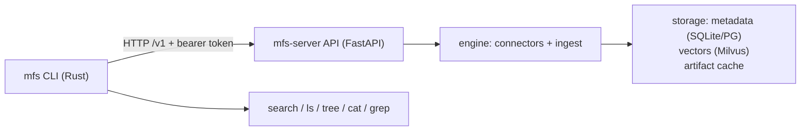

# Contributing to MFS

Thanks for your interest in contributing. This guide covers what MFS is, how the
pieces fit together, how to get them running locally, and the conventions a PR is
expected to follow. The largest section — [Contributing a connector](#contributing-a-connector)
— is the most common contribution and the place where MFS's design choices matter
most, so it explains the reasoning, not just the steps.

## What MFS is

MFS turns many kinds of content — code, docs, messages, databases, object stores —
into **one file-like, searchable namespace** for agents and developers. Every
source, however different its native shape, is addressed as a path tree under its
own `<scheme>://` URI, and the same verbs work everywhere: `ls / tree / cat /
head / tail / grep / search / export`. A Postgres table, a Slack workspace, an S3
bucket, and a local folder all answer to the same commands.

Two processes make this work:

- a thin **Rust CLI** (`mfs`) that is purely an HTTP client, and
- a **Python server** (`mfs-server`, FastAPI) that owns the connectors, the
  ingest pipeline, the vector index, and storage, and exposes everything over an
  HTTP `/v1` control plane.

The generated SDKs (`sdks/python`, `sdks/typescript`) are also just clients of
that server. Background and rationale live in
[docs/why.md](docs/why.md) and [docs/one-model-many-sources.md](docs/one-model-many-sources.md).

## Architecture at a glance



- **Connectors** read each source as a path tree and classify every object
  (`object_kind`). They never touch the index or embeddings directly.
- **Ingest** runs two lanes: an *Object Lane* (each object → chunks → vectors,
  via a producer → chunk queue → embed consumer) and a *Job Lane* (cross-object
  work like directory summaries). See [docs/ingest-pipeline.md](docs/ingest-pipeline.md).
- **Storage** is metadata in SQLite (or Postgres), vectors in Milvus (Lite by
  default), and an artifact cache. The on-disk shapes are documented in
  [docs/schema.md](docs/schema.md) and [docs/caching.md](docs/caching.md).
- **Search** fuses dense (semantic) and BM25 (keyword) recall per query.
- An optional **Rust acceleration** wheel (`server-rs`) speeds a few hot paths
  (gitignore walk, hashing, linear grep, tail). It is never required — the server
  falls back to pure Python with identical behaviour.

The fullest treatment is [docs/architecture.md](docs/architecture.md).

## Project layout

```
mfs/
├── cli/              Rust CLI (mfs binary). Talks to the server via HTTP.
├── server/python/    Python server (FastAPI). Connectors, ingest, search, storage.
├── server-rs/        Rust hot-path acceleration (PyO3 wheel). Optional.
├── sdks/python/      Python SDK (auto-generated from protocol/openapi.yaml).
├── sdks/typescript/  TypeScript SDK (auto-generated).
├── protocol/         OpenAPI spec — source of truth for HTTP / SDK shape.
├── skills/           Agent skills: mfs-ingest (register sources) + mfs-find (search/browse).
├── docs/             User + design documentation (MkDocs).
├── deployments/      Helm chart + container manifests.
└── evaluation/       Embedding / retrieval benchmarks.
```

The checked-in SDKs are generated from `protocol/openapi.yaml`, not from CLI
commands. Regenerate them only when the HTTP contract changes; CLI-only changes
do not require SDK regeneration. Release version bumps should keep the package
metadata for the CLI, server, server-rs, and both SDKs in lockstep.

## Setup

You'll need:

- **Rust 1.85+** (`rustup default stable`)
- **uv** (`curl -LsSf https://astral.sh/uv/install.sh | sh`)
- **Python 3.10+** (uv will pin one for you)
- Optionally **pre-commit** (`uv tool install pre-commit`)

```bash
git clone https://github.com/zilliztech/mfs.git
cd mfs

# install pre-commit hooks (runs ruff format + cargo fmt on staged files)
pre-commit install
```

### Build the CLI

```bash
cd cli
cargo build --release        # ./target/release/mfs
./target/release/mfs --help
```

### Run the server

```bash
cd server/python
uv sync                          # default deps (local ONNX, Milvus Lite, SQLite)
uv sync --extra all-connectors   # include every connector SDK
uv run mfs-server setup          # optional: write $MFS_HOME/server.toml (Enter through for local defaults)
uv run mfs-server run            # 127.0.0.1:13619
```

Server state (Milvus Lite, SQLite metadata, caches, the ONNX model cache) lives
under `$MFS_HOME` (default `~/.mfs`).

There is also a per-connector wizard for operators who'd rather not hand-edit TOML:

```bash
uv run mfs-server connector add postgres://prod-db   # the wizard knows the scheme's schema
uv run mfs-server connector add --help               # lists every supported scheme
```

### Optional Rust acceleration

```bash
cd server-rs
uv run --project ../server/python maturin develop --release
```

`mfs_server.common.accel` imports `mfs_server_rs` transparently — without the
wheel it falls back to pure Python with identical behaviour.

## Testing

```bash
# Python
cd server/python
uv run --extra dev pytest                 # unit + smoke tests
uv run --extra dev pytest -k engine       # a subset

# Rust
cd cli
cargo test
```

Tests live in `server/python/tests/`. The engine and connectors are tested with
fakes (a fake plugin + fake Milvus/embedder), so most tests need no network — see
`tests/test_engine_chunkable_e2e.py` for the pattern. Tests that talk to a real
external API are marked `@pytest.mark.live` and skipped by default; add that
marker when you contribute one.

## Lint and format

CI enforces formatting.

```bash
# Python
cd server/python
uv run --extra dev ruff format src/ tests/           # apply
uv run --extra dev ruff format --check src/ tests/   # CI mode
uv run --extra dev ruff check src/ tests/            # lint

# Rust
cargo fmt --manifest-path cli/Cargo.toml --all
cargo fmt --manifest-path server-rs/Cargo.toml --all
# CI mode (checks both crates):
cargo fmt --manifest-path cli/Cargo.toml --all -- --check
cargo fmt --manifest-path server-rs/Cargo.toml --all -- --check
```

Pre-commit runs these on staged files if you ran `pre-commit install`.

## Contributing a connector

Adding a source type — a database, a SaaS API, an object store — is the most
common contribution. Expect roughly **500–1500 lines of Python** under
`connectors/<name>/`, depending on how many optional capabilities you implement.

### The mental model: a thin connector on a fat framework

A connector's only job is to **present an external system as a path tree and
detect changes**. Everything downstream — chunking, embedding, the vector index,
the artifact cache, the HTTP API, the `cat/grep/ls/...` verbs — is the
framework's, and you neither implement nor bypass it.

| Concern | You write | Framework owns |
|---|---|---|
| Connect / authenticate | use the source's SDK | credentials resolved from a `credential_ref` |
| Shape of the URI tree | `stat` / `list` + path↔resource mapping | the path/URI conventions below |
| Reading objects | `read` **or** `read_records` | `cat / head / tail / grep / ls / tree / export` |
| Change detection | `fingerprint` + `sync` | *which* changes invalidate artifacts/chunks/embeddings |
| Object classification | `object_kind_of` | the chunker/structure for each `object_kind` |
| Config schema | a pydantic model | validation, the `mfs add` flow |
| Chunking / embedding / summary / VLM | — | the ingest pipeline |
| Vector index / metadata DB / artifact cache | — | storage |
| HTTP API / SDKs / `mfs add / connector / status` | — | the engine |

The framework deliberately does **not** expose deeper extension points (custom
chunker internals, a custom artifact-cache format, writing Milvus directly). Those
layers are the framework's so it stays maintainable and your surface stays small.

### The plugin contract

A connector subclasses `ConnectorPlugin`
(`server/python/src/mfs_server/connectors/base.py`). Read that file — it is the
source of truth — and read `connectors/postgres/plugin.py` (a structured example)
and `connectors/web/plugin.py` (a dynamically-discovered tree) as live templates.

Class attributes: `NAME`, `URI_SCHEME`, `DISPLAY_NAME`, `PROMPT` (a one-line
description of the root layout), `CAPABILITIES`, `CONFIG_SCHEMA` (a pydantic model
for the connector TOML).

**Must implement** (abstract):

| Method | Purpose |
|---|---|
| `stat(path)` → `PathStat` | metadata for one path |
| `list(path)` → `list[Entry]` | one directory level |
| `fingerprint(path)` | current upstream change token (`None` = always fresh) |
| `sync(opts)` → `AsyncIterator[ObjectChange]` | stream the changed objects |
| `object_kind_of(path)` → `ObjectKind` | map a path to its kind |

Implement **`read`** (a byte stream) for byte-native sources, **or**
`read_records` (an async generator of dicts) for structured ones — the framework
wraps records into jsonl bytes so you don't write `read` twice.

**Optional overrides** (sensible base defaults; override only to do better):
`grep` (push a filter down to the source instead of a linear scan), `search`
(use a provider search API instead of Milvus recall), `preset_for` (built-in
`text_fields`/`locator_fields` so users needn't configure them), `chunk_plan`,
`render`, `task_priority` (first-screen ordering, e.g. index `README` first),
`record_count`, `introspect_for_wizard`, `healthcheck`, `on_object_indexed`,
`on_object_deleted`.

`CAPABILITIES` (a `Capabilities`) must be **honest** — it advertises what you
actually implemented. For example, `cursor_kind` only names the field you use for
your own delta logic; set `since_pushdown=True` *only if* `sync()` really filters
by `opts.since`, or the engine will reject `--since` rather than silently ignore
it. Set `grep_pushdown` only if you overrode `grep`. `mfs ls <uri> --json` surfaces
these capabilities so clients can adapt.

> `path` in every method is the **connector-root-relative** path
> (`/public/tickets/rows.jsonl`), not the full URI — the framework strips the
> `scheme://alias` prefix first.

### File layout and registration

Connectors are flat — keep everything in `plugin.py`:

```
connectors/<name>/
├── __init__.py     # registers the plugin
└── plugin.py       # the ConnectorPlugin subclass, its CONFIG_SCHEMA, PROMPT, layout/sync logic
```

`__init__.py` registers it:

```python
from ..registry import register
from .plugin import MyPlugin

register(MyPlugin)
```

Then add `"<name>"` to the import tuple in `connectors/registry.py:load_builtin()`
so it loads on startup. If the connector needs a third-party SDK, declare it as a
`mfs-server[<name>]` extra in `server/python/pyproject.toml` (the loader skips a
connector whose extra isn't installed).

### Object naming conventions

These keep every connector's tree predictable for agents and users:

- **Collections of records → `.jsonl`**, one record per line (`rows.jsonl`,
  `messages.jsonl`, `issues.jsonl`). Never a directory of `1.json`, `2.json`, … —
  it doesn't scale and breaks `head`/`grep` over the whole set.
- **Schema / metadata descriptions → `.json`** (`schema.json`, `database.json`).
- **Long text you generate → `.md`** (a crawled page, a Notion doc).
- **Real files pass through** with their original name and extension; `cat`
  returns their bytes (unless the framework can convert the type, e.g. PDF/DOCX).
- **Directories** are trailing-`/` path segments and **can't be `cat`'d** (that's
  what `ls` is for) — don't make a directory return an "overview".
- **A single record is reached by a search hit's `locator`, not its own path.**
  Expose a per-record path only when the record genuinely has a stable, bounded
  identity (e.g. a GitHub PR's `pulls/42/diff.patch`).
- **Crawler-style connectors must canonicalize URL → path** (lowercase host, drop
  the fragment and tracking params, sort kept query params) so two URLs can't
  collide onto one object. Keep the original URL in `extra` for rendering.

### Boundary rules

| Want to | Allowed? |
|---|---|
| Add a value to `object_kind` / `chunk_kind` | No — both are framework-fixed; open an RFC first |
| Write Milvus, call an embedding API, or read the cache directly | No — go through the pipeline / storage |
| Store cursors / etags / small JSON in `self.state` | Yes — you define the schema; the framework doesn't introspect it |
| Put a full per-object map in `self.state` | No — that gets heavy; the file connector's `file_state` table is the one framework-provided exception |
| Expose a path that isn't described in `PROMPT` / the skill / docs | No — exposing it means documenting it |
| Register a brand-new URI scheme | Yes — just `register()` it |

### Four sources, one source of truth

A connector's configuration is described in four places that **must stay
consistent**; the **code is the source of truth** and the others document it at
increasing detail (Skill < Wizard < Docs):

1. **Code** — `connectors/<name>/plugin.py` (the keys it reads) + the
   user-authored `connector.toml`.
2. **Wizard** — `server/connector_schemas.py` (an *important-fields subset*, for
   `mfs connector add`).
3. **Skill** — `skills/mfs-ingest/reference/connectors/<name>.md` (short; tells an
   agent what to configure and where to get credentials).
4. **Docs** — `docs/connectors/<name>.md` (the full human walkthrough).

When you change one, grep the connector name across the other three and reconcile.
Field names and enum values must match the plugin exactly everywhere.

Secrets are **never** plaintext in TOML: the TOML carries a reference
(`env:VAR_NAME` or `file:/abs/path`) that the server resolves at plugin-build
time. A plugin reads credentials only through the framework (`self.credential` /
its config fields) — never hard-code `os.environ["..."]`.

### Before you write code

Answer these first (they decide the whole shape):

1. What objects does the root expose, and what is each one's `media_type` and
   `object_kind`?
2. How expensive is listing / reading? Does it need the artifact cache?
3. How do you detect change — what does `fingerprint` compute?
4. Which objects get indexed, and what are the default `text_fields`?
5. Can you push `grep` / `search` / `tail` down to the source?
6. Can upstream detect deletes — which `delete_detection` tier (`never` /
   `explicit` / `full_scan` / `state_change`)?
7. What credentials / OAuth scopes are required, and what's the minimal config a
   user must supply?

### Testing a connector

Add tests under `server/python/tests/` using a fixture-based fake (no live
network) — model them on `tests/test_engine_chunkable_e2e.py`. At minimum cover
`add → ls → head → search` end to end, and assert `object_kind_of` covers every
path pattern your connector exposes. Mark any real-API test `@pytest.mark.live`.

## Commits and pull requests

Use [Conventional Commits](https://www.conventionalcommits.org/) prefixes in
**PR titles** — release notes are generated from them.

| Prefix | Example |
|---|---|
| `feat:` | `feat: add hubspot probe-and-skip for free tier portals` |
| `fix:` | `fix: incremental sync skips renamed files on cross-fs moves` |
| `docs:` | `docs: clarify upload flow in file connector reference` |
| `ci:` | `ci: pin rustfmt to the stable channel` |
| `chore:` | `chore: bump pyo3 to 0.23` |
| `refactor:` | `refactor: collapse the lines field into the locator envelope` |
| `test:` | `test: extend jira e2e to cover enhanced_jql pagination` |
| `perf:` | `perf: parallelise sha1 over staged file batches` |

A `!` suffix (`feat!:`, `fix!:`) marks a breaking change.

### Workflow

1. **Branch** from `main`.
2. **Make focused changes** — one feature or fix per PR. Touch one package when
   reasonable; cross-package PRs are fine when the change needs it (a CLI flag
   plus its server endpoint, say).
3. **Add or update tests.**
4. **Run lint locally** (`ruff format --check`, `ruff check`, `cargo fmt --check`).
5. **Open a PR** to `main` with a conventional-commit title.
6. **Squash merge** is the default — the PR title becomes the commit on `main`.

## Reporting issues

https://github.com/zilliztech/mfs/issues

Useful detail: CLI / server version (`mfs --version`, `mfs-server --version`), the
connector URI scheme, and redacted error output. For a failed sync, the job id
from `mfs job list` plus `mfs job show <id>` is the single most useful attachment.

## License

By contributing you agree your contributions are licensed under
[Apache-2.0](LICENSE).
