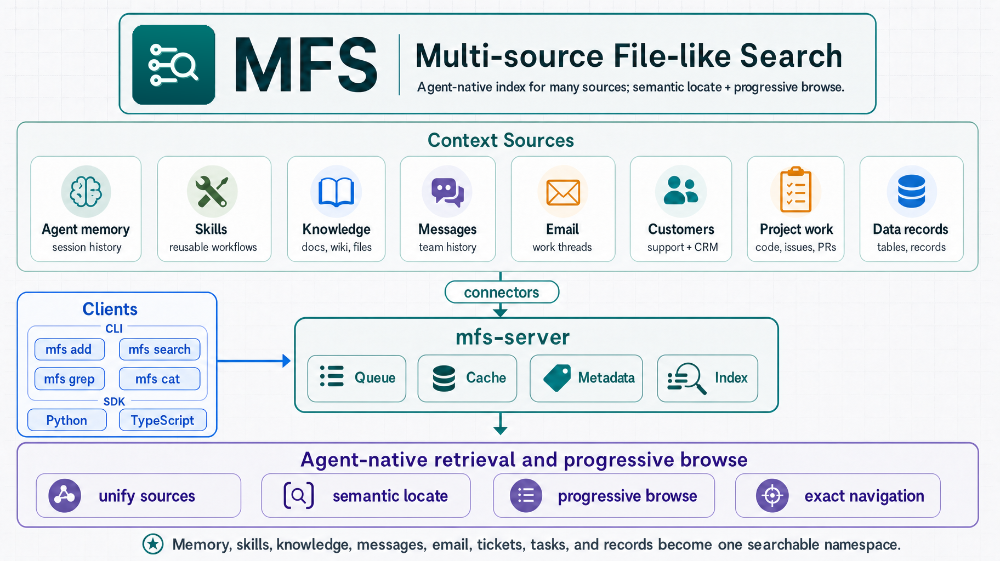

<p align="center">
  
</p>

<h1 align="center">MFS — Multi-source File-like Search</h1>

<p align="center">
  <strong>A context harness for AI agents — and for building them.</strong><br/>
  One shell over your codebases, memory, skills, documents, messages, and every data source you work in.
</p>

<p align="center">
  <a href="https://github.com/zilliztech/mfs/blob/main/LICENSE"></a>
  <a href="https://crates.io/crates/mfs-cli"></a>
  
  <a href="https://milvus.io/"></a>
  <a href="https://github.com/zilliztech/mfs/stargazers"></a>
</p>

---

Modern AI agents need a place to keep their **context**: codebases,
memory, skills, knowledge, work messages, documents, databases. Most of
that lives scattered across `~/notes/`, `~/.claude/`, ten SaaS apps,
three databases.

MFS gathers it under one shell. Every source — local folders, a
Postgres table, a Slack workspace, a Google Drive, a Notion graph — is
mounted as a **file-like tree under a stable URI**. The shell verbs you
already use work everywhere: `ls`, `cat`, `tree`, `grep`, `head`,
`tail`. Plus `search` for hybrid semantic + keyword retrieval.

Defaults run entirely on your laptop. No API keys. No cloud account.
No GPU.

<p align="center">
  
</p>

## What you can do with it

**Give an AI agent every context you have.** Slack threads, Gmail,
Notion, GitHub PRs, Drive folders, your design docs — all in one
query. The agent stops asking *which tool was that in?*

```bash
mfs search "how did we handle the SSO outage last quarter" --all
```

**Manage your agent's memory, skills, and code.** Markdown notes,
JSONL session logs, SKILL packs, working repos — usually scattered
across `~/notes/`, `~/.claude/skills/`, `~/repos/`. MFS turns the
whole spread into one searchable layer.

```bash
mfs add ~/notes ~/.claude/skills ~/repos/agents
mfs search "the prompt I tuned for refund disputes" --all
```

**Build a multi-source RAG or coding agent without writing 19
connectors.** MFS already speaks Postgres, GitHub, Notion, Drive,
Slack, Gmail, S3, BigQuery, Snowflake, and more. You build the agent;
MFS is the retrieval layer underneath.

```bash
mfs --json search "user requested deletion" --all --top-k 20
```

**Debug across sources in one shot.** Logs, Slack history, Jira
tickets, database rows — when an incident hits, search every layer in
one command instead of flipping between five tabs.

```bash
mfs search "rate-limit pegged at 22:00" slack://acme jira://acme ./repo
```

**Audit or onboard.** Find every place a key, email, or function
name shows up. Or point a new hire at every design doc — wherever it
actually lives.

```bash
mfs grep "API_SECRET_xyz" --all
mfs search "auth architecture" notion://team gdrive://design github://owner/repo
```

## A harness for agent builders

MFS isn't just *callable* by agents — it's the harness you use to
*build* them.

A modern agent project juggles several streams of state:

- **Memory** — past sessions, recaps, decision logs, scratch notes
- **Skills** — reusable `SKILL.md` packs, prompts, runbooks
- **Code** — every repo the agent reads or writes
- **Knowledge** — docs, PDFs, design specs, meeting transcripts
- **Work signals** — Slack threads, emails, tickets, CRM records,
  database state, dashboards

Without a harness, this scatters across local folders, SaaS apps, and
private databases. With MFS, the agent gets one CLI surface
(`mfs search`, `mfs cat`, `mfs grep`) over all of it — and so do you,
the human building the agent. Drop the
[`skills/mfs-find`](skills/mfs-find/SKILL.md) and
[`skills/mfs-ingest`](skills/mfs-ingest/SKILL.md) packs into Claude
Code, Codex CLI, OpenCode, or your own agent runtime — your agent
inherits the whole context layer with no custom integration.

## Get running in 60 seconds

The local path needs **no API key, no GPU, no cloud account**.
Defaults are local ONNX embeddings + Milvus Lite + SQLite, all stored
under `~/.mfs/`.

```bash
# 1. Install the CLI
curl --proto '=https' --tlsv1.2 -LsSf \
  https://github.com/zilliztech/mfs/releases/download/v0.4.0-beta.2/mfs-cli-installer.sh | sh

# 2. Run the server from source (until it's on PyPI)
git clone https://github.com/zilliztech/mfs.git
cd mfs/server/python
uv sync
uv run mfs-server run

# 3. In another terminal — try it
mfs add ./my-repo
mfs search "rate limit handler" ./my-repo --top-k 5
```

First boot downloads the default embedding model (~600 MB) into
`~/.mfs/onnx-cache/`. After that the local stack is fully offline.

> macOS first launch may prompt about an unidentified developer. Run
> `xattr -d com.apple.quarantine $(which mfs)` once after install.

## Run it in production

The CLI is a thin Rust client (2–4 ms cold start, ~6 MB binary). The
server holds everything heavy: queues, Metadata DB, Milvus, caches,
workers, and the credentials for every connector. So you can put them
on different machines.

```bash
# Server: run in Docker / on a remote VM
docker compose -f deployments/compose/docker-compose.yml up

# Client: point at the remote server from anywhere
export MFS_API_URL=https://mfs.your-corp.internal
export MFS_API_TOKEN=...
mfs status

# Swap in cloud-grade backends as you grow
uv run mfs-server setup --section embedding   # ONNX → OpenAI / Gemini / Ollama
uv run mfs-server setup --section milvus      # Milvus Lite → self-hosted / Zilliz Cloud
uv run mfs-server setup --section database    # SQLite → Postgres (for multi-replica)
```

## How the C / S split works

| On the client | On the server |
|---|---|
| `mfs` CLI (Rust, 2–4 ms cold start, ~6 MB binary) | All connector credentials, env vars, and TOML config |
| Generated SDKs (Python, TypeScript) | Queue + workers, indexing jobs |
| Agent skill packs (`mfs-find`, `mfs-ingest`) | Metadata DB (SQLite or Postgres) |
| Endpoint / profile / token resolution | Vector index (Milvus Lite, self-hosted Milvus, or Zilliz Cloud) |
| Output rendering | Artifact + transformation caches |
| | Embedding, VLM, summary, chunking, conversion |

Client and server can sit on the **same machine** (the quick-start
mode above) or on **different machines** (production mode). The client
is nearly stateless, so re-creating it on a new laptop, in a Docker
image, or inside an agent runtime is free. The server is where the
state, the secrets, and the expensive work live.

## Configure the server: wizard or TOML

The interactive wizard walks six sections — defaults are
self-contained, press Enter through to keep them:

```text
MFS server setup
  writing to ~/.mfs/server.toml
  6 section(s): embedding · image-summary · milvus · database · cache · auth

╭─ Step 1/6 · Embedding ───────────────────────────────────────────────╮
│  Default is local ONNX (no API key, BGE-M3 int8, ~600 MB download). │
│  Pick another provider to opt out.                                  │
╰─────────────────────────────────────────────────────────────────────╯
? Provider (↑↓ to move · Enter to confirm)
 » onnx       local, no API key (default)
   openai     needs OPENAI_API_KEY env
   gemini     needs `uv sync --extra gemini`
   voyage     needs `uv sync --extra voyage`
   ollama     needs `uv sync --extra ollama` + running ollama server
   local      needs `uv sync --extra local` (pulls torch ~2 GB)

╭─ Step 3/6 · Milvus (vector DB) ─────────────────────────────────────╮
│  Default = Milvus Lite (a file under $MFS_HOME). Switch to remote   │
│  Milvus / Zilliz Cloud by supplying the URI.                        │
╰─────────────────────────────────────────────────────────────────────╯
? Backend  lite  ·  remote-milvus  ·  zilliz-cloud
```

Run a single section any time:

```bash
uv run mfs-server setup --section embedding
```

For advanced knobs (cache size, eviction policy, chunker thresholds,
namespace, custom worker count) — edit `~/.mfs/server.toml`
directly. See [docs/configuration.md](docs/configuration.md) for the
full field reference.

## Try a cross-source search

After registering a few connectors:

```text
$ mfs search "rate-limit guard misfires under burst" \
    ./repo slack://acme jira://acme

slack://acme/channels/oncall/messages.jsonl  score=0.91
  [Mon 22:14] @alice: ratelimiter pegged 500ms p99 tail, dump attached
  [Mon 22:18] @bob:   smells like the burst guard from PR #418

jira://acme/teams/PLAT/issues.jsonl  score=0.83
  PLAT-491  "rate-limit guard misfires under burst"
            state=In Progress  assignee=alice

file://local/repo/src/throttle.go  score=0.71
  42  func handleRateLimit(req Request) error {
  43      if exceedsBudget(req.UserID) {
  44          return ErrTooManyRequests
```

The result list is one stable shape across connectors, so you can
copy any hit into `mfs cat --range` or `mfs cat --locator` to read
exact evidence:

```bash
mfs cat ./repo/src/throttle.go --range 42:78
mfs cat jira://acme/teams/PLAT/issues.jsonl --locator '{"id":"PLAT-491"}'
```

## Connectors

Beyond local files, MFS ships 18 more connectors. Each exposes its
source as a URI tree you can `ls` / `cat` / `search` like a directory:

| Group | Schemes |
|---|---|
| Files & objects | `file`, `s3`, `gdrive` |
| Databases | `postgres`, `mysql`, `mongo`, `bigquery`, `snowflake` |
| Code & issues | `github`, `jira`, `linear` |
| CRM & support | `hubspot`, `zendesk` |
| Chat, mail, docs | `slack`, `discord`, `gmail`, `feishu`, `notion`, `web` |

Probe before adding:

```bash
mfs connector probe linear://workspace --config ./linear.toml
mfs add linear://workspace --config ./linear.toml
```

Per-connector credential setup and TOML shape:
[docs/connector-reference.md](docs/connector-reference.md).

## Robust by design

MFS treats the index as **derived state** — losable, rebuildable, and
crash-safe. A few mechanisms make that work:

### Rename detection: three tiers, zero waste

Rename a 1 GB Markdown file, move your `notes/` folder, or check out
a different git branch. MFS catches it in three layers:

1. **Stat-first lazy hashing.** Scan compares `(size, mtime_ns)`
   first. Match → skip. Different → check `sha1`. If `sha1` matches,
   only `mtime` is touched. No work done.
2. **Inode pairing.** A same-filesystem `mv` keeps the inode → rename
   detected with **zero hashing**.
3. **Content pairing.** Cross-filesystem moves, Windows, or git
   operations that re-create files lose the inode — MFS falls back to
   size-prefilter + sha1 across the added/deleted set.

Result: renaming or relocating files costs **zero bytes uploaded**
(in client/server mode) and **zero embedding API calls**.

### Caches that survive `git checkout`, branch flips, model rollbacks

Every expensive operation — PDF→Markdown conversion, embedding, VLM
description, summary — is keyed by `sha1(content + tool + version)`.
You get free hits in three real situations:

- **Git branch flip.** Same content, different mtime → mtime updates,
  sha1 unchanged → **zero embedding calls**.
- **Vector DB rebuild.** Drop your Milvus collection by accident; rerun
  `mfs add` — every chunk hits cache. You only pay for the Milvus
  INSERT.
- **Model rollback.** Switch your embedding model back to a previous
  version → previous results restored from cache, no API spend.

Cache is content-addressable and cross-object — the same paragraph in
a Slack thread and a code comment is embedded **once**.

### Idempotent everything → recovery = "rerun"

```
chunk_id = sha1(namespace + connector + object_uri + chunk_kind + locator + lines)
```

Writing a chunk is `DELETE by chunk_id + INSERT`. Retries, concurrent
workers, mid-job crashes — they all converge on the same final state.
There's no `mfs retry`, no `mfs resume`, no checkpoint state machine.
Recovery collapses to one rule:

> **Crash → just rerun `mfs add`.**

State commits at per-object boundaries, so a kill mid-job never leaves
a half-indexed object in your index.

### Three-layer ignore — what never enters

Ignored files don't merely skip indexing — they don't become MFS
objects. `ls`, `cat`, `grep`, `search` behave as if they don't exist:

1. Built-in defaults (`.git/`, `node_modules/`, common binaries).
2. The repo's own `.gitignore` — respected automatically.
3. `.mfsignore` (highest priority, supports `!pattern` to re-include).

## Why it works the way it does

A few principles run through the architecture above:

**Upstream stays the source of truth.** Your files, your Postgres
rows, your Slack history — those are the truth. MFS just keeps a
derived index. Delete `~/.mfs/` and you lose no data; `mfs add`
rebuilds the index from the actual sources.

**Search and browse are two legs of the same loop.** A library doesn't
hand you the book — it points at a shelf, you flip a few pages, then
you read the right one. MFS works the same way: `search` and `grep`
find candidates, `ls` / `tree` show what's around them, `cat` reads
the exact passage. Don't trust a search hit until you've reopened it.

**File-like URIs because agents already speak shell.** No new query
language to learn, no per-source SDK to import. `ls`, `cat`, `grep`,
`tree`, `head`, `tail` work on every connector the same way. The
abstraction every dev (and every agent) already knows.

## Docs

The full guide lives in **[docs/](docs/)** (also served via MkDocs):

- [Quickstart](docs/getting-started.md) — first local run, end to end.
- [Search and Browse](docs/search-and-browse.md) — the search →
  locate → read loop.
- [Connectors](docs/connectors.md) — catalog and per-connector setup.
- [Configuration](docs/configuration.md) — server settings, env vars,
  auth.
- [Deployment](docs/deployment.md) — Docker, Compose, remote server.
- [Troubleshooting](docs/troubleshooting.md) — when things break.

## Roadmap

- Publish `mfs-server` to PyPI for one-command installs.
- OAuth `client_credentials` for Salesforce and OAuth-only orgs.
- More connectors (Confluence, Asana, Drive shared drives).
- Lock `/v1` HTTP API for the `v0.4.0` final.

## Status

`v0.4.0-beta.2`. The CLI surface and connector matrix are stable; the
HTTP API may still shift before `v0.4.0` final, so pin versions in
scripts. Found a bug? Open an issue:
<https://github.com/zilliztech/mfs/issues>.

## Acknowledgements

MFS is shaped by several related projects:

- [claude-context](https://github.com/zilliztech/claude-context) and
  [memsearch](https://github.com/zilliztech/memsearch) — earlier
  Zilliz code-search and memory-search efforts whose community
  feedback shaped MFS's agent-facing direction.
- [VKFS](https://github.com/ZeroZ-lab/vkfs) — a sister exploration
  of a Unix-like interface for agent access to vector-backed
  knowledge.

## License

Apache-2.0. See [LICENSE](LICENSE).
