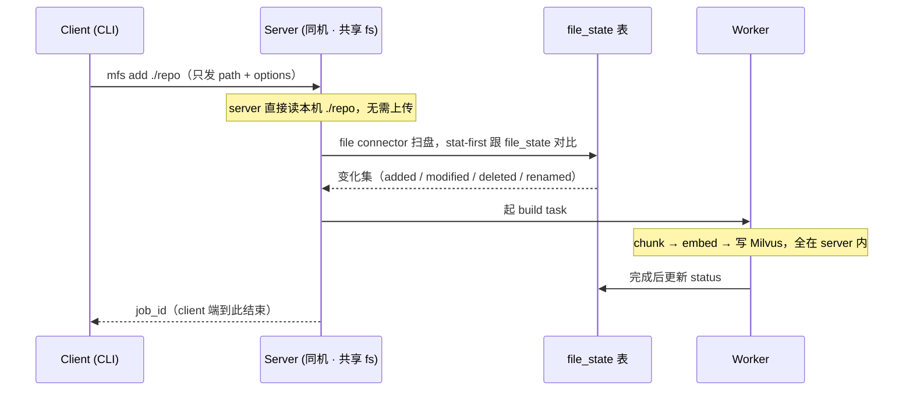
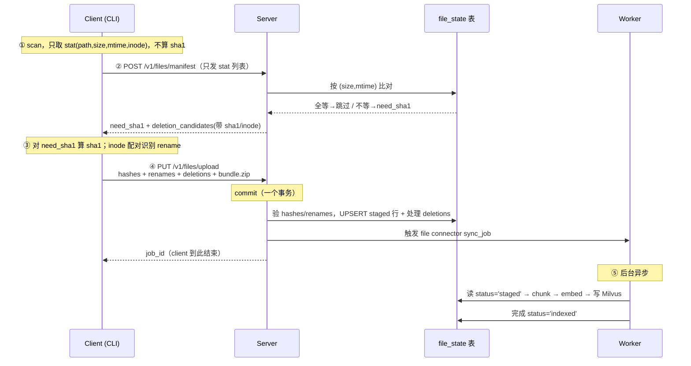
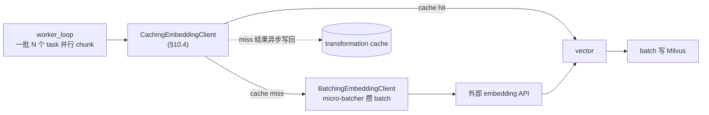
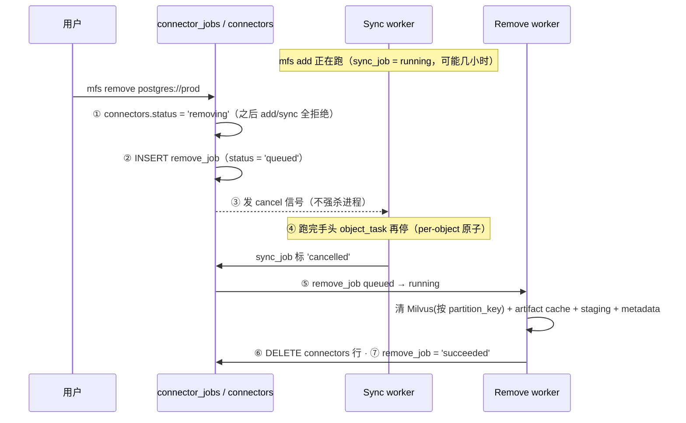

# 架构

这一篇讲 MFS 的整体架构、客户端跟服务端的分工、数据怎么流、存储怎么放、任务队列怎么跑、多租户怎么演进。看完知道整个系统长什么样。

实施细节（部署形态、发版、工程目录、运维指标）在 [10-packaging-and-deployment.md](10-packaging-and-deployment.md)。

## 1. 整体长什么样

```
┌─────────────────── Client ──────────────────┐
│  mfs CLI / Python SDK / TS·Go·Java SDK       │
│                                              │
│   parse args · 解析 profile · HTTP transport │
└──────────────────────┬───────────────────────┘
                       │  HTTP /v1（主要是 control plane）
                       ▼
┌─────────────────── Server ──────────────────┐
│  API routes                                  │
│    /v1/add  /v1/objects/*  /v1/search        │
│    /v1/grep /v1/connectors/* /v1/jobs/*      │
│       │                                      │
│       ▼                                      │
│  Engine（业务编排：路由 → 起 job → 调插件）  │
│       │                                      │
│       ▼                                      │
│  Connectors                                  │
│    file / web / postgres / slack / github /…│
│    实现 list / stat / read / fingerprint /   │
│    sync 等契约                               │
│       │                                      │
│       ▼                                      │
│  Object Processors（按 object_kind 加工）   │
│    document / code / table_rows /            │
│    message_stream / record_collection /      │
│    image / binary                            │
│       │                                      │
│       ▼                                      │
│  Common Services                             │
│    embedding · summary · VLM · retrieval     │
│       │                                      │
│       ▼                                      │
│  DB 任务队列 + Worker pool                  │
│       │                                      │
│       ▼                                      │
│  ┌──────────┐  ┌──────────┐  ┌──────────┐  │
│  │ Metadata │  │  Object  │  │  Milvus  │  │
│  │   DB     │  │  store   │  │          │  │
│  └──────────┘  └──────────┘  └──────────┘  │
└──────────────────────────────────────────────┘
```

CLI 跟 server 走 HTTP，互相不 import。server 端按层组织：API → Engine 编排 → Connector 拉数据 → Processor 加工 → Common Service 提供 embedding/VLM/retrieval → 三套存储落地。

## 2. 术语

MFS 的术语按受众分三组，避免一次塞太多。

### 用户和开发者都用（6 个）

| 术语 | 是什么 |
|---|---|
| **Connector** | 一个已注册的数据源实例（`postgres://prod` / `./repo`） |
| **Object** | connector 暴露的一条虚拟文件（URI + media_type） |
| └─ **Cache** | object 相关的缓存（对外一个概念）：artifact（per object，让 cat/head/tail 不打回 connector）+ transformation（跨对象，省重复 embedding/VLM 等 API），内部细分见 [§10.4](#104-cache-层) |
| └─ **Chunks** | object 派生：Milvus 行，被 search/grep 召回 |
| **Profile** | client 端的 endpoint 配置（连哪个 server + token） |
| **Job** | 用户一次操作的记录：`mfs add` / `mfs remove` 各产生一个 job |

关系：一个 Connector 暴露多个 Object；每个 Object 可能有 Cache 和 Chunks。Profile 决定 client 连哪个 server。用户每次操作创建一个 Job。

### 后台开发者额外用（2 个）

| 术语 | 是什么 |
|---|---|
| **Task** | Job 内的子单元，每个变化的 object 一个 task |
| **Worker** | 从 DB 拉 task 跑的 coroutine |

> DB 表（`connector_jobs` + `object_tasks`）起到队列容器的作用——文中说"DB 队列"是描述，不把 Queue 当独立术语。

### 读 server 代码时额外用（6 个）

| 层名 | 职责 |
|---|---|
| **HTTP API** | FastAPI routes（`/v1/...`） |
| **Engine** | 业务编排：路由请求 / 起 job / 调 connector |
| **Connectors** | 各数据源的插件 |
| **Object Processors** | 各 object_kind 的加工逻辑 |
| **Common Services** | 通用工具（embedding / summary / VLM / retrieval / export） |
| **Storage** | metadata DB / object store / Milvus 三套后端 |

整个系统里还有一个不对外的内部主键 `namespace_id`，所有顶层表 + Milvus partition + object store prefix 都按它切。v0.4 单一 `default` namespace，用户感知不到；多租户演进见 [§9](#9-多租户与-namespace)。

## 3. Client 和 Server

CLI、SDK 是 client，所有重活在 server。server 有两种部署位置：

| 部署 | 用途 |
|---|---|
| 本机 server（`mfs serve` 起一个 `mfs-server` 进程） | 个人本机，CLI 跟 server 共享文件系统 |
| 远端 server | 团队/云端，CLI 通过 HTTPS 访问 |

### 3.1 配置文件

两个文件分别属于 client 和 server：

| 文件 | 路径 | 内容 | 谁读 |
|---|---|---|---|
| client 配置 | `~/.mfs/client.toml` | profiles、endpoint URL、API token | `mfs` CLI |
| server 配置 | `~/.mfs/server.toml`（本机）<br>`/etc/mfs/server.toml`（远端） | 存储后端、worker、embedding、artifact_cache 等 | `mfs-server` |

只装 CLI 的用户只接触 `client.toml`；只装 server 的运维只接触 `server.toml`。

`server.toml` 查找顺序：`--config` → `$MFS_SERVER_CONFIG` → `./server.toml` → `~/.mfs/server.toml` → `/etc/mfs/server.toml` → 内置默认值。

### 3.2 Profile 配置

```toml
# ~/.mfs/client.toml
[client]
default_profile = "local"
client_id       = "01HX...XYZ"      # 首次启动自动生成的 UUIDv7

[[profiles]]
name = "local"
api_base_url = "http://127.0.0.1:8765"

[[profiles]]
name = "prod"
api_base_url = "https://mfs.example.com"
credential_ref = "env:MFS_API_TOKEN"
```

`client_id` 是这台 client 的稳定身份（下面 §3.4 详讲）。profile 里**不需要写 `kind`**，CLI 自动判断 client 和 server 是否共享 fs。

profile 管理：

```bash
mfs profile add <name> --url <url>
mfs profile use <name>
mfs profile list
mfs profile status
```

### 3.3 自动判定是否共享 fs

CLI 握手时用 machine-id 比对，决定走"server 直接读本机"还是"upload 流"：

```python
client_machine_id = read_machine_id()
server_resp = await client.get(profile.url + "/v1/server/info")
profile.is_local = (client_machine_id == server_resp["machine_id"])
```

| 场景 | machine-id 比对 | 结果 |
|---|---|---|
| 同机 `mfs serve start` | 一致 | local（server 直接读本机） |
| 远端 HTTPS server | 不一致 | remote（走 upload） |
| Docker / WSL2 / SSH forward | 不一致 | remote |

调试时可以 `MFS_FORCE_REMOTE=1` 强制 remote。

### 3.4 client_id：client 的稳定身份

machine-id 用来判 is_local，**不**用来当 client 长期身份。原因：machine-id 在 Docker 容器、`systemd-machine-id-setup --commit`、系统重装等场景会变。如果用 machine-id 进 `connector_uri`，那些场景下已有的 file connector 都会变成孤儿。

所以 `client_id` 由 CLI 首次启动生成（UUIDv7），写在 `client.toml` 里。`file://<client_id>/<abs-path>` 是 file connector 的稳定标识。备份 `client.toml` 就能跨机器迁移；Docker 容器把 `~/.mfs` 挂成 volume 就能跨重启保持身份。

**client.toml 之外 client 端不持久化任何状态**——manifest 全部在 server 端 `file_state` 表里，上传协议 stateless（详见 [§4.2](#42-本地文件-upload-flow不共享-fs-时)）。CI / 临时 runner / 切机器场景下 client 重启零成本。

### 3.5 Server 端存储后端跟 profile 无关

profile 只管 client 怎么连 server。server 端用什么 backend 由 `server.toml` 决定：

```toml
[metadata]
backend = "sqlite"                  # 或 "postgres"

[object_store]
backend = "local"                   # 或 "s3" / "r2" / "minio"

[milvus]
uri = "~/.mfs/milvus.db"            # 或 http://host:19530 / https://*.zillizcloud.com
```

常见组合：

| 是否共享 fs | metadata | object store | milvus | 适合 |
|---|---|---|---|---|
| 共享 | sqlite | local | Lite | 个人本机默认 |
| 共享 | postgres | s3 | Zilliz | 个人 dogfood 生产配置 |
| 不共享 | postgres | s3 | Zilliz | 团队部署 |

本机 server 完全可以用 Postgres + S3 + Zilliz Cloud——这两个维度正交。

### 3.6 多租户走 profile 切换

v0.4 server 只有一个隐式 `default` namespace，client 不感知。v0.5+ 引入认证后，**namespace 选择由 token 决定**——一个 token 在 server 端绑定一个或多个 namespace 的访问权限。client 切租户 = 切 profile：

```toml
[[profiles]]
name = "acme-corp-prod"
api_base_url = "https://mfs.example.com"
credential_ref = "env:MFS_TOKEN_ACME"

[[profiles]]
name = "globex-corp-prod"
api_base_url = "https://mfs.example.com"
credential_ref = "env:MFS_TOKEN_GLOBEX"
```

connector URI 保持纯净（`postgres://prod`），不带租户信息。

请求头：

```
Authorization: Bearer <token>
MFS-CLI-Version: 0.4.0
MFS-API-Version: v1
```

## 4. 控制面 vs 数据面

HTTP API 主要走 control plane（路径、option、状态、搜索结果），数据在 server 内部流动。**唯一例外**是 remote profile 下处理本地路径——这时 client 需要把字节上传给 server。

### 4.1 一般情况

| 是否共享 fs | 输入 | 数据流 | HTTP 传什么 |
|---|---|---|---|
| 共享 fs | 本地路径 | server 直接读本机文件 → 内部 chunk → 内部写 Milvus | 仅 path + options |
| 共享 fs | 外部 URI | connector 调外部 API → 内部 chunk → 内部写 Milvus | 仅 URI + options |
| 不共享 | 外部 URI | 远端 server 调外部 API → 内部 chunk → 内部写 Milvus | 仅 URI + options |
| 不共享 | 本地路径 | server-driven diff（基于 file_state）→ client 上传变化的 bytes → server 处理 | **bytes**（§4.2） |

除了"不共享 + 本地路径"这一条，client 都不传 bytes、不拆 chunk、不上传 embedding——这些都是 server 的事。这一条下 client 也只做 stat 扫描 + 对 server 指定的少数 path 算 sha1，不拆 chunk / 不调 embedding。

#### 共享 fs 下的本地文件（对照 §4.2）

本机 server 跟 CLI 共享文件系统时，**client 几乎什么都不用做**——把 path 发过去就完事，扫盘 / 比对 / chunk / embed 全在 server：



跟 §4.2 的 CS 上传流程对照看：**两边的 file connector 是同一份代码**，扫的都是"自己 scope 下的真实目录"——本机模式 scope 直接指向 `./repo`，CS 模式 scope 指向 server 上的 staging area。唯一多出来的就是 §4.2 那段"把 client 的字节搬到 server scope"的上传协议。`file_state` 表、stat-first 对比逻辑、后续 chunk/embed pipeline 两种模式完全共用。

### 4.2 本地文件 upload flow（不共享 fs 时）

`mfs add ./repo` 在 remote profile 下走 **2 个 HTTP RTT**，之后后台 sync 异步跑。**client 端不持久化任何 manifest**——所有比对状态都在 server 端 `file_state` 表里（详见 [§10.1](#101-metadata-db)），client.toml 里只放 profile / `client_id`。

概念上跟本地模式统一：两种模式都是 **reality vs `file_state`** 的 stat-first 对比，差别只在 reality 怎么到达 server——本地模式 server 直接读盘，CS 模式经过下面的上传协议把字节落到 staging area。对比逻辑和 file_state 一张表，两边共用。



逐步文字版：

```
① client scan: 遍历 + stat，拿 (path, size, mtime_ns, inode)
   纯 stat 操作，不算 sha1。1M 文件几秒钟。
   ⚠ 枚举必须完整：遇到子目录权限不足 / IO 错误等不能静默跳过——
     否则漏掉的 path 会在 ② 被 server 当成 deletion_candidates（盘上还在却被判删）。
     扫描出错就 abort 整个 mfs add（报错让用户处理），绝不交一份残缺 manifest。
     这是 §7.4.3 "全量枚举要么完整、要么 raise" 契约在 client 端 scan 的对应要求。

② POST /v1/files/manifest
   body: {
     connector_uri,
     files: [(path, size, mtime_ns, inode), ...]
   }
   server 拿 file_state 算 diff:
     stat 全等 (size + mtime_ns) → 跳过，client 不用做事
     stat 不等 → 加进 need_sha1
     file_state 里有但 client 没 → deletion_candidates
   返回 {
     need_sha1:           [path, ...],
     deletion_candidates: [(path, size, inode, sha1), ...]
       // ↑ 带上 file_state 里这些 path 的字段，供 client 端
       //   做 inode + sha1 配对识别 rename
   }

③ client 本地处理:
   - 对 need_sha1 中每个 path 算 sha1(content)
   - inode 配对识别 rename:
       need_sha1 中 file_state 不存在的 path × deletion_candidates
       inode + size 都对得上 → 视为 rename
   - 准备 upload 数据:
       hashes:       need_sha1 全部的 (path, sha1, size, mtime_ns, inode)
       renames_hint: [(old, new, sha1), ...]
       deletions:    deletion_candidates 减去 renames 用到的 old paths
       bundle.zip:   need_sha1 中的文件字节（renames 不打包）

④ PUT /v1/files/upload  (multipart: hashes + renames_hint + deletions + bundle.zip)
   server commit (一个事务):
     a) 验 hashes，对每条 (path, sha1):
          一致（mtime-touch） → UPDATE file_state.mtime_ns，bundle.zip 里同 path 字节丢弃
          不等                → 用 bundle.zip 里的字节，UPSERT file_state
                                (sha1, size, mtime, inode, status='staged')
     b) 验 renames_hint，对每条 (old, new, sha1):
          server_sha1 = file_state[old].sha1
          一致 → accept
            · staging OS mv: old → new (保留 inode)
            · file_state: DELETE old 行；INSERT new 行
              (同 sha1/size/mtime/inode, status='staged', renamed_from=old)
          不等 / old 不存在 → reject，退化为 missing + extra
                              （client 那边会重新归类，下次重传补字节）
     c) 处理 deletions: rm staging 文件，DELETE file_state 行
        Milvus 行此时不动，待 sync 跑到时统一删
     d) 删 bundle.zip
     e) 触发 file connector sync_job
   返回 job_id

⑤ file connector sync (后台异步，跟本机模式同一份代码):
   扫 staging area + 跟 file_state 对比 → yield ObjectChange (详见 04 §5.5)
     - file_state.renamed_from 不为空的行 → 直接 yield "renamed"，
                                            framework 走 [04 §5.7.3] chunk_id rewrite
                                            (零 embedding API)
     - 普通 added / modified → 标准 chunk + embed pipeline
     - deleted（file_state 没有但 Milvus 还有）→ sync 末尾 reconcile pass 统一删
       (Milvus DELETE WHERE connector_uri = X AND object_uri NOT IN (file_state.path))
   处理完: UPDATE file_state SET status='indexed',
                                renamed_from=null,
                                indexed_at=now()
```

一致性保证：`/v1/files/upload` 成功返回后，**file_state + staging area 字节双双跟 client scan 看到的盘面对齐**——后台 sync 完成后 Milvus 也跟 file_state 对齐。

中途重传零浪费：

```
client 上传完了但没收到响应、Ctrl+C 重跑 mfs add:
  ① scan 拿 stat
  ② POST manifest，server 用 file_state 算 diff:
       commit 已经写过的 path → stat 全等 → 跳过
       commit 没写的 path     → 进 need_sha1
  ③ client 只对真还需要的 path 算 sha1
  ④ 只上传真没传完的字节
```

设计取舍：

- **client 无持久状态**：不需要本地 manifest SQLite，重装 / 切机器 / Docker 重建无成本
- **海量小文件**打 zip 一次上传，HTTP roundtrip 不随文件数线性增长
- **巨大单文件**（超过 `max_bundle_size_mb`）不打包，独立 multipart streaming PUT
- **rename**：client inode 配对后只传 rename 列表（几 KB），不传字节。mv 1GB 文件零带宽
- **mtime-touch**（mtime 变但 sha1 不变的少数文件）：会被算 sha1 + 字节进 bundle.zip，server 验证 sha1 一致后丢弃字节。一次浪费就是这几个文件的 sha1 计算 + 几 KB 上传，可接受
- 不做 chunk-level rsync / 断点续传（v0.4 范围 ROI 不划算）

#### Rename 验证

client 提交的 renames_hint 由 server 用 sha1 验证（client 端 inode 跨 client 不可信，但 sha1 是内容指纹）：

```
对每条 rename (old_path → new_path, sha1=X):
   server_sha1 = file_state[old_path].sha1
   if server_sha1 is None:
       reject → server 没见过 old_path，当 missing 处理
   elif server_sha1 != X:
       reject → 状态不一致，退化为 missing + extra（client 重传补字节）
   else:
       accept → 按 §④b 流程改写 file_state
```

退化路径保证 file_state 不一致也能恢复一致——坏情况下退化为常规上传，不会数据损坏。

错误恢复：

- 上传到一半失败 / multipart 没完成：server 不动 file_state，下次重跑 manifest diff 自然识别
- commit 解压过程中崩：bundle 先解压到 **temp 目录**，全部校验通过后才 atomic rename 进 staging area（`files/`）+ UPSERT `file_state`。崩在中间 → 半截文件留在 temp（**没进 staging、没有 file_state 记录**）。**file connector sync 只认 `file_state` 里 `status='staged'` 的记录，绝不把 staging 目录里"无 file_state 记录"的文件当 added** → 半截解压不会被误索引；temp 残留由 housekeeping 清理

`connector_uri` 构造为 `file://<client_id>/<abs-path>`；一个 connector_uri 一辈子绑定一个 client，v0.4 禁止多 client 共写同一 connector。

> **两个 ID 各司其职，别混**：`machine-id` 判 **is_local**（server 跟 client 是不是同一台机 → 要不要上传），瞬时算、不落库、不同机器必不同所以判得准；`client_id` 当 **file connector 身份**（焊进 connector_uri，每次 add/搜索/删除拿它认出"是不是上次那个 repo / 是 A 的还是 B 的"），要长期稳定所以不能用会变的 machine-id。详见 [§3.4](#34-client_idclient-的稳定身份)。

#### 已知限制：同一份文件、不同 client 环境 = 不同 connector

因为 file connector 身份 = `client_id + path`，**同一份文件从不同 client_id 环境 add 会被当成不同 connector**，重复索引、各花一份 embedding：

| 场景 | 为什么 |
|---|---|
| Docker dev container 挂载同一 repo | 容器自己的 `~/.mfs` = 不同 client_id |
| WSL2 / Windows 双访问同一文件 | 两侧各有 `~/.mfs` |
| CI / ephemeral runner | 每次全新环境、无持久 `~/.mfs` → 每次新 client_id |
| 重装没备份 `~/.mfs` | client.toml 丢了 → 新 client_id → 旧 connector 成孤儿 |

> 注意区分：两台**不同机器**各自 clone 的 `/repo`（内容可能不同）→ 不同 connector 是**正确的**，不算限制。限制只在"同一份逻辑文件、不同 client 环境"时浪费。

**缓解**：把 `~/.mfs`（即 client.toml 里的 client_id）在环境间共享——Docker 挂 `~/.mfs` volume、CI 缓存 `~/.mfs`、跨机器备份恢复 client.toml。共享后 client_id 一致 → 同一个 connector，不重复索引。但**只从一处 `mfs add`**（v0.4 禁止多 client 并发写同一 connector，同时从 laptop 和容器 add 会 race）。

彻底解耦身份与 client_id（如 `mfs add /repo --alias my-repo` → `file://my-repo`，谁用这 alias 都写同一个）是 v0.5+——要一并解决多 client 并发写协调。

## 5. Server 启动

`mfs-server` 是服务端 binary，`mfs serve` 是 client 端的便利封装。

### 5.1 运维侧

```bash
# 一体（demo / 小规模）
mfs-server run --bind 0.0.0.0:8765 --config /etc/mfs/server.toml

# 拆分（生产）
mfs-server api    --bind 0.0.0.0:8765 --config /etc/mfs/server.toml
mfs-server worker --concurrency 8     --config /etc/mfs/server.toml

# 重载配置（不重启进程；不支持热改的项会提示要重启）
mfs-server reload --config /etc/mfs/server.toml
```

### 5.2 个人本机

```bash
mfs serve start             # 等价 mfs-server run --bind 127.0.0.1:<port>
mfs serve stop
mfs serve restart           # 重启进程（改了 ~/.mfs/server.toml 后生效）
mfs serve status            # pid / port / version / uptime / health
mfs serve logs              # ~/.mfs/server.log
```

如果没装 `mfs-server` 包，`mfs serve` 会提示装。`MFS_AUTOSTART=1` 时首次 `mfs add` 检测不到本机 server 会自动 spawn 一次。

### 5.3 本地鉴权

监听 `127.0.0.1` 也需要鉴权（多用户主机场景）：

- 优先 Unix socket，权限 0600，只有 owner 能连
- 否则 loopback TCP + token：server 启动时生成随机 token 写 `~/.mfs/server.token`（0600），CLI 读这个文件作为 Bearer
- Windows 用 named pipe + ACL

## 6. 任务队列

所有 sync / remove / update_config 等操作都进 `connector_jobs` 表，按 `op_kind` 区分；具体的 chunk + embed 任务进 `object_tasks` 表。MFS 直接用 metadata DB 表当队列，不引入 Redis / Celery 等额外组件。

> **术语统一**：规范名是 **connector_job**（`connector_jobs` 表的一行，CLI 通过 `mfs job` 操作它）。文中出现的 "sync job / remove job / force_sync job" 都是同一个东西的口语叫法——指 `op_kind = 'sync' / 'remove' / 'force_sync'` 的 connector_job；单说 "job" 也指 connector_job。它跟更细的 `object_task`（job 内的子单元，每个变化对象一个）是两层，别混。

### 6.1 为什么用 DB 当队列

| 维度 | DB 队列 | 外部 broker |
|---|---|---|
| 部署组件 | 零额外（复用 metadata DB） | 多一个 broker |
| 一致性 | 事务内 enqueue + 状态一起 commit | 跨系统需要 outbox |
| 可观测 | SQL 直接查 | broker UI / MONITOR |
| 吞吐上限 | Postgres 几千-几万 op/s | Redis 几十万 op/s |
| 本机部署 | SQLite 复用 | 用户要额外装 Redis |

MFS 的瓶颈不是队列吞吐——embedding API rate limit、LLM 速率、Milvus 写入吞吐才是上限。典型每天几十到几万 task，远低于 Postgres 上限。业界 GitLab / Sentry / Trigger.dev / Hatchet 都用 Postgres + SKIP LOCKED 这套。

未来如果真撑不住，可以换 Redis / NATS 做中间派发，**表 schema 不变**，迁移路径可控。

### 6.2 Worker 怎么拉 task

worker 一次拉一批 task，跑完批量写 Milvus，减少 round-trip。SQL 形态分两种后端：

**Postgres**（多 worker 并发）：

```sql
SELECT * FROM object_tasks
WHERE status = 'pending' AND connector_job_id = $1
ORDER BY priority ASC, started_at ASC NULLS FIRST
FOR UPDATE SKIP LOCKED
LIMIT $batch_size
```

**SQLite**（本机 daemon）：SQLite 不支持 `FOR UPDATE / SKIP LOCKED`，改用显式事务：

```sql
BEGIN IMMEDIATE;
SELECT id FROM object_tasks
  WHERE status = 'pending' AND connector_job_id = ?
  ORDER BY priority ASC, started_at ASC
  LIMIT $batch_size;
UPDATE object_tasks SET status = 'running', started_at = current_timestamp
  WHERE id IN (...);
COMMIT;
```

SQLite 路径建议 `concurrency = 1`，多 worker 在 SQLite 上互相 serialize 没收益。本机部署单 worker 够用。

#### 多个 in-flight job 之间怎么选（$1 怎么定）：v0.4 = FIFO

上面 SQL 里的 `connector_job_id = $1` 把一次 claim 限定在**一个 job 内**（一批 task 共享同一个 connector 上下文，chunk 阶段不用来回切）。但不同 connector 可以同时各有一个 running job（[§8](#8-并发协调) 的 unique 约束是 per-connector），所以要决定 `$1` 在多个 in-flight job 里怎么选。

**v0.4 用 job 间 FIFO**：

```
pick_next_job(in_flight_jobs):
    选【入队最早、且还有 pending task】的 job
    → claim 它的一批 task（job 内按 priority ASC, started_at ASC，见 §6.3）
    → 抽干了再选下一个最早的 job

多 worker（远端 concurrency=N）:
    N 个 worker 都收敛到当前最早那个 job → 全扑上去并行啃 → 啃完一起移到下一个
```

`pick_next_job` 是个**可替换的策略点**——v0.4 用 FIFO，将来按需换 round-robin / per-job worker 上限 / 加权公平，**不动 schema、不动 claim 之外的代码**。

> **已知限制（队头阻塞）**：FIFO 下大 job 会延后后来的小 job——`mfs add postgres`（几小时）后再 `mfs add ./small-repo`（几秒的活），小仓库要等大表啃完才轮到。v0.4 接受它：早期用户很少同时跑多个巨型 job，队列里通常就一两个，FIFO 体感够用。真成痛点了再换 `pick_next_job` 策略（跨 job 公平调度是独立的一块，按需加，不在 v0.4 范围）。

### 6.3 优先级

`object_tasks.priority` 越小越先。framework 在入队时调一次 `connector.task_priority(change)` 算出 priority 写进 task 行。**默认 0**，FIFO；只有有"首屏可见"诉求的 connector 才重写，比如 file connector 让 README / 核心源码先索引：

| 文件特征 | 相对 priority |
|---|---|
| `README.md` / `CLAUDE.md` / `SKILL.md` / `INDEX.md` | 最先（-350） |
| `pyproject.toml` / `package.json` / `Cargo.toml` / ... | 很先（-260） |
| `src/` / `lib/` / `app/` 下 | 较先（-220） |
| `docs/` / `guides/` 下 | 较先（-190） |
| `tests/` / `fixtures/` 下 | 较后（+80） |
| `dist/` / `build/` / `vendor/` 下 | 最后（+260） |

效果：`mfs add .` 跑到 30% 时核心文件已经索引完，agent 立刻可以搜到关键内容；剩下没跑完的多半是 tests / generated。Postgres / Slack / GitHub 这些 connector 一般保持默认即可——它们产出 ObjectChange 的顺序本身就有意义。

幂等性不依赖顺序：`chunk_id = sha1(namespace_id + connector_uri + object_uri + chunk_kind + locator + lines)` 跟处理顺序无关。priority 只影响体感和调度便利性，不影响正确性。

> **v0.4 这张表是 file connector 代码内置的，用户改不了**——connector TOML 的 `[[objects]]` 段和 `mfs add` flag 都没有 priority 入口。理由正是上一句：priority 只影响体感顺序、不影响正确性，内置启发式够用，不值得为它开一套用户配置面。用户自定义优先级（如 `[[objects]].priority` glob 覆盖）留 v0.5+ 真有人提再加，是纯增量、不动 schema。

### 6.4 Batching

**三层叠加**，对 worker 透明：



worker 只调最外层 `CachingEmbeddingClient`，里面三层各管各的：cache 命中直接出向量，miss 才进 micro-batcher 攒 batch 调 API，结果再异步回写 cache。embedding / VLM / summary / converter 各有一套同构的三层。

**第一层：worker 拉 task、按 chunk 上限分组（粒度 framework 内部定，不暴露给用户）**

```python
async def worker_loop():
    while True:
        tasks = await db.claim_batch(limit=TASK_CLAIM_SIZE)   # 内部默认，省 DB round-trip
        if not tasks:
            await asyncio.sleep(POLL_INTERVAL_MS / 1000)
            continue

        # 并行跑 chunker（IO 并发 + Rust PyO3 模块释放 GIL，CPU bound 部分也能多核）
        chunk_lists = await asyncio.gather(*[chunk_object(t) for t in tasks])

        # embedding 跨 task 攒批（省 API）：向量只是算出来放内存，不影响可见性 / 原子性
        all_chunks = [c for lst in chunk_lists for c in lst]
        vecs = await embedding_client.batch_embed([c.content for c in all_chunks])
        for c, v in zip(all_chunks, vecs):
            c.dense_vec = v

        # 写 Milvus + mark 按【task 边界】走 —— 保证 per-object 原子（§7 ②）：
        # 一个 object 的所有 chunk 一次性 upsert 完，立刻 mark 这个 task succeeded。
        # 崩在某 task 的 upsert 中间 → 该 task 没 mark、整个重跑（chunk_id 幂等覆盖），
        # 已 mark 的 task 不受影响。
        for t, chunks in zip(tasks, chunk_lists):
            for group in batched(chunks, MAX_CHUNKS_PER_BATCH):  # 仅当【单个 object】chunk 数超上限才分多组
                await milvus.batch_upsert(group)                 # 内部再按 insert_batch_size 分 RPC
            await db.mark_succeeded(t.id)
```

> embedding 跨 task 攒批（省 API）和「upsert 按 task 边界」（保原子）不冲突——前者只是把向量算出来放内存，真正决定 search 可见性的是 upsert。唯一的边界情况：**单个超大 object**（chunk 数超 `MAX_CHUNKS_PER_BATCH`）自己要分多组 upsert，那个 object 在分组之间可能短暂 partial 可见——这一例外靠 chunk_id 幂等自愈（重跑覆盖），细检查点见 [§8.3](#83-sync-中的-remove-流程)。**多个普通 object 之间**则严格 per-object 原子，不会出现「A 写一半 B 写一半」。

`TASK_CLAIM_SIZE` / `MAX_CHUNKS_PER_BATCH` 都是 **framework 内部默认值，不暴露为用户配置**——worker 拉多拉少影响小（瓶颈在 embedding API rate limit，且第二层 micro-batcher 按自己的 `batch_size` 攒 API 批、不绑定 worker 拉取粒度），没必要让用户操心。真正给用户的旋钮是 `chunk_max`（控单 object 索引规模 / 成本，见 [06 §11](06-search-and-retrieval.md#11-大对象索引控制)）和可选的 `embedding.batch_size`（贴 provider rate limit）。

`chunk_object(t)` 按 object_kind 分派到对应 processor（document → markdown chunker / pdf → converter → markdown chunker / image → VLM / table_rows → row text 拼接 / ...）。CPU 重的部分（AST 切分、JSONL 流处理、大目录 scan）走 server-rs 的 Rust PyO3 模块，调用时释放 GIL，所以 `asyncio.gather` 在多核上是真并行。

**第二层：micro-batcher（DataLoader 模式）**

embedding / summary / VLM / converter 这类外部 API 调用，client 包一层 micro-batcher——多个并发 await 自动合并成一次 API 调用：

```python
class BatchingEmbeddingClient:
    """攒到 max_batch 或超时就 flush。
    embedding / summary / VLM / converter 各有一个独立实例，互不干扰。"""
    async def embed(self, text: str) -> Vector: ...
    async def embed_many(self, texts: list[str]) -> list[Vector]: ...
```

这层是吞吐的关键——一次 API 调用做几十到几百个 chunks 远比逐个调省钱省时间。Milvus 不需要 client batcher（worker 显式 batch 写入）。

**第三层：transformation cache 包装**（详见 [§10.4](#104-cache-层)）

```python
class CachingEmbeddingClient:
    """worker 直接调这个。先查 transformation cache，miss 才进 BatchingEmbeddingClient。"""
    async def batch_embed(self, texts: list[str]) -> list[Vector]:
        # 1) 算 cache_key
        # 2) cache.batch_get  (一次 SQL IN-clause 拿全部命中)
        # 3) miss 进 BatchingEmbeddingClient → 真 API
        # 4) async 写回 cache（不阻塞主流程）
        # 5) 拼回原顺序返回
```

CachingVlmClient / CachingSummaryClient / CachingConverterClient 同模式。`[transformation_cache] enabled = false` 时这层退化成透明 passthrough。

**两层 batch_size 协调**：

| 配置 | 典型值 | 含义 |
|---|---|---|
| `embedding.batch_size` | 100 | micro-batcher 单次 API 调用上限 |
| `transformation_cache.lookup_batch_size` | 1000 | cache lookup 单次 SQL IN-clause 上限（定义见 §10.4.6）|

cache lookup 比 API 调用便宜得多，能一次查更多。worker 攒到 500 chunks → 一次 SQL 查完 → 没命中的可能还有 200 个 → 拆成 2 个 API batch。两层数量级解耦。

### 6.5 配置

```toml
# server.toml
[worker]
# concurrency 不写或写 "auto" 时按 metadata backend 自适应：
#   SQLite  → 强制 1（多 worker 互相 serialize 没收益）
#   Postgres → 默认 4
# 显式写数字会覆盖自适应（SQLite 下写 >1 会启动时报警并降到 1）。
concurrency = "auto"
# poll_interval / heartbeat_interval / task-claim 数 / chunk-batch 上限都是 framework
# 内部默认（影响小、瓶颈在 embedding API），不暴露为用户配置；超大 task 由内部 chunk
# 硬上限防爆，单 object 规模由 chunk_max 控（见 06 §11）。

[embedding]
batch_size = 100
batch_max_wait_ms = 100

[summary]
batch_size = 20
batch_max_wait_ms = 500

[vlm]
batch_size = 10
batch_max_wait_ms = 500

[converter]                       # PDF / DOCX 等可批量 converter，可选
batch_size = 4
batch_max_wait_ms = 200

[milvus]
insert_batch_size = 1000
```

worker 不做"按历史平均预测 batch"的自适应（影响小、不值得）。它就一道**固定的 chunk 硬上限**（`MAX_CHUNKS_PER_BATCH`）：claim 一批 task、chunk 出来后按这个上限分组 embed + 写 Milvus。大 task（`rows.jsonl` 出几万 chunk）被切成多组、不灌爆内存；小 task（image 出 1 chunk）多攒几个 task 凑一组——大小通吃，无需动态预测，也无需用户配。

## 7. 一致性

**Source of truth 是外部数据源（upstream）**：Metadata DB 只是"我对 upstream 的认知"，Object store 和 Milvus 是从 DB 的 fingerprint 派生出来的产物。这个分层意味着 MFS 的一致性保证只覆盖"upstream 变了我能感知"，不覆盖"派生层被外部直接改了/损坏了"——后者的托底是 `mfs remove + mfs add` 重建。

整套 sync 的正确性靠四条规则：

**① Chunk-level 幂等**

```
chunk_id = sha1(namespace_id + connector_uri + object_uri + chunk_kind + locator + lines)
写 chunk = DELETE WHERE chunk_id = X + INSERT
```

任何 worker / 重试 / 并发，对同 chunk_id 的写都等效。`namespace_id` 必须进 hash——否则两个 namespace 注册同名外部数据源（如都叫 `prod`）会让 chunk_id 撞车。

`locator` 和 `lines` 一起保证 chunk_id 在 **同一 object 内唯一**：结构化对象（DB row / thread / issue）靠 `locator`（pk / thread_ts / number）区分；`body` / document / code 这类 `locator` 为 null 的对象靠 `lines`（chunk 的 `[start, end]` 行区间，见 [06 §3](06-search-and-retrieval.md#3-locator-schema-per-connector)）区分——否则同一文件切出的多个 `body` chunk 会落到同一个 chunk_id、互相覆盖，最终一个文件只剩一个 chunk。`summary` / `vlm_description` / `directory_summary` / `schema_summary` 这类每个 object 至多一条，locator/lines 都为 null 也不会撞。

**② Per-object 原子**

```
object_task.status = 'succeeded'
   ↔ 该 object 的所有 chunks 写入 Milvus 且 artifact cache 已更新
```

中途任一步失败 → object_task 保持 'running' 或退 'failed'，下次 sync 重试整个 object。

**③ State 末尾提交（可选 checkpoint）**

`connector.sync()` 过程中 `self.state.set(...)` 写入暂存（`connector_jobs.state_snapshot`），默认只在 sync_job 所有 task 成功时才 commit 到 `connector_state` 表。

中途崩溃 → state 不 commit → 下次 sync 从上次成功的 state 重启。`connector.sync()` 必须 idempotent。

外部 API 大数据量场景（Slack / Gmail 等）可以调 `self.state.checkpoint()` 主动 commit 当前 state，避免崩溃后整批重跑被 rate limit 打爆。详见 [04 §5.6](04-connector-and-ingest.md#56-mid-job-checkpoint)。

**④ 变化检测只一层；中间复用靠 cache；框架配置变化 v0.4 手动重建**

变化检测只对 **connector yield 出来的 object** 跑——即只处理 **upstream 变化**（connector 自己判断，§5.1）。中间产物（convert / chunk / embed）的复用不靠多层 fingerprint 比对，而靠 content-addressable cache（[04 §5.2](04-connector-and-ingest.md#52-重建与-cache) / [§10.4](#104-cache-层)）。

换 embedding 模型 / 升级 chunker / 改 text_fields 这类**框架配置变化**，connector 看 upstream 没动、啥都不 yield，下游产物却 stale。**v0.4 对这类变化不自动检测**，由用户手动 `mfs add --force-index`（单 connector）或 `mfs add --all --force-index`（全局）重建——重跑时 cache 大量命中，只为真变的部分花钱。

> 自动检测配置漂移（扫描 + 分级提示 + 维度变蓝绿重建 + 全局 fan-out）是一块独立的重能力，整体放 v0.5+，详见 [04 §5.2](04-connector-and-ingest.md#52-重建与-cache)。

framework 不暴露 `commit()` 给 connector（只暴露 `checkpoint()`），commit 时机由 framework 控制。

### 7.1 故障恢复

daemon / worker 重启时扫一次：

```sql
-- 心跳超时的 sync_job 标 failed
-- heartbeat 是 connector_jobs 表里的一个 TIMESTAMP 字段，worker 跑 task 时
-- 周期 UPDATE 它；housekeeping coroutine 看到超过 5 分钟没刷就判定 worker 崩了。
UPDATE connector_jobs SET status='failed', error='interrupted'
  WHERE status='running' AND heartbeat < now() - interval '5 minutes';

-- 对应 object_tasks 重置为 pending，依赖幂等性重跑
UPDATE object_tasks SET status='pending'
  WHERE status='running'
    AND connector_job_id IN (SELECT id FROM connector_jobs WHERE status='failed');
```

state 没 commit，下次 `mfs add` 自然从上一个成功的 state 接续。没有 `mfs job retry` 命令——重跑 = 下次 `mfs add`。

#### 未完成 / 失败 task 由下次 job 继承（不靠重新 yield）

上面那条 reset SQL 把崩溃 job 的 task 退回 `pending`，但 worker claim 是按 `connector_job_id` 限定的（[§6.2](#62-worker-怎么拉-task)），这些 task 挂在已 `failed` 的旧 job 下、不会被认领。**谁来跑它们 = 下一个 sync_job 过继**：

```
mfs add <connector> 启动新 sync_job 时，先过继该 connector 名下的残留 task：
  UPDATE object_tasks
     SET connector_job_id = <new_job>, status = 'pending'
   WHERE connector_id = <this connector>
     AND status IN ('pending', 'failed')      -- 上个 job 没跑完的 + 失败的
     AND attempts < max_attempts              -- 超上限的不再复活，留 failed 供诊断
  再跑 connector.sync() 把【本次新变化】叠加进来（chunk_id 幂等，重复 yield 不写脏）
```

为什么不能只靠"下次 sync 重新 yield"补偿失败 task：**cursor 推进 ≠ task 成功**。`sync()` 推进 / checkpoint cursor 的依据是"我已 yield 了这批 ObjectChange"，而 task 的 chunk + embed 是异步消费、可能晚很久才失败。cursor 一旦越过某个 object（它上游不再变），重新 yield 永远不会再带上它——所以失败 object 的重试必须挂在 **durable 的 object_task + 下次 job 过继**上，而不是 cursor 重放。这条同时回答了"failed job 的 pending task 谁 claim"。

`failed` 是"上一轮结果"的记录；task 行本身被新 job 复活重跑。真正的结构性失败（如某 row 恒缺 text_fields）会反复 `failed` + `attempts` 累加，到上限后不再复活、在 `mfs status --verbose` 里可见，由用户改配置解决，不无限静默重试。

#### 错误分类：retry-able vs fatal

单 task 失败有两类原因，区别对待：

| 类型 | 例子 | 处理 |
|---|---|---|
| **retry-able**（瞬时） | HTTP 429 / 5xx、TCP timeout、Milvus 偶发不可用 | 单 task 指数退避重试 N 次（默认 3），超限标 `failed`。**整 sync_job 继续跑其他 task** |
| **fatal**（结构性） | HTTP 401（auth 失效） / 402（quota / 没钱） / Embedding API key invalid / 5xx 连续不退 | task 标 `failed`，**触发 circuit breaker** |

**Circuit breaker**：worker 维护一个滑动窗口计数器，**同一 sync_job 内连续 N 个 task 因同类 fatal 错误失败**（默认 5），判定为外部依赖结构性故障：

- 立刻 abort 整个 sync_job，标 `failed`，`error` 字段写明 fatal 类型（如 `embedding_quota_exceeded`）
- 后续 pending task 标 `cancelled`
- 不再无意义白跑剩下几千个 task 烧时间

用户视角：

```
$ mfs status postgres://prod
Connector: postgres://prod
Status:    failed
Last job:  job_01HX... (failed)
  Reason:  embedding API quota exceeded (HTTP 402)
  Tasks:   142 succeeded, 5 failed (consecutive 402), 1234 cancelled

Recommendation: top up your embedding provider, then `mfs add postgres://prod`
```

错误码相应增加：

| code | 含义 |
|---|---|
| `embedding_quota_exceeded` | embedding API 返回 402 / quota_exceeded |
| `embedding_auth_failed` | embedding API 返回 401 / invalid key |
| `vlm_quota_exceeded` / `vlm_auth_failed` | VLM 同上 |
| `summary_quota_exceeded` / `summary_auth_failed` | summary 同上 |
| `connector_auth_failed` | connector 凭据失效（postgres 密码错 / GitHub token 过期等） |
| `circuit_breaker_tripped` | 连续 N 个 task fatal，整 job abort |

配置：

```toml
[worker.retry]
max_retries = 3                     # 单 task 重试上限（retry-able 错误）
backoff_initial_ms = 1000
backoff_max_ms = 30000

[worker.circuit_breaker]
consecutive_fatal_threshold = 5     # 连续这么多 fatal 触发整 job abort
```

### 7.2 重跑语义

| 命令 | 行为 |
|---|---|
| `mfs add <uri>` 已注册 | 新建 sync_job → connector.sync() 从 connector_state 接续 → 增量出 ObjectChange |
| `mfs add <uri> --force-index` | 所有 object 视为 modified，跳过 fp 比对，强制重 chunk + embed |
| `mfs add ./path --force-upload` | 仅 upload flow：跳过 manifest diff，所有 path 按 stale 处理全量重传 + server 强制重 index |
| `mfs add <uri>` 在前次失败后 | state 未 commit，从上一个成功的 state 重跑 |
| 第二次 `mfs add <uri>` 在前次还 running | 拒绝 `sync_already_running, see job <id>` |

### 7.3 完成 job 的归档

DB 队列没有传统 FIFO 的"出队"动作。任务靠 `status` 流转：

```
pending → running → succeeded / failed / cancelled
```

worker 只看 `status='pending'`，终态行留在表里供 `mfs job list / inspect` 查。按 status 分级保留：

```toml
[jobs.retention]
succeeded_days = 7
failed_days = 30                # 失败的留久点方便 debug
cancelled_days = 7
running_timeout_hours = 24      # 超过 24h 视为僵尸标 failed
```

server 启一个 housekeeping coroutine，每天跑两步：标僵尸 + 按 retention 删过期。`finished_at` 而不是 `created_at`——长 sync 的 created_at 不该作为归档基准。

### 7.4 Deletion 策略

framework 怎么决定 "Milvus 里哪些 chunk 该删"？核心约束：**"没 yield" 不等于"被删"**——它可能只是增量 sync 里"没变化"。能不能推断删除，取决于这次 sync 是不是全量枚举。

只有两条规则，没有阈值、没有 confirm 命令：

```
① Sync 模式决定能不能推断删除
     incremental sync  → 跳过 deletion 整步
                         (cursor 只 yield 变化，"没 yield" 推不出"删了")
     full scan sync    → 全集 diff，推断删除：
                         to_delete = (objects 表 ∩ Milvus) - 本次 yield 的全集
                         对 to_delete 执行 Milvus DELETE

② explicit "deleted" event 任何模式都直接处理
     connector 能从上游拿到删除信号时（gdrive changes / CDC / S3 delete marker）
     直接 yield ObjectChange("deleted")，framework 立即删，不依赖全量 diff
```

模式信号来源（connector **运行时声明**，不靠输入侧反推）：

- connector 在 `sync()` 里调 `ctx.declare_enumeration(mode)` 声明本次**实际**枚举模式：`'full'`（完整枚举了全集 → 可做全集 diff 删除）/ `'incremental'`（增量，默认 → 跳过 deletion）/ `'explicit_only'`（只靠 yield 的 deleted event）。**不声明 = `incremental`（最保守）**。
- 关键：用 connector 运行时声明的**事实**，不是 `SyncOptions.full`——后者只是 framework 让它走全量的*请求*，连接器到底有没有完整枚举只有它自己知道。只在完整枚举成功路径上 declare `'full'`；中途 raise 就没声明到 → sync_job 失败、到不了 deletion 步、不删（呼应 §7.4.3 枚举契约）。
- `delete_detection = 'never'` 的 connector（如 slack）→ 永远跳过 deletion

> v0.4 不内置定时调度，所以"全量 sync"基本是用户主动触发的（手动 `--force-index` 或自带 cron 调一次全量）。postgres 这类 `full_scan` connector 的删除，就在这种用户触发的全量 sync 时被发现，不自动发现（详见 04 §9）。

#### 7.4.1 为什么不需要阈值 / confirm 这类防护

抖动导致"数据没拉全 → 误删"这件事，**根本到不了 deletion 这一步**：

```
deletion 是 sync 末尾、枚举成功之后才跑的。抖动时：
  connector.sync() 拉一半挂 → raise → sync_job 标 failed → 流程到不了 ⑦ → 不删
  或连续 fatal → circuit breaker (§7.1) abort → 同样到不了 ⑦ → 不删
```

所以**靠 retry + circuit breaker + connector 契约就挡住了抖动**，不用再叠 50% 阈值这种难调的数字。手动误删（用户改 config 缩小 scope）则是用户的选择，framework 不拦。

唯一能骗过这套的是 connector 拉一半出错、自己 catch 了假装拉完——这是 connector bug，由契约（§7.4.3）禁止，不靠 framework 兜。

万一真有 connector bug 漏报导致误删，[§10.4 transformation cache](#104-cache-层) 让恢复变便宜：下次正确 sync 重新 yield → re-chunk + cache 命中 → 零 API 钱 + 秒级恢复。cache 是这里的**兜底，不是删除前的前置闸门**。

#### 7.4.2 几种 connector 的 deletion 行为

| Connector | sync 模式 | `delete_detection` | 实际行为 |
|---|---|---|---|
| `file` (本机 / CS) | 每次都是 full scan + manifest diff | `'full_scan'` | 每次 sync 都是全量 → 每次都能推断删除 |
| `postgres rows` | 增量 cursor，全量 sync 时做 PK diff | `'full_scan'` | 增量跑时跳过删除；用户跑全量 sync 时推断删除 |
| `slack messages` | ts cursor 单调推进 | `'never'` | 永远跳过 deletion（消息不会被删的语义）|
| `github issues` | updated_at cursor | `'state_change'` | closed/locked 走 yield "modified"，不删 |
| `gdrive` | changes API | `'explicit'` | changes API 报 delete 时 yield "deleted" |
| `s3` | list，全量 sync 时对比 | `'full_scan'` | 同 postgres rows |

`delete_detection` 是 connector 作者在代码 `Capabilities` 里声明的**能力事实**（不是用户配置），完整枚举见 [07 §3](07-contributing-connector.md#3-connectorplugin-契约)。新 connector 不声明默认 `'explicit'`（最保守，只删上游明确报删的）。

#### 7.4.3 Connector 枚举契约

deletion 推断的正确性全靠这条契约：

> **full scan 模式下，connector.sync() 要么完整枚举整个全集，要么 raise。不准拉到一半静默返回部分结果。**

理由：full scan 的删除推断是 `objects 表 - 本次 yield 全集`。如果 connector 因为分页中断 / API 抖动只 yield 了部分就正常返回，framework 会把没 yield 的当成"删了"——误删。

正确做法：

- 分页拉取中途出错 → 把异常抛出去，让 sync_job 失败、state 不 commit、下次重跑
- 用 `self.state.checkpoint()`（§5.6）保住已推进的 cursor，重跑不必从头
- **绝不** `try/except: pass` 后继续正常返回

incremental 模式不受这条约束（它本来就不做删除推断）。

#### 7.4.4 失败恢复

deletion step 自身失败（中途 DB error / 网络断）时：

- 没真删的 chunk 留着，下次 full sync 重新进 to_delete 集合再试
- chunk_id 幂等 + transformation cache 命中 → 即便重删重建也不损坏、不烧钱
- 最坏是延后一次恢复

## 8. 并发协调

所有"对一个 connector 的操作"（sync / force_sync / remove / update_config）都进 `connector_jobs` 表，用 `op_kind` 区分。

### 8.1 约束

```sql
CREATE UNIQUE INDEX ux_connector_jobs_one_running
  ON connector_jobs (connector_id) WHERE status = 'running';
CREATE UNIQUE INDEX ux_connector_jobs_one_queued
  ON connector_jobs (connector_id) WHERE status = 'queued';
```

同 connector 任意时刻**至多一个 running** + **至多一个 queued**。两者可以同时存在——这正是 sync → remove preempt 流程需要的。具体哪些 op 跟哪些 op 冲突，应用层判断。

### 8.2 三条规则

**① 同种重复 → 拒绝**（destructive 除外，幂等）

- `sync + sync` / `force_sync + force_sync` / `update_config + update_config` → 拒绝
- `remove + remove` → 幂等成功（目标状态就是"消失"）

**② 不同种竞争 → remove 优先**

`remove` 是 destructive superset，永远能 preempt sync / force_sync / update_config。其他方向反过来不行。

**③ 同方向不允许 preempt**

`sync` 中又来 `sync` / `force_sync` → 拒绝。理由：

- sync 已经在做你想做的事，preempt 没收益
- force_sync 是 destructive，应该显式 `mfs job cancel` 后再来——避免"以为只是 add 结果触发了全量重跑"

跟 git 一致：rebase / merge 中间不能再触发同类操作，必须 `--abort`。

完整语义表：

| 当前 in-flight | 新来 | 行为 |
|---|---|---|
| 无 | 任意 | OK |
| `sync` | `sync` | 拒绝 `sync_already_running` |
| `sync` | `force_sync` | 拒绝；提示先 `mfs job cancel` |
| `sync` | `remove` | preempt：sync 标 cancelling，当前 task 完成后退出 → remove 入队 |
| `sync` | `update_config` | 拒绝 |
| `force_sync` | `sync` / `force_sync` | 拒绝 |
| `force_sync` | `remove` | preempt |
| `remove` | 任意非 remove | 拒绝 `connector_removing` |
| `remove` | `remove` | 幂等 |
| `update_config` | `sync` | 拒绝 |
| `update_config` | `remove` | preempt |

### 8.3 Sync 中的 Remove 流程

场景：用户正在跑 `mfs add postgres://prod`（一个 sync_job 可能要跑几小时），改主意跑 `mfs remove postgres://prod`。总不能等几小时——remove 要能**插队中断当前 sync**。

#### 整体流程

```
你跑 mfs remove postgres://prod
   │
   ① connectors.status = 'removing'        ← 一个 flag，之后的 add/sync 看到就拒绝
   ② INSERT 一个 remove 的 job 行，status='queued'
   │  （UNIQUE 约束此时允许：sync 占 running，remove 占 queued）
   ③ 给当前 running 的 sync_job 发"cancel"信号（不强杀进程）
   │
   ▼  worker 收到 cancel 信号
   ④ 当前 object_task 跑完 → worker 退出 → sync_job 标 'cancelled'
   ▼
   ⑤ remove_job 从 'queued' → 'running'，开始清理：
        Milvus:    DELETE WHERE namespace_id = X AND connector_uri = <root>
                   （按 partition_key 路由，只扫该 connector 的桶，不是全表）
        Object store: 删 artifact cache + staging files/
        Metadata DB:  删 artifact_cache / objects / connector_state /
                          file_state / object_tasks / connector_jobs
                          （connector_jobs 删除时 WHERE id != <当前 remove_job>——
                            remove_job 自己要留到 ⑦ 标 succeeded，之后由 retention 归档）
   ⑥ connectors 表行 DELETE
   ⑦ remove_job 标 'succeeded'
```

时序视角（看 remove 怎么"插队"中断 running 的 sync）：



#### 两个关键概念

**Per-object 原子**：单个 object_task 要么所有 chunks 都写完成功（status='succeeded'），要么完全没写（status='pending'）。**不存在"半截写了 5 个 chunks 没写完"的中间状态**。

这是为了让 cancel / crash 后可以安全地从 task 级别重跑——不会出现"前半 chunks 写过了后半没写，谁也不知道哪些写过了"的脏状态。所以 worker 看到 cancel 信号时不是踩急刹车，是"跑完手头这个 object 再停"：

```python
async def process_object_task(task):
    if await is_cancelled(task.connector_job_id):    # 进 task 前看一眼
        task.status = 'cancelled'
        return
    await do_work(task)                              # 整 task 不打断
    task.status = 'succeeded'
```

`is_cancelled()` 是 in-memory cached（每几秒刷一次），不每次都打 DB。

单 task 耗时极长（一个 object 出 10 万 chunk）的场景可以在 chunk 批次边界加细检查点，cancel 后已写入的 chunks 留着（下次 sync 因为 chunk_id 幂等会覆盖，不会脏）。

**中途崩可重入**：⑤ 的清理动作有 6 个步骤。如果跑到一半 worker 崩了，下次重启 worker 看到 remove_job 还是 'running' → 从头重新跑这 6 步。**这些步骤都是幂等的**（DELETE 已没匹配行 = no-op，删空目录 = no-op），重跑没副作用。所以不需要在 remove 中间记任何"我跑到哪一步了"的细粒度状态。

#### 用户视角

cancel 过渡期间 `mfs status postgres://prod` 看到：

```
Connector: postgres://prod
Status:    removing
Current job: job_remove_xx (queued)
  waiting for: job_sync_yy (cancelling)
```

Watcher 也通过同一个 flag 协调：`connectors.status='removing'` 时 watcher 停止该 root，避免 race。

## 9. 多租户与 namespace

### 9.1 设计原则

借鉴 AWS（Account vs Organization）/ GCP（Project vs Folder）/ K8s（Namespace vs Project）：**数据隔离边界跟组织结构语义解耦**。

- **底层**：`namespace_id` 是唯一的物理分区主键。所有 DB 表 / Milvus 数据 / object store prefix 都按它切。稳定、不可重组。
- **上层**：Workspace / User / Project / Team 是产品概念，通过 **mapping 表**指向 namespace。组织关系演化（个人 → 团队、跨 workspace 共享）只改 mapping，底层数据零迁移。

> 用户视角看不到 "namespace" 这个词——它是 server 内部主键。对外暴露的概念是 Workspace / User（v0.5+ 引入）。

### 9.2 v0.4：单 namespace，零配置

v0.4 server 启动时自动创建一个 `default` namespace。所有数据写入都带 `namespace_id = "default"`，所有查询都 filter `namespace_id = "default"`。client.toml 没有租户字段，HTTP 请求不带租户 header。

### 9.3 v0.5+：加 Workspace + User mapping

底层 namespace schema 不动，新增 mapping 表：

```sql
users (
  id            VARCHAR PRIMARY KEY,
  email         VARCHAR UNIQUE,
  created_at    TIMESTAMP
);

workspaces (
  id            VARCHAR PRIMARY KEY,
  name          VARCHAR,
  billing_id    VARCHAR,
  created_at    TIMESTAMP
);

workspace_members (
  workspace_id  VARCHAR REFERENCES workspaces(id),
  user_id       VARCHAR REFERENCES users(id),
  role          VARCHAR,                          -- 'owner' | 'member' | 'viewer'
  PRIMARY KEY (workspace_id, user_id)
);

workspace_namespaces (
  workspace_id  VARCHAR REFERENCES workspaces(id),
  namespace_id  VARCHAR REFERENCES namespaces(id),
  PRIMARY KEY (workspace_id, namespace_id)
);

user_namespaces (
  user_id       VARCHAR REFERENCES users(id),
  namespace_id  VARCHAR REFERENCES namespaces(id),
  role          VARCHAR,
  PRIMARY KEY (user_id, namespace_id)
);

namespaces (
  id            VARCHAR PRIMARY KEY,
  slug          VARCHAR UNIQUE,
  created_at    TIMESTAMP
);
```

请求作用域：

```
token → user_id → 该 user 能访问的 namespace_id 集合
  ↓
所有 query: WHERE namespace_id IN (resolved_set)
```

能拼出来的产品形态：

| 产品概念 | mapping 表达 |
|---|---|
| 个人空间 | `user_namespaces` 1:1 |
| 团队 workspace | `workspace_namespaces` 1:1 + `workspace_members` |
| 一个 workspace 下多 project | `workspace_namespaces` 1:N，每个 project 一个 namespace |
| 跨 workspace 共享数据 | 同一 namespace_id 出现在多个 `workspace_namespaces` 行 |
| 个人迁到团队 | 把 namespace 从 `user_namespaces` 移到 `workspace_namespaces`——数据零迁移 |

### 9.4 Milvus 隔离：collection_strategy

Milvus 上的 namespace 隔离强度由 server.toml 的 `collection_strategy` 决定，**部署时选定**（后期改要迁移数据）。v0.4 提供两种策略：

```toml
[milvus]
collection_strategy = "shared"        # 默认
# collection_strategy = "per_namespace"
```

| 策略 | collection 布局 | namespace 隔离靠 | 适合 |
|---|---|---|---|
| **shared**（默认）| 一张 `mfs_chunks` | `namespace_id` scalar filter | 多租户、scale 到上千租户 |
| **per_namespace** | 每 namespace 一张 `mfs_chunks__<ns>` | collection 物理边界 | 强隔离（合规 / 私有化）、租户少 |

两种策略**字段定义、partition_key（都是 `connector_uri`）、chunk_id 公式完全一致**，唯一差别是 collection 命名和隔离机制——框架用一个 `resolve_collection(namespace_id, strategy)` 决定写/查哪张表，其余代码零分叉。schema 对比见 [06 §1](06-search-and-retrieval.md#1-milvus-collection-schema)。

为什么不做 `per_connector`：`shared` 的 partition_key 已经按 connector_uri 物理分桶，每个 connector 的数据本就在自己桶里、查询直达、删除只扫该桶——per_connector 比它多的只有"独立 collection 生命周期"，却要 connector 上千就 collection 上千，撞 Milvus 的 collection 数量/内存上限，不划算。

v0.4 单 namespace 下两种策略都是一张表（`mfs_chunks` 或 `mfs_chunks__default`），行为等价；等 v0.5+ 多 namespace 落地，`per_namespace` 自动裂成多张。**所以 SaaS 强隔离场景在 v0.4 就能选 `per_namespace` 表达意图**，不必等到 v0.5+ 才有隔离能力——这也是为什么把这个配置提前放进 v0.4，而不是事后再补（事后改 collection 布局要迁移全部数据）。

## 10. 存储层

三套存储，职责清晰；每套的具体后端独立可换。

### 10.1 Metadata DB

本机 SQLite `~/.mfs/metadata.db`，远端 Postgres。

```sql
connectors (
  id              VARCHAR PRIMARY KEY,
  namespace_id    VARCHAR DEFAULT 'default',
  root_uri        VARCHAR,
  type            VARCHAR,
  label           VARCHAR,
  status          VARCHAR DEFAULT 'active',        -- 'active' | 'removing'
  config_json     TEXT,
  config_hash     VARCHAR,
  credential_ref  VARCHAR,
  registered_at   TIMESTAMP,
  last_health     TIMESTAMP,
  health_status   VARCHAR,
  UNIQUE (namespace_id, root_uri)
);

objects (
  connector_id    VARCHAR REFERENCES connectors(id),
  object_uri      VARCHAR,
  parent_path     VARCHAR,
  type            VARCHAR,                          -- "file" | "dir"
  media_type      VARCHAR,
  size_hint       INTEGER,
  extra_json      TEXT,
  fingerprint     VARCHAR,
  indexable       BOOLEAN,
  capabilities    TEXT,
  last_seen       TIMESTAMP,
  -- 索引状态（ls --json / status 直接读；与会归档的 object_tasks 解耦，是 object 级长期状态源）
  search_status   VARCHAR,                          -- 'not_indexed' | 'building' | 'indexed' | 'partial' | 'stale'
  chunk_count     INTEGER,                          -- 该 object 当前在 Milvus 的 chunk 数
  index_error     TEXT,                             -- 最近一次索引失败原因（chunk_max_exceeded / field_missing 等），成功为 null
  indexed_at      TIMESTAMP,                        -- 最近一次成功索引完成时间
  PRIMARY KEY (connector_id, object_uri),
  INDEX (connector_id, parent_path)
);

-- artifact cache：per-object 派生产物（按 object_uri 寻址，给 cat/head/chunker 用）
-- 与之对应的 transformation cache 是按 content_hash 寻址的计算缓存，见 [§10.4]
artifact_cache (
  namespace_id    VARCHAR DEFAULT 'default',
  object_uri      VARCHAR,
  artifact_kind   VARCHAR,
  storage_path    VARCHAR,
  fingerprint     VARCHAR,
  size_bytes      INTEGER,
  built_at        TIMESTAMP,
  last_accessed   TIMESTAMP,
  PRIMARY KEY (namespace_id, object_uri, artifact_kind)
);

-- 任务队列
connector_jobs (
  id                    VARCHAR PRIMARY KEY,
  namespace_id          VARCHAR DEFAULT 'default',
  connector_id          VARCHAR REFERENCES connectors(id),
  op_kind               VARCHAR,        -- 'sync' | 'force_sync' | 'remove' | 'update_config'
  trigger               VARCHAR,        -- 'manual' | 'watch'（'scheduled' 预留给 v0.5+ 内置调度）
  status                VARCHAR,        -- 'queued' | 'running' | 'cancelling' | 'cancelled' | 'succeeded' | 'failed'
  started_at            TIMESTAMP,
  finished_at           TIMESTAMP,
  heartbeat             TIMESTAMP,
  total_objects         INTEGER,
  succeeded_objects     INTEGER,
  failed_objects        INTEGER,
  cancelled_objects     INTEGER,
  error                 TEXT,
  state_snapshot        TEXT            -- pending：暂存的 connector state，sync 末尾才 commit
);
CREATE UNIQUE INDEX ux_connector_jobs_one_running ON connector_jobs (connector_id) WHERE status = 'running';
CREATE UNIQUE INDEX ux_connector_jobs_one_queued  ON connector_jobs (connector_id) WHERE status = 'queued';

object_tasks (
  id                    VARCHAR PRIMARY KEY,
  connector_job_id      VARCHAR REFERENCES connector_jobs(id),
  object_uri            VARCHAR,
  change_kind           VARCHAR,        -- 'added' | 'modified' | 'deleted' | 'renamed'
  status                VARCHAR,
  priority              INTEGER DEFAULT 0,
  attempts              INTEGER DEFAULT 0,
  last_error            TEXT,
  started_at            TIMESTAMP,
  finished_at           TIMESTAMP
);
CREATE INDEX ix_object_tasks_sched ON object_tasks (connector_job_id, status, priority);
CREATE INDEX ix_object_tasks_running ON object_tasks (status, started_at) WHERE status = 'running';

-- Connector 内部 state
connector_state (
  connector_id          VARCHAR,
  key                   VARCHAR,
  value                 TEXT,
  updated_at            TIMESTAMP,
  PRIMARY KEY (connector_id, key)
);

watch_grants (
  namespace_id    VARCHAR DEFAULT 'default',
  connector_id    VARCHAR REFERENCES connectors(id),
  path            VARCHAR,
  granted_at      TIMESTAMP,
  PRIMARY KEY (namespace_id, path)
);

-- file connector 专属状态表（替代旧 upload_manifests + connector_state 里的 manifest blob）
-- 其他 connector 的状态走 connector_state K/V 表（见上面），不用 file_state
file_state (
  namespace_id    VARCHAR DEFAULT 'default',
  connector_id    VARCHAR REFERENCES connectors(id),
  path            VARCHAR,
  size            INTEGER,
  mtime_ns        BIGINT,
  inode           BIGINT,                   -- 平台不可信时为 NULL（详见 04 §5.5）
  sha1            VARCHAR(40),
  status          VARCHAR,                  -- 'staged' | 'indexed'
  renamed_from    VARCHAR,                  -- 仅 commit 步刚写入 rename 后存在；
                                            -- sync 完成 chunk_id rewrite 后清空
  staged_at       TIMESTAMP,                -- commit 步写入
  indexed_at      TIMESTAMP,                -- sync 完成时写入
  PRIMARY KEY (namespace_id, connector_id, path)
);
CREATE INDEX ix_file_state_staged
  ON file_state (namespace_id, connector_id, status)
  WHERE status = 'staged';
```

v0.4 上传协议是单次 PUT（同一个请求里发字节 + 改状态，详见 [§4.2 ④](#42-本地文件-upload-flow不共享-fs-时)），不需要跨请求追踪 temp upload；连接断开 = 整个 PUT 失败 = server 不留任何痕迹。v0.5+ 加分块续传 / 大文件断点续传时再引入 `upload_staging` 表跟踪 `temp_file_id`。

`file_state` 跟其他 connector 的 `connector_state` K/V 不一样：

- `connector_state` 是任意 schema 的 K/V，适合 cursor / etag / token 这类小状态
- `file_state` 是结构化表，每 path 一行，支持按 status 索引和 commit 协议直接 UPSERT
- 只有 file connector 用 file_state，其他 connector （postgres / slack / github 等）不需要——它们 retry 时靠 cursor + chunk_id 幂等就够了，不存在"客户端传字节给服务端"这个中间环节

所有顶层表都以 `namespace_id` 作为物理分区主键。v0.5+ 多租户上线只加 mapping 表，底层 schema 不动。

### 10.2 Object store

存两类东西：

- **artifact cache 文件**：每个有 artifact cache 的 object 的派生产物（每个 object 通常只对应一个 artifact_kind）
- **upload staging**：client 上传的 zip bundle + 解压后的文件树（仅 §4.2 upload flow 用）

> **transformation cache**（按 content_hash 寻址的计算缓存）跟这里的 artifact cache 是不同的两层，物理上也分开（独立 store：本机 SQLite / CS Postgres），详见 [§10.4](#104-cache-层)。

artifact_kind 跟 object 类型的对应：

| object 类型 | artifact_kind | 例子 |
|---|---|---|
| PDF / DOCX 等可转 markdown | `converted_md` | `manual.pdf` 的 markdown |
| DB rows / API records 集合 | `page_cache` | DB 物化页（存储文件名 `page_cache.jsonl`）|
| DB rows 的 head 预拉取 | `head_cache` | 前 100 行预拉取，加速 head 命中（`head_cache.jsonl`）|
| 图片 | `vlm_text` | 图片 VLM description |
| DB schema dump | `schema_dump` | postgres schema.json 的物化（`schema_dump.json`）|
| markdown / code / 纯文本真实文件 | **无 artifact cache** | 直接 read |

目录布局（**按 namespace_id 切**）：

```
~/.mfs/cache/
  artifacts/                                 ← artifact cache 物理目录
    <namespace_id>/                          ← v0.4 恒为 "default"
      <sha1(./repo/manual.pdf)>/
        converted_md
      <sha1(postgres://prod/.../rows.jsonl)>/
        page_cache.jsonl
      <sha1(./repo/diagram.png)>/
        vlm_text
      <sha1(postgres://prod/.../schema.json)>/
        schema_dump.json
  uploads/
    <namespace_id>/<connector_id>/
      <request_id>.zip                       ← 单次 PUT 请求期间临时存在，处理完即删
  files/
    <namespace_id>/<connector_id>/           ← upload flow 解压后的真实文件树
      src/cli.py
      README.md
```

按 namespace_id 切的原因：artifact 内容来自 object_uri 的 sha1，但两个 namespace 可能注册同名 connector → object_uri 相同 → key 撞。v0.4 单 namespace 只是 `default/` 一层，没成本；v0.5+ 已经物理隔离不需要重组。

#### 后端选择

| 后端 | 首字节延迟 | 多 worker 共享 | 持久化 | 适合 |
|---|---|---|---|---|
| `local`（fs） | ~1ms | 仅同进程 | 跟随 disk | 个人本机、单容器 server |
| `minio` | ~5-10ms | ✅ | 跟随 volume | Docker Compose 多 worker |
| `s3 / r2 / gcs` | ~50-100ms | ✅ | HA、跨实例 | K8s 生产部署 |

S3 看起来比本地慢，但仍然远比 connector 重新拉取外部 API 快。对吞吐影响小（streaming）。

部署建议：

| 部署形态 | object_store backend |
|---|---|
| 个人本机 `mfs serve` | `local`（零配置） |
| Docker 单容器 server | `local`（必须 `-v /data/cache` 持久化） |
| Docker Compose 多 worker | `minio` |
| K8s / 商业化生产 | `s3 / r2 / gcs` |

不做"S3 + 本机磁盘两级 cache"——v0.4 用户察觉不到 50ms 区别，ROI 不值。

```toml
[artifact_cache]
max_size_gb = 10
eviction = "lru"

[upload]
max_bundle_size_mb = 500
staging_path = "uploads/"
# staging_expiry_hours 不需要——v0.4 单次 PUT 设计下 temp upload 是请求级，
#                      失败即清除，没有跨请求残留
# per_namespace_quota_gb 在 v0.5+ 多租户上线后引入，v0.4 不预留 toml 配置项
```

### 10.3 Milvus

collection 布局由 `collection_strategy` 决定（`shared` 默认 / `per_namespace`，见 [§9.4](#94-milvus-隔离collection_strategy)），两种策略都 `partition_key = connector_uri`。详细 schema 见 [06 §1](06-search-and-retrieval.md#1-milvus-collection-schema)。

#### 为什么 partition_key 选 connector_uri，不选 namespace_id

`shared` 策略下，partition_key 该对齐**最高频的查询过滤条件**——MFS 是路径/connector 寻址的，最高频是"在某个 connector 里搜"，不是"搜整个 namespace"：

| 查询 | partition_key=connector_uri | partition_key=namespace_id |
|---|---|---|
| `search postgres://prod`（最高频）| 路由到该 connector 桶，只扫一个 ✅ | 扫该 ns 全部 connector 再过滤 ❌ |
| `search --all`（低频）| scatter 全桶 | 路由到 ns 桶 ✅（唯一占优）|

三个压死的理由：

1. **v0.4 单 namespace**：namespace_id 当 key → 所有 chunk 同一个值 → 全挤进 1 个桶 → 等于没分片；connector_uri 上千值 → 散进 64 桶 → 真分片
2. **数据倾斜**：namespace_id 当 key，大租户全砸进它那一个桶；connector_uri 当 key，按 connector 散开，粒度更细更均
3. **dominant query 扫描量**：connector_uri 桶里通常就一个 ns 的一个 connector，scalar filter 几乎不干活；namespace_id 桶里混着该 ns 全部 connector，搜单个还得筛一大堆

想要"按租户物理聚集/强隔离"用 `per_namespace` 策略（整张 collection 分开），不靠"shared 里拿 namespace 当 key"这种半吊子——它既没强隔离又赔上 dominant query 和 v0.4 分片。

#### partition_key vs named partition

**partition_key 不是 named partition**。Milvus 里有两套不同机制：

| 机制 | API | 数量上限 | 适合 |
|---|---|---|---|
| Named partition | `create_partition / drop_partition` | ~4096 / collection | 你显式管理的少量分区 |
| `partition_key` 字段 | schema 声明，写入/查询自动哈希路由 | 由 `num_partitions` 配置，默认 64 桶 | 多租户类大量自动分桶 |

MFS 用 partition_key，理由是 connector 数量预期上千：

| 维度 | partition_key | named partition |
|---|---|---|
| connector 数量上限 | 几万级 | 单 collection ~4096，硬上限 |
| 注册/注销代码 | 不动 schema | 显式 create/drop，需手动 GC |
| remove 性能 | DELETE WHERE（中等） | drop_partition（最快） |
| 多 namespace × 多 connector | 可 scale | partition 数量爆炸 |

代价是 remove 走 `DELETE WHERE connector_uri = X`（按 partition_key 路由，只扫该桶不是全表），比 drop_partition 慢一个数量级，但比"全表 scan delete"快很多。

backend 推荐：

| 后端 | URI | 适合 |
|---|---|---|
| Milvus Lite 3.0+ | `~/.mfs/milvus.db` | 个人本机，零运维 |
| Zilliz Cloud | `https://*.zillizcloud.com` + token | CS 部署、商业化 |
| 自部署 Milvus 3.0+ | `http://host:19530` | 自有数据中心 |

v0.4 主推 Lite（个人）+ Zilliz Cloud（CS）。自部署 Milvus 是多容器拓扑（etcd / pulsar / object store），运维负担重，不作为默认推荐。文档默认假设 Milvus 3.0+（sparse_vec / BM25 / partition_key 必需）。

> Milvus Lite 3.0 是大版本重构（Python 全重写），实施 v0.4 时按 Lite 3.0 最新代码实测对齐能力。如果 Lite 3.0 不支持 sparse_vec 或 partition_key，个人本机退回 single collection + scalar filter 也行。

```toml
[milvus]
uri = "~/.mfs/milvus.db"               # 默认 Lite
# uri = "https://xxx.zillizcloud.com"  # CS
# token = "..."
```

v0.4 的两种 collection_strategy（`shared` / `per_namespace`，见 [§9.4](#94-milvus-隔离collection_strategy)）都从 v0.4 实现——单 namespace 下都是一张表，行为等价；v0.5+ 多 namespace 落地后 `per_namespace` 自动裂成多张。布局策略部署时定，后期改要迁移，所以提前给配置让部署表达隔离意图。`per_connector` 不做（理由见 §9.4）。

### 10.4 Cache 层

对外宣传上 MFS 就**一个 cache 概念**——自动避免重复拉取、重复计算，不重复花钱。它替代了过去那套 fingerprint chain：上游变了就重跑 pipeline（04 §5.2），中间贵操作过 cache，cache key 里含 `工具 + 配置 + 版本`，所以"换工具 / 配置要不要重做"由 key 自然回答，不需要框架显式维护多层失效。

内部物理上分两块（介质和访问模式不同，但用户不感知）：

| 内部块 | key | 谁用 | 物理存储 | 丢失代价 |
|---|---|---|---|---|
| **artifact cache**（§10.2，派生产物缓存）| `(namespace_id, object_uri, artifact_kind)` | `cat / head / chunker` 读派生产物 | object store `artifacts/` 目录 + metadata DB 索引 | 重转 / 重算（花 API 钱）|
| **transformation cache**（本节，按内容寻址的计算 memoization）| `sha1(input + kind + provider + model + version + config)` | `convert / embed / vlm / summary client` 跳过 API 调用 | 独立 store：本机 SQLite / CS Postgres | Milvus / 产物还在的话基本没影响 |

artifact cache 按 **object_uri** 寻址（给 cat/chunker 快速读"这个对象的 md / 描述"）；transformation cache 按 **内容** 寻址（跨对象 / 跨连接器 / 跨 namespace 复用 API 结果）。前者是 I/O 服务，后者是纯函数 memoization，互补。

**哪步写哪层**（以"图片→描述→embed"和"PDF/HTML→md→embed"两条线为例）：

| pipeline 步骤 | transformation cache | artifact cache | Milvus |
|---|---|---|---|
| convert（PDF/HTML→md）| ✓ memoize 转换 | ✓ `converted_md`（给 cat / chunker）| — |
| vlm（图片→描述）| ✓ memoize VLM | ✓ `vlm_text`（给 cat --meta）| — |
| summary（长文→摘要）| ✓ memoize summary | — | summary chunk |
| chunk（md→分块）| —（便宜，不缓存）| — | — |
| embedding（text→向量）| ✓ memoize embedding | **✗ 不存向量** | ✓ `dense_vec` |

规律：**转换类**（md / 描述）两层都写——transformation cache 按内容跨对象省 API 钱、artifact cache 按 object_uri 给读命令快取；**embedding 产出的向量只进 transformation cache + Milvus，不进 artifact cache**。所谓"重复"只在转换产物那段文本——逻辑上两层各一条（用途不同：按内容 vs 按对象），物理字节实现时可择一存（见 [06 §10.1](06-search-and-retrieval.md#101-transformation-cache跨调用复用-api-结果)）。

**transformation cache 覆盖四类贵操作**（v0.4）：

| Kind | 输入 | 输出 | 单次成本 | 期望命中率 |
|---|---|---|---|---|
| **convert** | 原文件 bytes | markdown | ★★ 烧钱（LLM-based converter 尤其）| 中（换 chunker / `--force-index` 重建时，原文件没变就命中）|
| **embedding** | chunk text | dense vector | ★★★ 真烧钱 | 高（boilerplate / 跨文件重复段落多）|
| **vlm** | image bytes | description text | ★★★ 真烧钱 | 中（同图复用少，attachment 重复多）|
| **summary** | long text | summary text | ★★ 烧钱 | 中 |

**converter 进 cache 是 v0.4 的决定**（早先设计放 v0.5+，现已提前）：收敛掉 fingerprint chain 后，配置变化靠 `--force-index` 重跑整条 pipeline——convert 不进 cache 的话，重建会重复花转换钱。key = `sha1(原文件 bytes + converter + version)`，原文件没变就命中、零转换成本。converted_md 的字节存哪（object store 还是 SQLite）实现时择一，对外都是"cache 命中"。

#### 10.4.1 Schema

独立 store，**跟 metadata DB 逻辑隔离**（本机用独立 SQLite 文件，CS 用 Postgres，见下）：

```sql
-- 本机：~/.mfs/transformation_cache.db（SQLite）；CS：Postgres 独立 schema，BLOB→BYTEA
transformation_cache (
  cache_key       VARCHAR(64) PRIMARY KEY,    -- sha1(input + kind + provider + model + version + config)
  kind            VARCHAR(16),                -- 'convert' | 'embedding' | 'vlm' | 'summary'
  input_hash      VARCHAR(40),                -- sha1(input)，调试用
  provider        VARCHAR(32),                -- 'openai' / 'voyage' / 'google' / ...
  model           VARCHAR(64),
  model_version   VARCHAR(32),
  output_bytes    BLOB,                       -- embedding: float32 packed；convert/vlm/summary: utf-8 text
  output_size     INTEGER,
  hit_count       INTEGER DEFAULT 0,
  created_at      TIMESTAMP,
  last_hit_at     TIMESTAMP
);
CREATE INDEX ix_tx_lru ON transformation_cache (last_hit_at);
CREATE INDEX ix_tx_kind ON transformation_cache (kind);
```

`cache_key` 是单一 sha1 哈希主键，所有维度（输入内容、kind、模型、版本、prompt/config 等）都揉进去 hash。这样 lookup 是 `WHERE cache_key IN (...)` 一句 SQL，不需要多列匹配。

**为什么逻辑独立**（跟存储后端无关）：

- cache 写量大（每次 sync 几千到几万行），跟 metadata DB 的事务关键路径隔离
- LRU eviction 频繁删/insert，跟核心 schema 隔离
- 丢失或清空 cache 不影响业务正确性，方便整体重置

**后端按部署选**（跟 metadata / object store 一样可配置）：

| 部署 | 后端 | 说明 |
|---|---|---|
| 本机 `mfs serve`（单 worker）| **SQLite** 独立文件 `~/.mfs/transformation_cache.db` | WAL（多读单写）够用 |
| CS / Docker Compose / K8s（多 worker）| **Postgres** | 多 worker 跨进程 / 跨 Pod 共享；SQLite 是单机文件、跨 Pod 共享不了 |

CS 下可复用 metadata 那个 Postgres 实例的**独立 database / schema**——PG 行级锁、并发写强，不抢 metadata 的锁，上面"逻辑隔离"的意图照样达成，不必单独实例。SQLite 路径用 WAL：

```python
conn.execute("PRAGMA journal_mode=WAL")
conn.execute("PRAGMA synchronous=NORMAL")  # cache best-effort，不要 FULL
```

#### 10.4.2 Client 包装层

每个 `BatchingXxxClient`（§6.4）外面再包一层 `CachingXxxClient`，对 worker 透明：

```python
class CachingEmbeddingClient:
    """worker 实际调这个。lookup cache → miss 进 BatchingEmbeddingClient → 写回 cache"""

    def __init__(self, cache: TransformationCache,
                 batcher: BatchingEmbeddingClient,
                 provider: str, model: str, version: str):
        ...

    async def batch_embed(self, texts: list[str]) -> list[Vector]:
        # 1) 算 cache_key
        keys = [self._key(t) for t in texts]

        # 2) 一次 SQL IN-clause 拿到所有命中
        cached = await self.cache.batch_get(keys)

        # 3) miss 进 batcher 跑真 API（micro-batcher 自动攒 batch）
        miss_idx = [i for i, k in enumerate(keys) if cached[k] is None]
        miss_vecs = await self.batcher.embed_many([texts[i] for i in miss_idx])

        # 4) 异步写回 cache（不阻塞，主流程继续）
        self.cache.enqueue_put([(keys[miss_idx[j]], v)
                                for j, v in enumerate(miss_vecs)])

        # 5) 拼回原顺序
        result: list[Vector] = [None] * len(texts)
        miss_iter = iter(miss_vecs)
        for i, k in enumerate(keys):
            result[i] = decode_vec(cached[k]) if cached[k] is not None else next(miss_iter)
        return result

    def _key(self, text: str) -> str:
        return sha1(f"{sha1(text)}|embedding|{self.provider}|{self.model}|{self.version}".encode()).hexdigest()
```

`CachingVlmClient` / `CachingSummaryClient` / `CachingConverterClient` 同模式。worker 只跟 `CachingXxxClient` 打交道，不感知 cache 是否启用——`[transformation_cache] enabled = false` 时这一层退化成透明 passthrough。

#### 10.4.3 异步 batch writer

cache 写**不进主流程关键路径**——主流程 enqueue 后立即返回，后台 task 定期 flush：

```python
class AsyncCacheWriter:
    def __init__(self, db: sqlite3.Connection, flush_interval_s: float, buffer_max: int):
        self.buffer: list[tuple] = []
        self.lock = asyncio.Lock()
        asyncio.create_task(self._flush_loop())

    def enqueue(self, entries: list[tuple]):
        self.buffer.extend(entries)
        if len(self.buffer) >= self.buffer_max:
            asyncio.create_task(self._flush())   # 满了直接触发一次

    async def _flush_loop(self):
        while True:
            await asyncio.sleep(self.flush_interval_s)
            await self._flush()

    async def _flush(self):
        async with self.lock:
            if not self.buffer:
                return
            batch, self.buffer = self.buffer, []
        await db.executemany(
            "INSERT OR REPLACE INTO transformation_cache "
            "(cache_key, kind, input_hash, provider, model, model_version, "
            " output_bytes, output_size, created_at, last_hit_at) "
            "VALUES (?, ?, ?, ?, ?, ?, ?, ?, ?, ?)",
            batch
        )
```

容错性：buffer 没 flush 就 crash → 那一批 cache 丢了，**下次同样的 text 来还能 hit Milvus 那条 row 复用 vector；最坏 case 是重算一次 embedding，没数据损坏**。Cache 整套都是 best-effort 优化。

#### 10.4.4 LRU eviction

不在每次写时跑，**后台 task 周期清理**：

```python
async def eviction_loop():
    while True:
        await asyncio.sleep(config.eviction_interval_s)
        size = await db.fetchone("SELECT sum(output_size) FROM transformation_cache")[0]
        if size > config.max_size_bytes:
            # 删 oldest 20%，水位下到 80%
            await db.execute("""
                DELETE FROM transformation_cache WHERE cache_key IN (
                    SELECT cache_key FROM transformation_cache
                    ORDER BY last_hit_at ASC
                    LIMIT CAST((SELECT count(*) * 0.2 FROM transformation_cache) AS INTEGER)
                )
            """)
```

超额几百 MB 没事，10 分钟跑一次清理足够。

#### 10.4.5 跟 deletion 策略的协同

transformation cache 在 deletion 里只扮演**兜底恢复**的角色，不是删除前的前置检查：

```
没 cache 时：
  误删 chunk → 恢复要重打 embedding API → 真花钱

有 cache 时：
  误删 chunk → 下次正确 sync 重 chunker + cache 命中 → 零 API + 秒级恢复
```

deletion 本身的判断很简单（详见 [§7.4](#74-deletion-策略)）：incremental sync 不删；full scan sync 用全集 diff 推断删除；explicit "deleted" event 任何模式直接删。**没有 pre-flight cache 检查、没有 50% 阈值、没有 confirm 命令**——抖动靠 retry/circuit-breaker + connector 枚举契约挡住，到不了 deletion；真有 connector bug 漏报误删，cache 让恢复变便宜就够了。

#### 10.4.6 配置

```toml
# server.toml
[transformation_cache]
enabled = true                        # 全局开关，false 时退化成透明 passthrough
backend = "sqlite"                    # 本机默认；CS / K8s 多 worker 用 "postgres"
db_path = "~/.mfs/transformation_cache.db"   # backend=sqlite 时
# dsn = "<env:TX_CACHE_DSN>"          # backend=postgres 时（可复用 metadata PG 的独立 schema）
max_size_gb = 5                       # LRU 上限
eviction_interval_s = 600             # 10 min 跑一次清理
write_flush_interval_s = 2            # 异步 writer 每 2s flush 一次
write_buffer_max = 5000               # buffer 满这么多项就提前 flush
lookup_batch_size = 1000              # 单次 SQL IN-clause 上限
```

**典型 cache 体积**：

| 内容 | 单条大小 | 1M 条规模 |
|---|---|---|
| embedding (1536 dim × float32) | ~6 KB | ~6 GB |
| vlm description | ~800 B | ~800 MB |
| summary | ~2 KB | ~2 GB |

5 GB max 适合个人 / 中等团队。CS 部署可调到几十 GB，反正 SQLite + LRU eviction 撑得住。

#### 10.4.7 Observability

```bash
mfs status --transformation-cache --json
```

```json
{
  "enabled": true,
  "db_path": "~/.mfs/transformation_cache.db",
  "size_bytes": 3284902341,
  "entry_count": 542183,
  "hit_rate_7d": 0.78,
  "evictions_24h": 12453,
  "by_kind": {
    "embedding": {"entries": 489102, "hit_rate_7d": 0.81},
    "vlm":       {"entries":  21044, "hit_rate_7d": 0.65},
    "summary":   {"entries":  32037, "hit_rate_7d": 0.71}
  }
}
```

`hit_rate` 在 60-90% 算正常。低于 50% 且长期持续可能说明数据多样性高、cache 收益有限，可以调小 `max_size_gb` 把空间还给其他用途。

## 11. 凭据

### 11.1 Connector 凭据

connector TOML 用 `credential_ref` 引用，不写明文。**v0.4 只支持 `env:VAR_NAME` 一种 scheme**——简单、跨平台、CI / Docker / systemd 都通行：

```toml
credential_ref = "env:PG_PROD_DSN"
```

`credential_ref` 字符串格式预留 scheme 前缀（`env:` / 未来可加 `secret:` / `file:` / `vault:`），v0.5+ 加新 scheme 时**用户配置不需要变**。其他 scheme 的解析 v0.4 直接返回 `not_implemented_yet` 错误。

未来 scheme 路线图（不是 v0.4 范围）：

1. `env:VAR`——环境变量（v0.4 唯一支持）
2. `secret:NAME`——OS keychain（macOS Keychain / Linux secret-service / Windows Credential Manager）
3. `file:PATH`——本地文件，默认权限 0600
4. `vault:PATH`——HashiCorp Vault（远端部署主流）

凭据 schema 由 connector plugin 自己定义（PostgresCredential / SlackCredential / ...）。

### 11.2 Remote server 认证

```toml
[[profiles]]
name = "prod"
api_base_url = "https://mfs.example.com"
credential_ref = "env:MFS_API_TOKEN"
```

请求头：`Authorization: Bearer <token>`。

`mfs login` 命令 v0.4 不内置，属于商业化能力。
