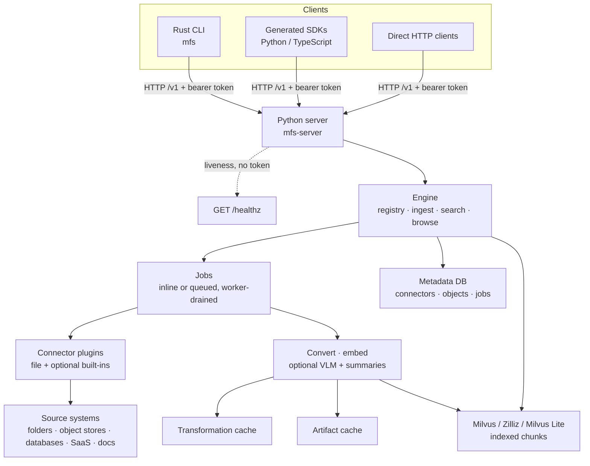

# How it works

MFS is a client/server system. A thin Rust CLI and the generated SDKs are client
surfaces; all the real work happens in a stateful Python server. The split is
deliberate: the client stays small and portable, while connectors, indexing,
retrieval, and state live in one place that you run once and point everything at.

The CLI's only job is to parse a command, resolve the endpoint and token, package
an upload when one is needed, call `/v1`, and render the result as text or JSON.
Everything stateful — what's registered, what's indexed, what's cached — belongs
to the server.

## A request, end to end

When you run `mfs search "retry budget" repo/`, the CLI resolves your server URL
and bearer token, issues `GET /v1/search`, and prints the ranked hits. On the
server, the engine turns the query into a hybrid (semantic + keyword) recall
against Milvus, scoped to the paths under that connector, and returns each hit
with the `source` URI and `locator` you need to reopen it.

Reads work the opposite way. `search` and `grep` *find*; `ls`, `tree`, `cat`,
`head`, `tail`, and `export` *fetch*. A browse read goes straight to the
connector for live bytes rather than to the index — `tree` is just repeated `ls`
calls, and `cat --locator` hands a structured locator back to the connector to
resolve. That's why the reliable pattern is always search to locate, then reopen
the exact source before trusting it.

## What the server owns

| Component | Where it lives | Responsibility |
|---|---|---|
| FastAPI app | `api/` | Wires `/v1`, bearer-token middleware, `/healthz`, error envelopes, request/response models. |
| Engine | `engine/` | Orchestrates add/sync jobs, connector registration, upload staging, object processing, search, grep, and browse. |
| Connectors | `connectors/` | Expose local and external sources as URI trees. `file` is always available; other built-ins load lazily when their optional dependencies are installed. |
| Processors | `processors/` | Convert documents to text, embed chunks, and run optional VLM image descriptions and summaries. |
| Metadata DB | `storage/metadata/` | Connector registry, object state, and jobs. SQLite by default; Postgres when configured. |
| Transformation cache | `storage/transformation_cache/` | Caches model outputs (embeddings, summaries, VLM text) so re-syncs don't recompute. |
| Artifact cache | `storage/artifact_cache.py` | Stores derived blobs such as converted document text on the filesystem. |
| Vector store | `storage/milvus.py` | Holds indexed chunks in Milvus Lite by default, or a configured Milvus/Zilliz endpoint. |
| Workers | `worker/`, `engine/job_lane/` | Drain queued jobs. A SQLite all-in-one run can drain in-process; a scaled deployment runs standalone workers. |
| Rust acceleration | `server-rs/` | Optional PyO3 extension for hot paths (directory walks, hashing, grep, tail); the server falls back to Python when it's absent. |

## The `/v1` surface

Every `/v1` request carries `Authorization: Bearer <token>` when the server has
auth configured. `GET /healthz` sits intentionally outside `/v1` and is never
token-gated, so liveness probes work without credentials.

| Group | Endpoints | Drives |
|---|---|---|
| Server | `GET /v1/server/info`, `GET /v1/status`, `GET /healthz` | `mfs status`, `mfs config show`, liveness checks |
| Ingest & jobs | `POST /v1/add`, `POST /v1/upload`, `POST /v1/files/manifest`, `PUT /v1/files/upload`, `GET /v1/jobs`, `GET /v1/jobs/{id}`, `POST /v1/jobs/{id}/cancel` | `mfs add`, upload mode, `mfs job ...` |
| Connectors | `POST /v1/connectors/probe`, `POST /v1/connectors/estimate`, `GET /v1/connectors/inspect`, `DELETE /v1/connectors` | `mfs connector ...`, `mfs remove` |
| Retrieval | `GET /v1/search`, `GET /v1/grep` | `mfs search`, `mfs grep` |
| Browse & read | `GET /v1/ls`, `GET /v1/cat`, `GET /v1/head`, `GET /v1/tail`, `GET /v1/export` | `mfs ls`, `mfs tree`, `mfs cat`, `mfs head`, `mfs tail`, `mfs export` |

The OpenAPI spec at `protocol/openapi.yaml` is the source of truth for these
paths and their schemas, and both SDKs are generated from it. See
[HTTP API](api.md) for the full contract.

## Two lanes of ingest

Indexing a source runs as a job, and a job has two parallel lanes:

- The **object lane** turns each object into searchable chunks: convert it to
  text if needed, split it, embed the chunks, and write them to Milvus. Document
  text, code, table rows, message threads, and image descriptions all flow
  through here.
- The **job lane** builds the connective tissue — directory summaries and schema
  summaries that make a large tree navigable and searchable at the folder level,
  not just the leaf.

Both lanes lean hard on the caches. Re-syncing a source only re-embeds what
actually changed, because the transformation cache already holds the model output
for everything that didn't. For the full walkthrough, see
[Ingest pipeline](ingest-pipeline.md).

## Where state lives

Run modes differ mainly in *where the state sits*, not in how the system behaves.

A local all-in-one run keeps everything under `$MFS_HOME` (default `~/.mfs`):
config, the generated server token, SQLite, the artifact cache, the ONNX model
cache, and Milvus Lite. The CLI on the same host reads `$MFS_HOME/server.token`
automatically, so a first local run needs no manual auth.

A scaled deployment externalizes each of those — Postgres for metadata,
object storage for artifacts, a managed Milvus/Zilliz endpoint for vectors — and
runs the API and workers as separate processes. The engine, connectors, and
retrieval logic are identical; only the backends behind them change. See
[Configuration](configuration.md) for the precedence rules and
[Deployment](deployment.md) for the topologies.
