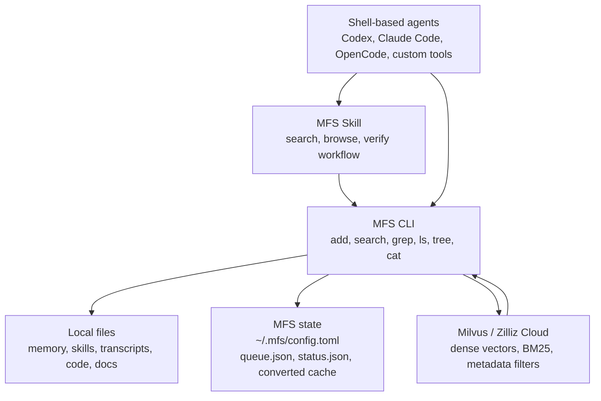
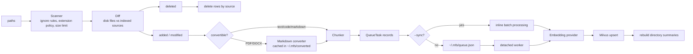
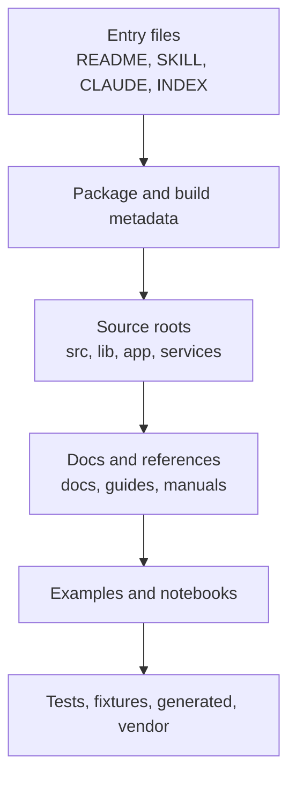
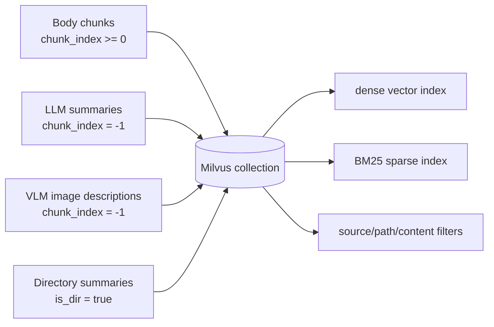
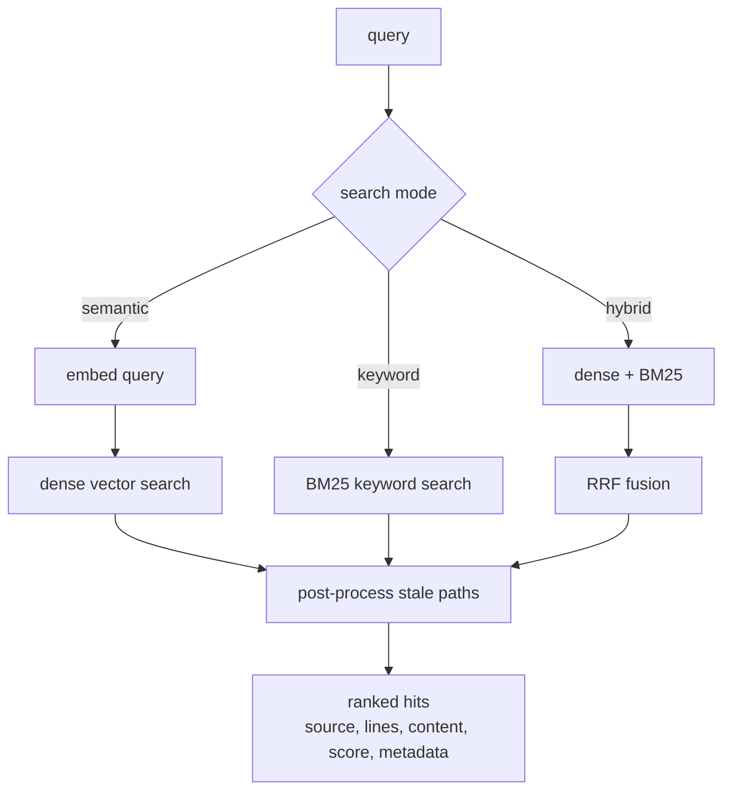
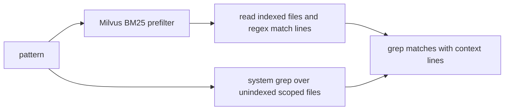
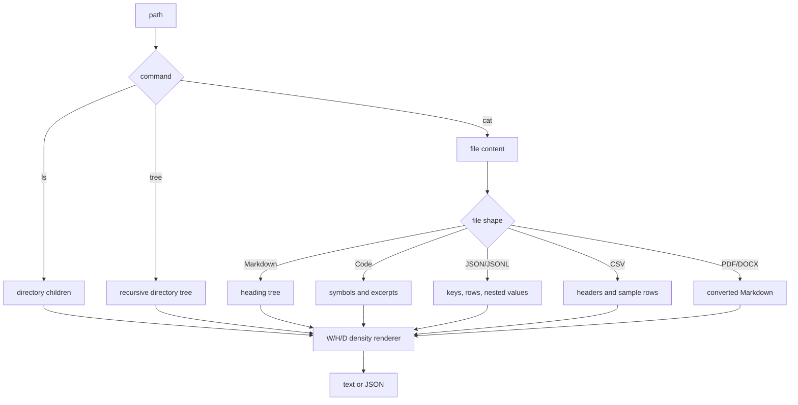
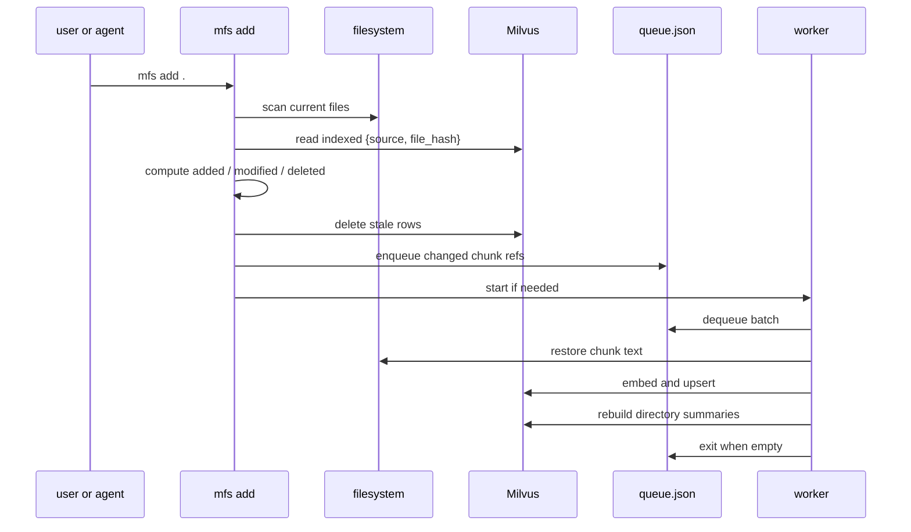

# Architecture

MFS is a small CLI layer around local files and Milvus. It has two major data
paths:

- **ingest**: turn files into indexed chunks, summaries, and metadata
- **retrieve**: combine indexed search with live filesystem browsing

## System Position



MFS does not mount a filesystem and does not require an always-on service. The
project directory stays clean; derived state lives under `~/.mfs/` by default.

## Command Surface

```text
                ┌─────────────── mfs ───────────────┐
                │                                    │
        ingest  │  add      status      remove       │
                │                                    │
        search  │  search   grep                    │
                │                                    │
        browse  │  ls       tree       cat           │
                │                                    │
        config  │  config path/show/get/set/init     │
                └────────────────────────────────────┘
```

Search commands read indexed state. Browse commands read the live filesystem and
can be used before indexing.

## Ingest Path

`mfs add <path...>` scans files, detects changes, builds chunk tasks, and either
processes them in the foreground or hands them to a short-lived worker.



Key points:

- `mtime` is used as a fast hint; file hash is the content check.
- `--force` skips the mtime shortcut and recomputes hashes.
- Modified files only re-queue chunks that changed; unchanged chunk IDs are
  preserved.
- PDF and DOCX are converted to Markdown before chunking or summarization.
- `--summarize` and `--describe` add enrichment tasks; they are opt-in.

## Queue and Worker

The async path is intentionally simple.

```text
mfs add .
  ├─ scan, diff, chunk
  ├─ write lightweight QueueTask records to ~/.mfs/queue.json
  ├─ start worker if one is not running
  └─ return to caller

worker
  ├─ dequeue batch
  ├─ restore chunk text from source file when task_type=embed_ref
  ├─ call LLM/VLM only for opt-in summary/description tasks
  ├─ embed texts in batches
  ├─ upsert rows into Milvus
  ├─ update ~/.mfs/status.json
  ├─ rebuild touched directory summaries
  └─ exit when queue is empty
```

The queue is not a durable broker. It stores references and metadata instead of
large raw chunk bodies. If the machine stops mid-index, run `mfs add .` again or
use `mfs add . --force`.

Priority ordering is applied before async enqueue:



This does not change the final index. It only makes large corpora useful earlier
while embedding is still running.

## Milvus Collection Model

All searchable records share one collection.

```text
mfs_chunks
  id             primary key, deterministic chunk id
  source         original file or directory path
  parent_dir     parent directory path
  chunk_index    body chunk index, -1 for generated enrichment, 0 for dirs
  start_line     source start line
  end_line       source end line
  chunk_text     searchable text, analyzer-enabled for BM25
  dense_vector   embedding vector
  sparse_vector  BM25 sparse vector generated by Milvus
  content_type   markdown, code, text, llm_summary, vlm_description, directory
  file_hash      source file hash
  is_dir         directory summary marker
  embed_status   complete / pending
  metadata       JSON details such as headings, language, stale state
  account_id     tenant or namespace label
```



Directory summaries are records too. They let broad queries return a directory
when the directory is the right navigation target, and they feed `mfs ls` /
`mfs tree` previews.

## Retrieval Path

`mfs search` and `mfs grep` use different routes.



Search modes:

| Mode | Route | Best for |
| --- | --- | --- |
| `hybrid` | dense + BM25 + reciprocal rank fusion | default agent search |
| `semantic` | dense vector only | paraphrased or conceptual queries |
| `keyword` | BM25 only | identifiers, exact terms, error codes |

`mfs grep` is exact search. It first uses indexed BM25 to find likely indexed
files, then verifies matches by reading file lines. For unindexed files under a
scoped directory, it can fall back to system grep.



## Browse Path

Browse commands read files directly. They are not just wrappers around search.



The density controls are shared:

| Control | Meaning |
| --- | --- |
| `-W` | width: characters per node, value, paragraph, or summary |
| `-H` | height: number of headings, rows, entries, or children |
| `-D` | depth: nested levels to expand |

This is the "look once" layer between `ls` and full-file `cat`.

## Sync and State



Default state layout:

```text
~/.mfs/
  config.toml
  milvus.db
  queue.json
  queue.json.lock
  status.json
  worker.log
  converted/
    <hash>.md
```

The collection can be rebuilt from files. The files remain the durable source.
