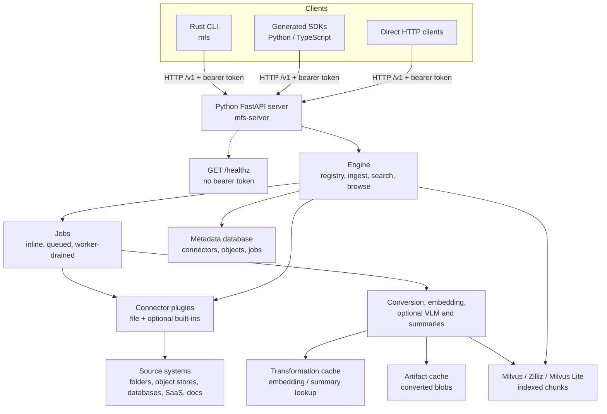

# Architecture

MFS v0.4 is a client/server system. The Rust CLI and generated SDKs are client
surfaces over the `/v1` HTTP control plane. The Python FastAPI server owns
connector execution, ingest jobs, retrieval, browsing, metadata, cache, and
Milvus/Zilliz integration.

Use this page for the system map. For runnable steps, start with
[Quickstart](getting-started.md). For exact commands, use
[CLI Reference](cli.md). For direct integration, use [HTTP API](api.md) and
[SDKs](sdks.md).

## Runtime and data flow

`search` reads indexed chunks. `grep`, `ls`, `tree`, `cat`, `head`, `tail`, and
`export` are browse/read operations: `tree` is implemented by repeated `ls`
calls, and search hits should be reopened with `cat` or a bounded read before
being used as evidence.

## Component responsibilities

| Component | Repository area | Responsibility | Go deeper |
|---|---|
| Rust CLI | `cli/` | Parses commands, resolves endpoint and token sources, packages uploads when needed, calls `/v1`, and renders JSON or text output. | [CLI Reference](cli.md) |
| OpenAPI protocol | `protocol/openapi.yaml` | Source of truth for `/v1` endpoint paths, operation IDs, and typed schemas used by docs and SDK generation. | [HTTP API](api.md) |
| Generated SDKs | `sdks/python/`, `sdks/typescript/` | Generated Python and TypeScript clients for programmatic callers. | [SDKs](sdks.md) |
| FastAPI server | `server/python/src/mfs_server/api/` | Wires the `/v1` API, bearer-token middleware, `/healthz`, error envelopes, and request/response models. | [Server](server.md), [HTTP API](api.md) |
| Engine | `server/python/src/mfs_server/engine/` | Orchestrates add/sync jobs, connector registration, upload staging, object processing, search, grep, browse, and connector removal. | [Server](server.md) |
| Connectors | `server/python/src/mfs_server/connectors/` | Expose local and external sources as URI trees; `file` is always imported and other built-in schemes are loaded lazily when optional dependencies exist. | [Connectors](connectors.md) |
| Metadata database | `server/python/src/mfs_server/storage/` | Stores connector registry rows, object state, jobs, and related metadata. SQLite is the local default; Postgres is configured through server settings. | [Configuration](configuration.md), [Deployment](deployment.md) |
| Transformation cache | `server/python/src/mfs_server/storage/` | Stores transformation lookups such as embedding and summary bytes. It defaults under `$MFS_HOME` and can share Postgres when configured. | [Configuration](configuration.md) |
| Artifact cache | `server/python/src/mfs_server/storage/` | Stores derived blobs such as converted document text and image descriptions. Local filesystem is the default; S3-compatible storage is configured through server settings. | [Configuration](configuration.md), [Deployment](deployment.md) |
| Vector database | `server/python/src/mfs_server/storage/` | Stores indexed chunks in Milvus Lite by default, or a configured Milvus/Zilliz endpoint. | [Configuration](configuration.md), [Deployment](deployment.md) |
| Workers | `server/python/src/mfs_server/engine/`, `mfs-server worker` | Drain queued jobs. SQLite all-in-one runs can use an in-process worker; api/worker deployments use a standalone worker process. | [Deployment](deployment.md), [Troubleshooting](troubleshooting.md) |
| Optional Rust acceleration | `server-rs/` | Optional PyO3 extension for server hot paths such as directory walks, hashing, grep, and tail; the server falls back to Python when it is not installed. | [Server](server.md) |

## API surface map

| Group | Endpoints | Used by |
|---|---|---|
| Server | `GET /v1/server/info`, `GET /v1/status`, `GET /healthz` | `mfs status`, `mfs config show`, liveness checks, direct clients |
| Ingest and jobs | `POST /v1/add`, `POST /v1/upload`, `POST /v1/files/manifest`, `PUT /v1/files/upload`, `GET /v1/jobs`, `GET /v1/jobs/{job_id}`, `POST /v1/jobs/{job_id}/cancel` | `mfs add`, upload mode, `mfs job ...`, SDK/API integrations |
| Connectors | `POST /v1/connectors/probe`, `POST /v1/connectors/estimate`, `GET /v1/connectors/inspect`, `DELETE /v1/connectors` | `mfs connector ...`, `mfs remove`, pre-flight checks |
| Retrieval | `GET /v1/search`, `GET /v1/grep` | `mfs search`, `mfs grep`, search integrations |
| Browse/read | `GET /v1/ls`, `GET /v1/cat`, `GET /v1/head`, `GET /v1/tail`, `GET /v1/export` | `mfs ls`, `mfs tree`, `mfs cat`, `mfs head`, `mfs tail`, `mfs export` |

Every `/v1` request requires `Authorization: Bearer <token>` when the server has
`auth_token` configured. `GET /healthz` is intentionally outside `/v1` and is
not bearer-token gated.

## Runtime modes

| Mode | What runs | Worker and state notes | Use this when |
|---|---|---|---|
| Source all-in-one | Host `mfs-server run` plus one or more `mfs` clients. | Defaults to `127.0.0.1:13619`; `$MFS_HOME` defaults to `~/.mfs`; local defaults are ONNX embeddings, Milvus Lite, SQLite, local artifact cache, and a generated server token. SQLite all-in-one runs can drain queued jobs in-process. | You are doing the first local run, evaluation, or connector development. Start with [Quickstart](getting-started.md). |
| Docker or Compose all-in-one | One container runs `mfs-server run` with persistent `/data`. | The container uses `/data` for config, token, SQLite, caches, ONNX cache, and Milvus Lite. Use `mfs add --upload` from the host unless the target path is mounted into the container and passed as a server-visible path. | You want an isolated local server or repeatable container startup. See [Deployment](deployment.md). |
| Direct client/server | CLI, SDK, or HTTP client talks to a server it cannot assume shares local paths with the client. | Set endpoint and token explicitly, and use upload mode for client-local folders. The CLI chooses upload for local paths when it detects a different server machine unless `--no-upload` is set. | You are integrating from another host, VM, container, or automation process. See [CLI Reference](cli.md), [HTTP API](api.md), and [SDKs](sdks.md). |
| Helm-rendered api/worker | The chart renders an API Deployment, Worker Deployment, and API Service. | The repository documents this as the post-v0.4 scalable direction, not the runnable v0.4 operations path. The rendered shape expects externalized state such as Postgres, object storage, and remote Milvus/Zilliz. | You are validating the chart or planning the future split. See [Deployment](deployment.md). |

## Configuration boundaries

The CLI configures client concerns: endpoint selection, profile selection,
client identity, upload decisions, and bearer-token source. The server configures
runtime concerns: namespace, auth, database, metadata, transformation cache,
artifact cache, Milvus, embeddings, summaries, VLM, conversion, workers,
chunking, and search behavior.

Key local defaults are shared through `$MFS_HOME`: the CLI can read
`$MFS_HOME/server.token` for same-host local auth, while the server stores
`server.toml`, SQLite files, local caches, Milvus Lite, and the ONNX model cache
under the same root. For precedence rules and environment overrides, see
[Configuration](configuration.md).

## Related runbooks

| Need | Page |
|---|---|
| First local run | [Quickstart](getting-started.md) |
| Search, browse, and evidence verification | [Search and Browse](search-and-browse.md) |
| Connector selection and TOML setup | [Connectors](connectors.md) |
| Exact CLI command surface | [CLI Reference](cli.md) |
| Server package map | [Server](server.md) |
| Direct `/v1` integration | [HTTP API](api.md) |
| Generated clients | [SDKs](sdks.md) |
| Source, Docker, Compose, and Helm shapes | [Deployment](deployment.md) |
| Config files, env vars, and persisted state | [Configuration](configuration.md) |
| Endpoint, auth, job, ingest, search, and browse failures | [Troubleshooting](troubleshooting.md) |
