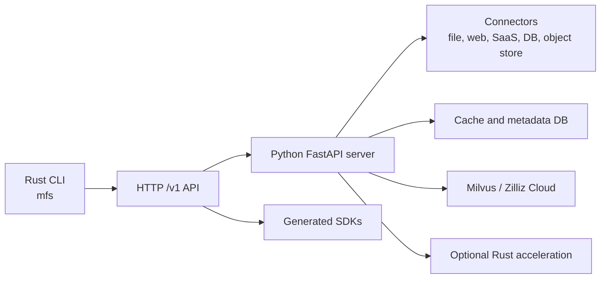

# Architecture

MFS v0.4 is a client/server system. The CLI is intentionally light: it parses
commands, packages local input when needed, calls the HTTP API, and renders
results. The server owns connector logic, indexing, retrieval, cache, and
storage.

## Main packages

| Path | Role |
|---|---|
| `cli/` | Rust CLI binary distributed as `mfs`. |
| `server/python/` | FastAPI server, connectors, ingest, retrieval, storage. |
| `server-rs/` | Optional PyO3 acceleration for server hot paths. |
| `protocol/` | OpenAPI source of truth for the HTTP API. |
| `sdks/` | Generated Python and TypeScript clients. |
| `skills/` | Agent-facing workflows for finding and ingesting data. |

## Runtime modes

The normal development shape is one server process plus one or more clients.
For local smoke tests, the server and CLI can run on the same machine. For
client/server tests, the server can run in Docker while the host uses the CLI.
