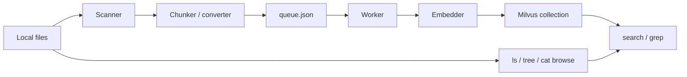

# Architecture

MFS has two paths: ingest and retrieve.



## Ingest path

`mfs add <path...>` does the indexing work in stages:

1. scan files under the requested paths
2. apply ignore rules and extension classification
3. convert PDF/DOCX to Markdown when needed
4. chunk Markdown, code, and text
5. enqueue chunk tasks
6. embed and write chunks to Milvus

Without `--sync`, steps 1-5 happen in the foreground and a detached worker
handles embedding. With `--sync`, embedding runs in the foreground with a
progress bar.

## Queue model

The queue lives at `~/.mfs/queue.json`. It is intentionally lightweight local
state, not a durable distributed queue. If a machine crashes during background
embedding, the recovery path is simple: run `mfs add . --force` or rebuild the
index from files.

Queue items store enough metadata for the worker to re-read changed files and
embed current chunks without keeping large raw text blobs in the queue.

## Priority order

When many files are queued, MFS pushes likely-useful files earlier:

- important entry files such as `README.md`, `SKILL.md`, `CONTRIBUTING.md`
- package/build files such as `pyproject.toml`, `package.json`, `go.mod`
- source directories such as `src`, `lib`, `app`, `services`
- documentation directories such as `docs`, `guides`, `reference`
- examples and notebooks after core docs/code
- generated, vendor, build, and test fixture paths later

This does not change the final index. It only improves early usefulness while
a large indexing job is still running.

## Retrieval path

`mfs search` uses a `Searcher` over Milvus:

- `hybrid`: dense vector search + BM25 + reciprocal rank fusion
- `semantic`: dense vector search only
- `keyword`: BM25 keyword search only

`mfs grep` routes exact search through indexed content where possible and falls
back to system grep for paths that are not embedded.

`mfs ls`, `mfs tree`, and `mfs cat` read the filesystem directly and render
bounded density views. They can also consult indexed summaries when available.

## Storage

Default state layout:

```text
~/.mfs/
  config.toml
  milvus.db
  queue.json
  converted/
```

The Milvus collection defaults to `mfs_chunks`. Each row represents a chunk,
summary, image description, or directory summary with metadata such as source
path, line range, content type, file hash, and account id.
