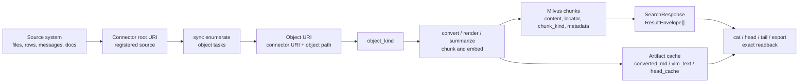

# Content Model

Use this page when you need to understand how MFS turns a source into searchable
chunks, result envelopes, and safe readback commands.

For daily commands, use [Search and Browse](search-and-browse.md). For source
setup, use [Connectors](connectors.md). For endpoint schemas, use
[HTTP API](api.md). For indexing progress, use
[Jobs and Indexing Progress](jobs.md). For provider and converter behavior, use
[Providers and Processing](providers.md). For runtime ownership, use
[Server](server.md) or [Architecture](architecture.md). For recovery, use
[Troubleshooting](troubleshooting.md).

## Lifecycle



Search is a candidate-finding step. A hit tells you which object and locator are
likely relevant; it is not evidence by itself. Reopen the object with
`mfs cat SOURCE --range A:B`, `mfs cat SOURCE --locator JSON`, `mfs head`, or
`mfs export` before quoting or acting on content.

!!! warning "Evidence safety"
    Treat `content` in a search hit as a preview. Use `source` plus `locator` to
    reopen the current object state, then cite or summarize only the readback.

## Identifiers

| Term | Where it appears | Meaning |
|---|---|---|
| Source | User-facing input such as a local path or connector target | The system MFS reads from. |
| Connector URI / root URI | Connector rows, `mfs connector list`, `mfs connector inspect` | Registered source root, such as `file://local/...`, `postgres://prod-db`, or `github://owner/repo`. |
| Object URI | `ResultEnvelope.source`, `LsEntry.path`, browse/read commands | A specific readable object under a connector root. Search returns this as `source`. |
| Object path | Server metadata and connector-relative code paths | The connector-relative part that is joined to the connector URI. |
| Locator | `ResultEnvelope.locator`, `GrepMatch.locator`, `cat --locator` | Per-hit identity inside an object. Line ranges live in `locator.lines`. |
| Metadata fields | `ResultEnvelope.metadata.fields` | Connector-selected side data copied from `metadata_fields`; useful for inspection or client-side filtering. |

Use returned object URIs exactly as MFS prints them. The server scopes search by
resolving the registered connector whose root is the longest match for the path.

## Objects and Chunks

`object_kind` is the framework processing classification chosen by a connector.
It is not the same as `LsEntry.type`, which is the browse shape `file` or `dir`.

The framework object-kind vocabulary is:

```text
document, code, image, binary, text_blob, table_rows, table_schema,
message_stream, record_collection, directory
```

| Framework `object_kind` | Current indexing path | Typical chunk kind or status |
|---|---|---|
| `document`, `code` | Read or convert text, split into line-addressed chunks, embed. | `body` |
| `image` | Generate a VLM description, then embed it when description text exists. | `vlm_description` |
| `table_rows`, `record_collection` | Render configured `text_fields`; one searchable chunk per rendered record. | `row_text` |
| `message_stream` | Aggregate messages by thread or configured group key; split long threads. | `thread_aggregate` |
| `table_schema` | Summarize schema when summaries are enabled. | `schema_summary` |
| `directory` | Directory summaries are built in a separate summary phase when summaries are enabled. | `directory_summary` |
| `binary` or `indexable = false` | Record object metadata only; skip chunking and embedding. | `not_indexed` |
| `text_blob` | Do not assume a searchable chunk; verify with `mfs ls PATH --json` before expecting search hits. | Browse-first unless object status says otherwise. |

The framework chunk-kind vocabulary is:

```text
body, row_text, thread_aggregate, record_aggregate, summary,
vlm_description, directory_summary, schema_summary
```

Current public examples and common runtime output use `body`, `row_text`,
`schema_summary`, `thread_aggregate`, `directory_summary`, and
`vlm_description`. Use the `metadata.chunk_kind` you actually see in JSON
results when filtering with `mfs search --kind ...`.

## Result Envelope

`mfs search --json` returns `SearchResponse.results`, where each result is a
`ResultEnvelope`:

```json
{
  "results": [
    {
      "source": "postgres://prod-db/public/tickets/rows.jsonl",
      "content": "subject: Login broken after SSO migration\nstatus: open",
      "score": 0.84,
      "locator": {"id": 12345},
      "metadata": {
        "kind": "search",
        "chunk_kind": "row_text",
        "fields": {"status": "open", "priority": "high"}
      }
    }
  ]
}
```

| Field | Use |
|---|---|
| `source` | Object URI to feed back to `cat`, `head`, `tail`, or `export`. |
| `content` | Preview snippet from the indexed chunk or grep match. |
| `score` | Ranking score when available; low scores are weak candidates. |
| `locator` | Per-hit identity for reopening the exact range, row, thread, or record. |
| `metadata.kind` | Runtime marker such as `search`. |
| `metadata.chunk_kind` | Chunk category; useful with `mfs search --kind ...`. |
| `metadata.fields` | Connector-selected metadata fields, not the full source record. |

## Locators and Readback

Line ranges are stored inside `locator.lines`; `lines` is reserved for this
purpose inside the locator object. There is no current runtime top-level
`lines` field to rely on.

| Hit shape | Example locator | Safe readback |
|---|---|---|
| Text, code, or document chunk | `{"lines": [42, 78]}` | `mfs cat SOURCE --range 42:78` or `mfs cat SOURCE --locator '{"lines":[42,78]}'` |
| Structured row or record | `{"id": 12345}` | `mfs cat SOURCE --locator '{"id":12345}'` |
| Composite structured key | `{"org_id": 7, "user_id": 999}` | `mfs cat SOURCE --locator '{"org_id":7,"user_id":999}'` |
| Thread aggregate | Connector thread key, sometimes with chunk window data | Use `cat --locator` with the connector locator shown by the hit or connector reference. |
| Once-per-object readable object, such as a schema or image description | `null` | Open the object with `mfs cat SOURCE`, or use `head` / `export` if size matters. |
| Directory summary | `null` | Use `mfs ls SOURCE` or `mfs tree SOURCE -L N`, then read child objects as evidence. |

Do not invent locator keys. Copy the locator from JSON output, or use the
connector reference for that scheme.

## Status Surfaces

Object-level `search_status` appears on `mfs ls PATH --json` entries. Source
availability terms are a separate protocol-level vocabulary; do not mix them.

| Surface | Values | Scope |
|---|---|---|
| `LsEntry.search_status` | `indexed`, `partial`, `not_indexed`, `null` | One listed object or entry. `null` means the entry is visible from the source but has no object metadata row. |
| Source search availability | `available`, `partial`, `building`, `unavailable` | Source-level readiness terms used by protocol references and status discussions. |

| Object status | Search meaning | User action |
|---|---|---|
| `indexed` | Chunks exist for this object. | Use search, then reopen hits before relying on them. |
| `partial` | Some chunks exist, but recall can be incomplete. | Increase `--top-k`, use keyword search or grep, and browse exact paths. |
| `not_indexed` | The object is known but has no searchable chunks. | Use `ls`, `head`, bounded `cat`, `grep`, or `export`; inspect connector config if it should be indexed. |
| `null` | The connector can list the entry, but MFS has no object row for it. | Browse directly, then re-run add or check path scope if it should be searchable. |

`chunk_max_exceeded` is not a normal hard HTTP error. It is represented as
partial search status, so search may still return candidates with incomplete
recall.

## Browseable but Not Searchable

An object can be browseable while not fully searchable when:

| Case | Why search may miss it | What still works |
|---|---|---|
| `binary` or `indexable = false` | The server records metadata but skips chunking and embedding. | `ls`, `cat --meta`, and connector-supported reads. |
| Empty or unsupported content path | Processing produced zero chunks. | `head`, bounded `cat`, `export`, or connector-specific troubleshooting. |
| Structured source without useful `text_fields` | Rows can be listed/read, but no searchable text was rendered. | `cat --range`, `head`, and connector config fixes. |
| Partial indexing | `chunk_max` or connector-side caps limited indexed chunks. | Search as a hint, then verify with browse/grep and adjust scope or config. |
| Indexing still running | Jobs have not finished writing all chunks. | `mfs job show JOB_ID`, `ls`, `grep`, and bounded reads while waiting. |

## Artifacts

Artifacts are derived per-object blobs stored separately from the source system
and the Milvus chunk rows.

| Artifact kind | Produced from | Read behavior |
|---|---|---|
| `converted_md` | Converted document text and generated markdown for supported document/web paths. | `cat`, `head`, `tail`, and `export` may read the converted text instead of raw bytes. |
| `vlm_text` | Image description text from the VLM path. | `cat` can return the description text; search uses `vlm_description` chunks when generated. |
| `head_cache` | First rows from structured objects. | `head` can serve a fast preview without rereading the full source. |

For storage backends and persisted paths, see [Configuration](configuration.md)
and [Server](server.md).
