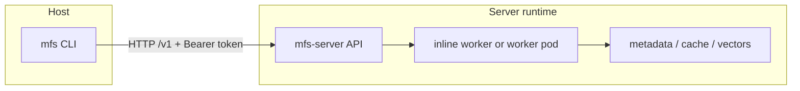

# Deployment

During the v0.4 beta, the published artifact is the Rust CLI. The Python
server is run from source or from a locally built Docker image. Use this page as
an operator guide for the four deployment shapes that exist in the repository.
For the token, secret, and process-boundary quick map, see
[Auth and Secrets](auth-and-secrets.md).
For provider extras, credentials, and first-run model cache behavior, see
[Providers and Processing](providers.md).
For state backup, restore, and reset boundaries, see
[Storage and Backup](storage-and-backup.md).

## Topology comparison

| Topology | What runs | Best for | v0.4 status | State location | Upload guidance |
|---|---|---|---|---|---|
| Source development server | Host `mfs-server run` plus host `mfs` CLI | Local evaluation and connector development | Supported beta path | `$MFS_HOME`, default `~/.mfs` | Use normal path mode when the server can read the path. |
| Docker all-in-one | One container running `mfs-server run` | Smoke tests and isolated server runtime | Runnable v0.4 topology | `/data` volume | Use `mfs add --upload` from the host unless the path is mounted into the container. |
| Docker Compose all-in-one | Compose wrapper around the same all-in-one container | Repeatable local container startup | Runnable v0.4 topology | `mfs-data` volume mounted at `/data` | Same as Docker all-in-one. |
| Helm-rendered api/worker | Kubernetes API Deployment, Worker Deployment, and API Service | Future scalable client/server topology | Rendered chart, post-v0.4 direction | Postgres, object store, and remote Milvus/Zilliz are expected | Use client/server upload mode; do not depend on shared local paths. |



!!! note "Runnable v0.4 topology"
    The repository deployment notes describe the single-container all-in-one
    server as the supported v0.4 topology. The Helm chart renders an api/worker
    split, but the chart notes describe that split as a post-v0.4 direction.

## Persisted state

MFS keeps server-owned state under `MFS_HOME`. In a source run, the default is
`~/.mfs`. In the Docker image and Compose file, `MFS_HOME` is `/data`.

| State | Source default | Container default | Why it matters |
|---|---|---|---|
| Server config | `$MFS_HOME/server.toml` | `/data/server.toml` | `mfs-server setup` writes the base server configuration here. |
| API token | `$MFS_HOME/server.token` | `/data/server.token` | Generated when no server token is configured; clients need the same bearer token. |
| Metadata database | `$MFS_HOME/metadata.db` | `/data/metadata.db` | Stores connectors, objects, jobs, and related metadata when SQLite is used. |
| Transformation cache | `$MFS_HOME/transformation_cache.db` | `/data/transformation_cache.db` | Stores transformation-cache lookup data when SQLite is used. |
| Artifact cache | `$MFS_HOME/cache` | `/data/cache` | Stores local artifact-cache blobs by default. |
| Milvus Lite database | `$MFS_HOME/milvus.db` | `/data/milvus.db` | Default vector database when no remote Milvus/Zilliz URI is configured. |
| ONNX model cache | `$MFS_HOME/onnx-cache/` | `/data/onnx-cache/` | The default local embedding model is downloaded on first embedding use and should be kept across restarts. |

!!! warning "Mount `/data` for containers"
    For Docker and Compose, mount `/data` to a persistent volume. Without it,
    SQLite metadata, Milvus Lite data, caches, and the generated server token are
    lost when the container is removed.

## Auth and tokens

The HTTP API protects `/v1` with bearer-token auth when `auth_token` is set.
`mfs-server run` and `mfs-server api` enable auth by default: if no token is
configured, the server reuses or creates `$MFS_HOME/server.token`. Set
`MFS_API_TOKEN` in the server environment to use a known token.

| Client/server placement | Token handling |
|---|---|
| Host CLI and host server share `$MFS_HOME` | The CLI can read `$MFS_HOME/server.token`; no manual token export is needed for the default local run. |
| Host CLI talks to Docker or Compose server | Export `MFS_API_URL` and `MFS_API_TOKEN` in the host shell. Read the generated token from `/data/server.token`, or start the container with a known `MFS_API_TOKEN`. |
| Direct HTTP client | Send `Authorization: Bearer <token>` on `/v1` requests. |
| Kubernetes chart | Use one shared API token for all API replicas. The chart helper reads `api-token` from the configured secret. |

!!! warning "Keep `/healthz` and `/v1` separate"
    `GET /healthz` is intentionally unauthenticated. `/v1/server/info`,
    `/v1/status`, and other `/v1` endpoints require the bearer token when auth is
    configured.

## Source development server

Run the server from the repository source tree during the v0.4 beta:

```bash
git clone https://github.com/zilliztech/mfs.git
cd mfs/server/python

# Basic source run.
uv sync

# Deployment-like source run with all connector SDKs.
uv sync --extra all-connectors

# Optional: write or update $MFS_HOME/server.toml.
uv run mfs-server setup

# Defaults to 127.0.0.1:13619.
uv run mfs-server run
```

Default first-run backends are local and require no API key:

| Concern | Default |
|---|---|
| Embeddings | Local ONNX, `gpahal/bge-m3-onnx-int8`, 1024 dimensions |
| Vector database | Milvus Lite under `$MFS_HOME` |
| Metadata database | SQLite under `$MFS_HOME` |
| Artifact cache | Local filesystem under `$MFS_HOME/cache` |
| VLM / image summaries | Off |
| API auth | Auto-generated bearer token at `$MFS_HOME/server.token` |

Verify the server from another terminal:

```bash
mfs status
curl http://127.0.0.1:13619/healthz
curl -H "Authorization: Bearer $(cat ${MFS_HOME:-$HOME/.mfs}/server.token)" \
  http://127.0.0.1:13619/v1/server/info
```

For same-host paths, let the server read the path directly:

```bash
mfs add --wait /path/to/project
```

Use upload mode only when the server process cannot read the path you pass to
the CLI.

## Docker all-in-one

Build the server image from the repository root. The Dockerfile installs the
Python server package and uses `mfs-server` as the entrypoint.

```bash
docker build -f deployments/docker/Dockerfile \
  --build-arg EXTRAS="[all-connectors]" \
  -t mfs-server:0.4.0-beta.2 .
```

Run the all-in-one server with a persistent `/data` volume:

```bash
docker run -d --name mfs-server \
  -p 13619:13619 \
  -v mfs-data:/data \
  mfs-server:0.4.0-beta.2
```

To use a known API token:

```bash
docker run -d --name mfs-server \
  -p 13619:13619 \
  -v mfs-data:/data \
  -e MFS_API_TOKEN="$MFS_API_TOKEN" \
  mfs-server:0.4.0-beta.2
```

To use Zilliz Cloud or another remote Milvus endpoint, pass the environment
variables that the server code reads:

```bash
docker run -d --name mfs-server \
  -p 13619:13619 \
  -v mfs-data:/data \
  -e MILVUS_URI="$ZILLIZ_URI" \
  -e MILVUS_TOKEN="$ZILLIZ_TOKEN" \
  mfs-server:0.4.0-beta.2
```

You can also use the fallback names read by the server:

```bash
docker run -d --name mfs-server \
  -p 13619:13619 \
  -v mfs-data:/data \
  -e ZILLIZ_URI="$ZILLIZ_URI" \
  -e ZILLIZ_TOKEN="$ZILLIZ_TOKEN" \
  mfs-server:0.4.0-beta.2
```

Connect the host CLI to the container:

```bash
export MFS_API_URL=http://127.0.0.1:13619
export MFS_API_TOKEN="$(docker exec mfs-server cat /data/server.token)"

mfs status
curl http://127.0.0.1:13619/healthz
curl -H "Authorization: Bearer $MFS_API_TOKEN" \
  http://127.0.0.1:13619/v1/server/info
```

### Host CLI with a container server

The server indexes paths from the server's filesystem. A Docker container cannot
read an arbitrary host path unless you mount it into the container. Pick one of
these modes deliberately:

| Situation | Command |
|---|---|
| The path exists only on the host | `mfs add --upload --wait /path/on/host` |
| The path is mounted into the container and you pass the server-visible path | `mfs add --no-upload --wait /path/in/container` |
| You need to resend every file | `mfs add --force-upload --wait /path/on/host` |
| Bytes are already staged but you want a full re-index | `mfs add --force-index --wait /path/on/host` |

After upload, the registered connector identity may be the uploaded connector
URI rather than the bare host path. Use these commands to inspect the current
target before scoping search or browse:

```bash
mfs connector list
mfs connector inspect TARGET
```

## Docker Compose all-in-one

The Compose file builds the same Dockerfile, runs `mfs-server run --bind
0.0.0.0:13619`, exposes host port `13619`, sets `MFS_HOME=/data`, and persists
`/data` in the `mfs-data` volume.

```bash
docker compose -f deployments/compose/docker-compose.yml up --build
```

From a second terminal:

```bash
export MFS_API_URL=http://127.0.0.1:13619
export MFS_API_TOKEN="$(
  docker compose -f deployments/compose/docker-compose.yml \
    exec -T mfs-server cat /data/server.token
)"

mfs status
curl http://127.0.0.1:13619/healthz
curl -H "Authorization: Bearer $MFS_API_TOKEN" \
  http://127.0.0.1:13619/v1/server/info
```

If you want a known token, export `MFS_API_TOKEN` before starting Compose:

```bash
export MFS_API_TOKEN="replace-with-a-shared-token"
docker compose -f deployments/compose/docker-compose.yml up --build
```

!!! warning "Milvus environment variable mismatch"
    The current Compose file sets `MFS_MILVUS_URI` and `MFS_MILVUS_TOKEN` from
    `ZILLIZ_URI` and `ZILLIZ_TOKEN`. The current server configuration code reads
    `MILVUS_URI` or `ZILLIZ_URI`, and `MILVUS_TOKEN`, `ZILLIZ_TOKEN`, or
    `ZILLIZ_API_KEY`; it does not read `MFS_MILVUS_URI` or `MFS_MILVUS_TOKEN`.
    Do not rely on the `MFS_MILVUS_*` names as effective runtime overrides until
    the deployment assets or server code are aligned.

For a Compose all-in-one server, keep the upload-mode rules from the Docker
section: use `mfs add --upload` for host-only paths, or mount a shared path and
pass the server-visible path with `--no-upload`.

## Helm-rendered api/worker topology

The Helm chart under `deployments/helm/mfs` renders:

| Rendered object | Current template behavior |
|---|---|
| API Deployment | Runs the configured image with `mfs-server api --bind 0.0.0.0:<port>`. |
| Worker Deployment | Runs the configured image with `mfs-server worker --concurrency auto`. |
| API Service | Selects the API pods and exposes the configured API port. |
| API probes | Use unauthenticated `GET /healthz` for readiness and liveness. |
| Shared environment | Rendered from `templates/_helpers.tpl` and the chart values. |

Render or lint the chart locally:

```bash
helm lint deployments/helm/mfs
helm template mfs deployments/helm/mfs \
  --set search.uri=https://xxx.zillizcloud.com
```

The default values expect a secret named `mfs-secrets`. The templates reference
these keys:

| Key | Used for |
|---|---|
| `api-token` | Shared API bearer token for all API replicas |
| `zilliz-token` | Zilliz/Milvus token rendered by the chart helper |
| `openai-api-key` | OpenAI API key when OpenAI-backed features are configured |
| `object-store-access-key` | S3-compatible artifact cache access key when object store type is `s3` |
| `object-store-secret-key` | S3-compatible artifact cache secret key when object store type is `s3` |

Example secret creation:

```bash
kubectl create secret generic mfs-secrets \
  --from-literal=api-token="$MFS_API_TOKEN" \
  --from-literal=zilliz-token="$ZILLIZ_TOKEN" \
  --from-literal=openai-api-key="$OPENAI_API_KEY" \
  --from-literal=object-store-access-key="$MFS_OBJECT_STORE_ACCESS_KEY" \
  --from-literal=object-store-secret-key="$MFS_OBJECT_STORE_SECRET_KEY"
```

Check Kubernetes health and API auth separately:

```bash
kubectl get pods -l app.kubernetes.io/name=mfs
kubectl port-forward svc/mfs-api 13619:13619

curl http://127.0.0.1:13619/healthz
curl -H "Authorization: Bearer $MFS_API_TOKEN" \
  http://127.0.0.1:13619/v1/server/info
```

!!! warning "Helm is not the runnable v0.4 topology"
    The deployment README and chart notes describe the api/worker split,
    Postgres metadata, object storage, and managed Milvus/Zilliz as the scalable
    client/server direction after v0.4. For v0.4 operations, use the all-in-one
    source, Docker, or Compose server unless you are explicitly validating the
    rendered chart.

!!! warning "Rendered Milvus env names"
    The Helm helper currently renders `MFS_MILVUS_URI` and `MFS_MILVUS_TOKEN`.
    The current server code does not read those names as Milvus/Zilliz runtime
    overrides. Treat this as a chart/runtime mismatch to resolve before relying
    on the rendered api/worker topology.

## Environment variables

| Variable | Read by | Effect | Default or note |
|---|---|---|---|
| `MFS_HOME` | Server | Sets the server home directory for config, token, SQLite files, local cache, Milvus Lite, and ONNX cache. | Defaults to `~/.mfs`; Dockerfile sets `/data`. |
| `MFS_SERVER_CONFIG` | Server | Adds an explicit config-file lookup path after the `--config` CLI argument. | Falls back through `./server.toml`, `$MFS_HOME/server.toml`, `~/.mfs/server.toml`, and `/etc/mfs/server.toml`. |
| `MFS_API_TOKEN` | Server and CLI docs | Server-side override for the bearer token; CLI-side token source for remote or container servers. | If unset on the server, `mfs-server run` and `mfs-server api` create or reuse `$MFS_HOME/server.token`. |
| `MFS_API_URL` | CLI docs | Points the CLI at a non-default server endpoint. | CLI default endpoint is `http://127.0.0.1:13619`. |
| `MILVUS_URI` | Server | Primary runtime override for Milvus Lite, Milvus, or Zilliz Cloud URI. | Defaults to `$MFS_HOME/milvus.db`. |
| `MILVUS_TOKEN` | Server | Primary runtime override for the Milvus/Zilliz token. | Empty by default. |
| `ZILLIZ_URI` | Server | Fallback URI name accepted for Zilliz Cloud. | Used only if `MILVUS_URI` is unset. |
| `ZILLIZ_TOKEN` | Server | Fallback token name accepted for Zilliz Cloud. | Used only if `MILVUS_TOKEN` is unset. |
| `ZILLIZ_API_KEY` | Server | Additional fallback token name accepted for Zilliz Cloud. | Used only if `MILVUS_TOKEN` and `ZILLIZ_TOKEN` are unset. |
| `OPENAI_API_KEY` | OpenAI SDK / deployment assets | Required only when OpenAI-backed embedding, VLM, or summary settings are selected. | Default embedding provider is local ONNX, so no OpenAI key is required for the default path. |
| `MFS_METADATA_DSN` | Server | Sets the unified database backend to Postgres and applies it to metadata. | If unset, metadata uses SQLite under `MFS_HOME`. |
| `MFS_TX_CACHE_DSN` | Server | Optional Postgres DSN for transformation cache. | Takes effect only when `MFS_TX_CACHE_PG` is also set. |
| `MFS_TX_CACHE_PG` | Server | Opts the transformation cache into Postgres. | Without it, the transformation cache keeps the default backend. |
| `MFS_OBJECT_STORE_BUCKET` | Server | Switches artifact cache to the S3-compatible backend and sets the bucket. | If unset, artifact cache uses local filesystem. |
| `MFS_OBJECT_STORE_ENDPOINT` | Server | S3-compatible endpoint URL. | Used when `MFS_OBJECT_STORE_BUCKET` is set. |
| `MFS_OBJECT_STORE_REGION` | Server | S3-compatible region. | Used when `MFS_OBJECT_STORE_BUCKET` is set. |
| `MFS_OBJECT_STORE_PREFIX` | Server | S3-compatible object prefix. | Used when `MFS_OBJECT_STORE_BUCKET` is set. |
| `MFS_OBJECT_STORE_ACCESS_KEY` | Server | S3-compatible access key. | Used when `MFS_OBJECT_STORE_BUCKET` is set. |
| `MFS_OBJECT_STORE_SECRET_KEY` | Server | S3-compatible secret key. | Used when `MFS_OBJECT_STORE_BUCKET` is set. |
| `MFS_SUMMARY_ENABLED` | Server | Enables or disables directory summaries from the environment. | Truthy values are `1`, `true`, `yes`, and `on`. |
| `MFS_MILVUS_URI` / `MFS_MILVUS_TOKEN` | Deployment assets only | Currently rendered or set by Compose/Helm assets. | Not read by the current server config code as runtime Milvus overrides. |

## Health and readiness checklist

Use this ladder to separate process health, auth, server state, and indexing
state:

| Check | Command | Success signal |
|---|---|---|
| Process health | `curl http://127.0.0.1:13619/healthz` | JSON `{"status":"ok"}` |
| Authenticated server info | `curl -H "Authorization: Bearer $MFS_API_TOKEN" http://127.0.0.1:13619/v1/server/info` | Server info JSON with version, machine id, and namespace |
| CLI connection | `mfs status` | JSON object with `connectors` and `jobs` |
| Jobs | `mfs job list` | Recent job records |
| Connector state | `mfs connector list` and `mfs connector inspect TARGET` | Registered connector URI and object/job summaries |
| Search and browse | `mfs search QUERY TARGET`, `mfs ls TARGET`, `mfs cat PATH --range 1:20` | Search hits and readable source content |

## Beta limitations and operational notes

| Limitation or risk | Operator action |
|---|---|
| The v0.4 beta publishes the CLI; the server is run from source or a local Docker image. | Pin the CLI version and build the server image from the same checkout you are testing. |
| The HTTP API may shift before v0.4 stable. | Avoid long-lived unpinned integrations against the beta API. |
| The default local ONNX model downloads on first embedding use. | Persist `$MFS_HOME/onnx-cache/` or `/data/onnx-cache/` to avoid repeated downloads. |
| Docker and Compose isolate the server filesystem from host paths. | Use `mfs add --upload` unless the target path is mounted and you pass the server-visible path. |
| Compose and Helm assets mention `MFS_MILVUS_*`, but server config reads `MILVUS_*` and `ZILLIZ_*`. | Use verified runtime variable names or `server.toml`; treat the deployment asset names as a mismatch until aligned. |
| The Helm chart renders an api/worker split that the deployment notes describe as post-v0.4 direction. | Use the all-in-one topology for runnable v0.4 operations; use Helm rendering for review or future topology validation. |

## Related guides

| Guide | Use it for |
|---|---|
| [Quickstart](getting-started.md) | First local source run and search/read verification. |
| [Configuration](configuration.md) | Server config lookup, backend defaults, auth, and environment settings. |
| [Storage and Backup](storage-and-backup.md) | State locations, backup targets, restore order, and safe reset boundaries. |
| [Auth and Secrets](auth-and-secrets.md) | Which process reads each token or secret, deployment injection paths, and first auth recovery commands. |
| [Providers and Processing](providers.md) | Embedding, summary, VLM, converter setup, and provider runtime requirements. |
| [CLI Reference](cli.md) | Current command names, flags, profiles, and upload options. |
| [Search and Browse](search-and-browse.md) | Search, list, read, and verify indexed content after deployment. |
| [Troubleshooting](troubleshooting.md) | Diagnose endpoint, auth, upload, connector, and indexing failures. |
| [Development](development.md) | Local package setup, checks, and OpenAPI-to-SDK regeneration. |

<details>
<summary>Minimal all-in-one smoke test</summary>

```bash
# 1. Create a tiny folder to index.
mkdir -p /tmp/mfs-quickstart
cat > /tmp/mfs-quickstart/README.md <<'EOF'
MFS v0.4 uses a Rust CLI and a Python FastAPI server.
The default server listens on 127.0.0.1:13619.
EOF

# 2. Start a source server or container server.
export MFS_API_URL=http://127.0.0.1:13619

# 3. Export MFS_API_TOKEN if the CLI cannot read the server token locally.
mfs status

# 4. Same host or shared path:
mfs add --wait /tmp/mfs-quickstart

# For Docker or a remote server, use upload instead:
# mfs add --upload --wait /tmp/mfs-quickstart

# 5. Verify retrieval and exact reads.
mfs search "FastAPI server default endpoint" /tmp/mfs-quickstart --top-k 5
mfs ls /tmp/mfs-quickstart
mfs cat /tmp/mfs-quickstart/README.md --range 1:20
```

</details>
