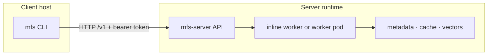

# Deployment

You run one `mfs-server`; everything else points at it. This page is the
operator's guide to the shapes that server can take — from a local server on
your laptop to a container to a Kubernetes split — and how a client reaches each
one.

The server installs from PyPI (`pip install mfs-server`) or runs from a
container you build from the repository. For the credential boundary see
[Auth and secrets](auth-and-secrets.md); for model/provider setup see
[Providers and processing](providers.md); for backup and restore see
[Storage and backup](storage-and-backup.md).

## The shapes

| Topology | What runs | Best for | State lives in |
|---|---|---|---|
| Local server | `mfs-server run` + the `mfs` CLI on one host | Local use, evaluation, connector development | `$MFS_HOME` (default `~/.mfs`) |
| Docker all-in-one | One container running `mfs-server run` | An isolated, repeatable server | a `/data` volume |
| Compose all-in-one | The same container wrapped in Compose | Repeatable container startup | the `mfs-data` volume at `/data` |
| Kubernetes api/worker | Separate API and worker Deployments + a Service | Horizontal scale | Postgres, object storage, managed Milvus/Zilliz |



The first three are all-in-one: one process (or container) holds the API, the
worker, and local state. The Kubernetes split is the scale-out target — separate
API and worker pods against externalized state — and is the direction the
architecture is built for. Use an all-in-one server for everyday operation; reach
for the chart when you actually need to scale.

## Persisted state

The server keeps everything it owns under one root: `$MFS_HOME` (default
`~/.mfs`) for a source run, `/data` in the container images.

| State | File | Why it matters |
|---|---|---|
| Server config | `server.toml` | Written by `mfs-server setup`. |
| API token | `server.token` | Generated when none is configured; clients need the same token. |
| Metadata DB | `metadata.db` | Connectors, objects, jobs (SQLite default). |
| Transformation cache | `transformation_cache.db` | Cached model outputs, so re-syncs don't recompute. |
| Artifact cache | `cache/` | Converted document blobs. |
| Vector DB | `milvus.db` | Milvus Lite, when no remote endpoint is configured. |
| ONNX model cache | `onnx-cache/` | The default embedding model, preloaded at startup. |

!!! warning "Mount `/data` for containers"
    Mount `/data` to a persistent volume. Without it, the metadata, vectors,
    caches, and the generated token all vanish when the container is removed.

## Auth and tokens

`mfs-server run` and `mfs-server api` enable bearer auth by default: if no token
is configured they reuse or create `$MFS_HOME/server.token`. Set `MFS_API_TOKEN`
in the server environment to pin a known token. `GET /healthz` is always
unauthenticated; every `/v1` endpoint needs the token when auth is on.

| Client / server placement | How the client gets the token |
|---|---|
| CLI and server share `$MFS_HOME` | The CLI reads `$MFS_HOME/server.token` automatically — nothing to set. |
| CLI → container server | Export `MFS_API_URL` and `MFS_API_TOKEN`; read the token from `/data/server.token` or start the container with a known `MFS_API_TOKEN`. |
| Direct HTTP client | Send `Authorization: Bearer <token>` on `/v1`. |
| Kubernetes | One shared API token for all API replicas, from the configured secret. |

## Local server

```bash
pip install mfs-server                       # base server
pip install "mfs-server[all-connectors]"     # + every connector's SDK

mfs-server setup                     # optional: write $MFS_HOME/server.toml
mfs-server run                       # binds 127.0.0.1:13619
```

To run from a checkout instead — for connector development or local changes —
`uv sync` in `server/python` and prefix the commands with `uv run` (see
[Development](development.md)).

The first-run defaults are fully local and need no API key: ONNX embeddings
(`gpahal/bge-m3-onnx-int8`, 1024 dims), Milvus Lite, SQLite, a local artifact
cache, VLM off, and an auto-generated bearer token. Verify from another terminal:

```bash
mfs status
curl http://127.0.0.1:13619/healthz
```

For same-host paths the server reads the path directly (`mfs add /path/to/project`).
Use upload mode only when the server process can't see the path you pass.

## Docker all-in-one

Build the image from the repository root and run it with a persistent `/data`
volume:

```bash
docker build -f deployments/docker/Dockerfile \
  --build-arg EXTRAS="[all-connectors]" -t mfs-server .

docker run -d --name mfs-server -p 13619:13619 -v mfs-data:/data mfs-server
```

Pin a known token, or point the server at Zilliz Cloud / a remote Milvus, with
environment variables:

```bash
docker run -d --name mfs-server -p 13619:13619 -v mfs-data:/data \
  -e MFS_API_TOKEN="$MFS_API_TOKEN" \
  -e MILVUS_URI="$ZILLIZ_URI" \
  -e MILVUS_TOKEN="$ZILLIZ_TOKEN" \
  mfs-server
```

Connect the host CLI to the container:

```bash
export MFS_API_URL=http://127.0.0.1:13619
export MFS_API_TOKEN="$(docker exec mfs-server cat /data/server.token)"
mfs status
```

### Indexing host paths from a container

A container can't read an arbitrary host path unless you mount it. Choose a mode
deliberately:

| Situation | Command |
|---|---|
| The path exists only on the host | `mfs add --upload /path/on/host` |
| The path is mounted into the container | `mfs add --no-upload /path/in/container` |
| Resend every file | `mfs add --force-upload /path/on/host` |
| Bytes already staged, force a full re-index | `mfs add --force-index /path/on/host` |

After an upload the registered connector identity may be the uploaded URI rather
than the bare host path — `mfs connector list` / `inspect TARGET` shows the real
target before you scope a search.

## Docker Compose all-in-one

The Compose file builds the same image, runs `mfs-server run --bind
0.0.0.0:13619`, exposes port `13619`, sets `MFS_HOME=/data`, and persists the
`mfs-data` volume:

```bash
docker compose -f deployments/compose/docker-compose.yml up --build
```

```bash
export MFS_API_URL=http://127.0.0.1:13619
export MFS_API_TOKEN="$(docker compose -f deployments/compose/docker-compose.yml \
  exec -T mfs-server cat /data/server.token)"
mfs status
```

To pin a known token, export `MFS_API_TOKEN` before `up`. The upload rules from
the Docker section apply unchanged.

## Kubernetes api/worker

The chart under `deployments/helm/mfs` renders an API Deployment
(`mfs-server api`), a Worker Deployment (`mfs-server worker --concurrency auto`),
and an API Service. Probes use unauthenticated `GET /healthz`. This shape expects
externalized state — Postgres, object storage, and a managed Milvus/Zilliz
endpoint.

```bash
helm lint deployments/helm/mfs
helm template mfs deployments/helm/mfs --set search.uri=https://xxx.zillizcloud.com
```

It expects a secret (default `mfs-secrets`) with these keys:

| Key | Used for |
|---|---|
| `api-token` | Shared API bearer token for all replicas |
| `zilliz-token` | Zilliz / Milvus token |
| `openai-api-key` | OpenAI key, when OpenAI-backed features are configured |

```bash
kubectl create secret generic mfs-secrets \
  --from-literal=api-token="$MFS_API_TOKEN" \
  --from-literal=zilliz-token="$ZILLIZ_TOKEN" \
  --from-literal=openai-api-key="$OPENAI_API_KEY"

kubectl port-forward svc/mfs-api 13619:13619
curl http://127.0.0.1:13619/healthz
```

## Native acceleration (optional)

A few server hot paths — the gitignore directory walk, parallel content hashing,
linear `grep`, and `tail` — have an optional Rust extension (`mfs-server-rs`,
built from `server-rs/`). It is **never required**: when the wheel isn't
installed, the server uses an equivalent pure-Python path and behaves
identically, just slower on large inputs. So treat it as a performance knob, not
a dependency.

It is **not** published to PyPI. Build it locally and install it into the same
environment as the server.

**In the Docker image**, pass `--build-arg ACCEL=1` — a separate build stage
compiles the wheel with a Rust toolchain and installs it; the default
(`ACCEL=0`) ships a pure-Python image and never pulls the toolchain:

```bash
docker build -f deployments/docker/Dockerfile \
  --build-arg ACCEL=1 --build-arg EXTRAS="[all-connectors]" -t mfs-server .
```

**For a source / virtualenv install**, build the wheel with maturin (needs a
Rust toolchain) into the server's environment:

```bash
cd server-rs
uv run --project ../server/python maturin develop --release   # in-place
# or: maturin build --release && pip install target/wheels/mfs_server_rs-*.whl
```

The server detects it automatically on the next start — nothing to configure.

## Environment variables

| Variable | Effect | Default |
|---|---|---|
| `MFS_HOME` | Server home for config, token, SQLite, caches, Milvus Lite, ONNX cache. | `~/.mfs` (containers: `/data`) |
| `MFS_SERVER_CONFIG` | Explicit config-file path, after the `--config` flag. | falls back through `./server.toml`, `$MFS_HOME/server.toml`, `/etc/mfs/server.toml` |
| `MFS_API_TOKEN` | Server: pin the bearer token. CLI: token for a remote/container server. | server generates `$MFS_HOME/server.token` if unset |
| `MFS_API_URL` | CLI: point at a non-default endpoint. | `http://127.0.0.1:13619` |
| `MILVUS_URI` | Milvus Lite path, or a Milvus/Zilliz endpoint. | `$MFS_HOME/milvus.db` |
| `MILVUS_TOKEN` | Milvus/Zilliz token. | empty |
| `ZILLIZ_URI` / `ZILLIZ_TOKEN` / `ZILLIZ_API_KEY` | Accepted fallbacks for the Zilliz endpoint and token. | used when the `MILVUS_*` form is unset |
| `OPENAI_API_KEY` | Needed only when an OpenAI-backed embedding/VLM/summary provider is selected. | unused on the default local path |
| `MFS_METADATA_DSN` | Switch metadata to Postgres. | SQLite under `$MFS_HOME` |
| `MFS_TX_CACHE_DSN` + `MFS_TX_CACHE_PG` | Put the transformation cache on Postgres. | default backend |
| `MFS_SUMMARY_ENABLED` | Toggle directory summaries. | per config |

## Health ladder

Climb this to localize a problem — process, then auth, then state, then indexing:

| Check | Command | Healthy signal |
|---|---|---|
| Process | `curl …/healthz` | `{"status":"ok"}` |
| Auth + server info | `curl -H "Authorization: Bearer $MFS_API_TOKEN" …/v1/server/info` | version, machine id, namespace |
| CLI connection | `mfs status` | JSON with `connectors` and `jobs` |
| Jobs | `mfs job list` | recent job records |
| Connectors | `mfs connector list` | registered connector URIs |
| Search & browse | `mfs search QUERY TARGET`, `mfs cat PATH --range 1:20` | hits and readable content |

<details>
<summary>Minimal all-in-one smoke test</summary>

```bash
mkdir -p /tmp/mfs-quickstart
cat > /tmp/mfs-quickstart/README.md <<'EOF'
MFS uses a Rust CLI and a Python server.
The default server listens on 127.0.0.1:13619.
EOF

export MFS_API_URL=http://127.0.0.1:13619
mfs status

mfs add /tmp/mfs-quickstart          # or: mfs add --upload ... for a container/remote server
mfs job show JOB_ID

mfs search "default endpoint" /tmp/mfs-quickstart --top-k 5
mfs cat /tmp/mfs-quickstart/README.md --range 1:20
```

</details>
