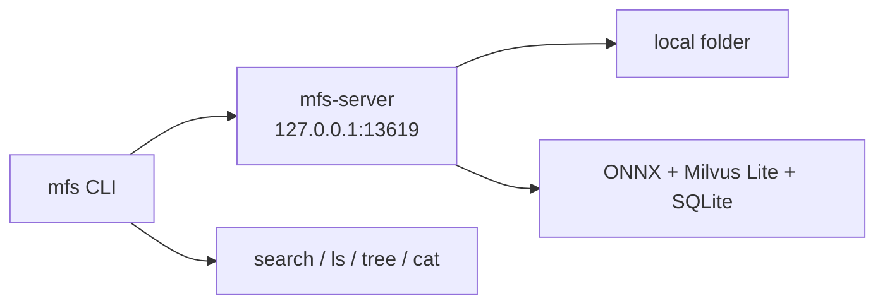

# Quickstart

This page is a first-run runbook for MFS v0.4. The CLI is a Rust binary named
`mfs`; the server is a Python FastAPI app named `mfs-server`. The CLI sends HTTP
requests to the server, and the server owns connectors, indexing, embeddings,
search, and browsing.



## What you will verify

| Checkpoint | Success signal |
|---|---|
| CLI installed | `mfs --version` prints a v0.4 CLI version. |
| Server running | `mfs status` returns a JSON object with `connectors` and `jobs`. |
| Auth wired locally | No manual token is needed when CLI and server share `$MFS_HOME`. |
| Folder queued | `mfs add <path>` returns a queued job id. |
| Search and browse work | `mfs search`, `mfs ls`, `mfs tree`, and `mfs cat` return content from the same folder. |

## 1. Install the Rust CLI

Install the published CLI release:

```bash
curl --proto '=https' --tlsv1.2 -LsSf \
  https://github.com/zilliztech/mfs/releases/download/v0.4.0-beta.2/mfs-cli-installer.sh | sh
```

Or install from crates.io:

```bash
cargo install mfs-cli --version 0.4.0-beta.2
```

Verify the binary:

```bash
mfs --version
```

Expected checkpoint:

```text
mfs 0.4...
```

## 2. Run the Python server from source

During the v0.4 beta, run the server from the repository source tree:

```bash
git clone https://github.com/zilliztech/mfs.git
cd mfs/server/python
uv sync
uv run mfs-server setup
uv run mfs-server run
```

`mfs-server setup` writes the server config to `$MFS_HOME/server.toml`. If
`MFS_HOME` is not set, MFS uses `~/.mfs`. You can press Enter through the setup
wizard to keep the local defaults:

| Server concern | Default first-run backend |
|---|---|
| Embeddings | Local ONNX, `gpahal/bge-m3-onnx-int8`, 1024 dimensions |
| Vector database | Milvus Lite, `$MFS_HOME/milvus.db` |
| Database | SQLite for connector state, object state, jobs, and transformation-cache lookup |
| Artifact cache | Local filesystem under `$MFS_HOME/cache` |
| API auth | Auto-generated bearer token at `$MFS_HOME/server.token` |
| Image summaries / VLM | Off |

!!! note "First ONNX run"
    The first local embedding run may download the ONNX model into
    `$MFS_HOME/onnx-cache/`. Keep that directory if you want later indexing runs
    to reuse the model.

By default, `mfs-server run` binds to `127.0.0.1:13619`. Leave this terminal
open.

## 3. Verify the CLI/server connection

Open a second terminal. If you kept the default endpoint, no extra environment
variables are required:

```bash
mfs status
```

Expected shape with a fresh `$MFS_HOME`:

```json
{
  "connectors": [],
  "jobs": {}
}
```

If this host already has MFS state, `connectors` or `jobs` may not be empty.
The checkpoint is that the CLI receives authenticated JSON from the server.

The server protects `/v1` with bearer-token auth by default. On the same host,
the CLI automatically reads `$MFS_HOME/server.token`, so a local first run does
not need `MFS_API_TOKEN`.

If you changed the endpoint, point the CLI at it:

```bash
export MFS_API_URL=http://127.0.0.1:13619
mfs status
```

For persistent remote profiles, see [CLI Reference](cli.md). For server and
environment settings, see [Configuration](configuration.md).

## 4. Create a small folder to index

Use a tiny folder first. This keeps the first model download and indexing run
easy to reason about:

```bash
mkdir -p /tmp/mfs-quickstart/notes
cat > /tmp/mfs-quickstart/README.md <<'EOF'
# MFS quickstart notes

MFS v0.4 uses a Rust CLI and a Python FastAPI server.
The default server listens on 127.0.0.1:13619.
EOF

cat > /tmp/mfs-quickstart/notes/search.md <<'EOF'
# Search checklist

Use mfs search when words may not match exactly.
Use mfs grep when the literal token matters.
Use mfs cat with --range to verify exact context.
EOF
```

## 5. Add the folder and watch indexing

For a local first run, let the server read the same host path:

```bash
mfs add /tmp/mfs-quickstart
```

Expected checkpoint:

```text
queued (job JOB_ID). Worker running in background -- run `mfs status` to check progress.
```

The job id differs per run. The important signal is that `mfs job show JOB_ID`
eventually reaches `succeeded` and `failed_objects` is `0`.

You can inspect server state at any point:

```bash
mfs status
mfs job list
mfs job show JOB_ID
mfs connector list
```

For job ids and progress states, see
[Jobs and Indexing Progress](jobs.md).

## 6. Search, browse, and read

Search within the indexed folder:

```bash
mfs search "FastAPI server default endpoint" /tmp/mfs-quickstart --top-k 5
```

Expected output includes matching source URIs and scores. For a local path, the
source URI contains `file://local` plus the absolute file path:

```text
file://local/tmp/mfs-quickstart/README.md  score=...
   MFS v0.4 uses a Rust CLI and a Python FastAPI server.
```

Search the whole namespace only when you intentionally want every registered
source:

```bash
mfs search "literal token matters" --all --top-k 5
```

Browse the indexed folder:

```bash
mfs ls /tmp/mfs-quickstart
mfs tree /tmp/mfs-quickstart -L 2
```

Read exact content before you trust a search hit:

```bash
mfs cat /tmp/mfs-quickstart/README.md --range 1:6
mfs cat /tmp/mfs-quickstart/notes/search.md --peek
```

Use literal search when the exact token matters:

```bash
mfs grep "127.0.0.1:13619" /tmp/mfs-quickstart
```

For more retrieval patterns, continue to [Search and Browse](search-and-browse.md).

## 7. Use upload mode for true client/server runs

The local command above works when `mfs-server` can read the path you pass to
`mfs add`. That is true for a same-host shell where the server and CLI share the
filesystem.

Use upload mode when the server cannot read the client path, such as a Docker
server, a remote VM, or a different host:

```bash
mfs add --upload /tmp/mfs-quickstart
```

Upload mode scans the client folder, sends changed files to the server, and
indexes the staged copy. Use `--force-upload` only when you need to resend every
file; use `--force-index` when the server already has the staged bytes but you
want a full re-index.

| Situation | Command |
|---|---|
| CLI and server run on the same host and share paths | `mfs add /path/to/folder` |
| Server runs in Docker or on another host | `mfs add --upload /path/to/folder` |
| Remote endpoint is set in `MFS_API_URL` and the target is a local path | The CLI auto-selects upload unless `--no-upload` is set. |
| Server can read a shared mounted path even though endpoint looks remote | `mfs add --no-upload /shared/path` |

For deployment topologies, see [Deployment](deployment.md). If upload or auth
does not behave as expected, see [Troubleshooting](troubleshooting.md).

## Where to go next

| Next page | Use it for |
|---|---|
| [Configuration](configuration.md) | Change embedding, Milvus, database, cache, auth, and environment settings. |
| [Search and Browse](search-and-browse.md) | Learn the search -> browse -> read verification loop. |
| [CLI Reference](cli.md) | Check command names and common options. |
| [Deployment](deployment.md) | Move from same-host development to Docker or hosted server shapes. |
| [Troubleshooting](troubleshooting.md) | Fix connection, upload, first-indexing, or docs-build issues. |
