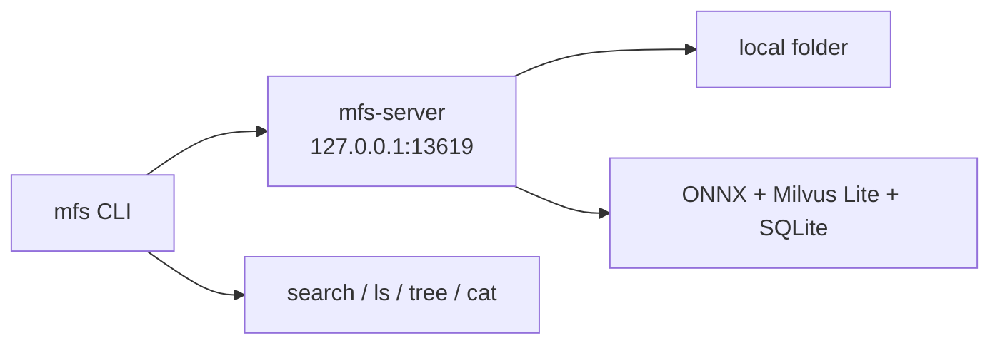

# Quickstart

The fastest way to run MFS is to let your agent drive it: install the two skills,
then ask in plain language. The agent installs the CLI, starts a local server, and
runs the commands for you. Prefer to do everything by hand? Jump to
[the manual path](#the-manual-path) — it's the same flow, one command at a time,
and it's worth reading even if you use the skills, because it shows what's
happening underneath.

## Install the skills

```bash
# every project + every supported agent (drop -g for the current project only)
npx skills add zilliztech/mfs --all -g
```

This installs two skills: **mfs-ingest** (bring sources in and keep them fresh)
and **mfs-find** (search and browse what's ingested).

<details>
<summary>Install to a specific agent</summary>

Pass one or more `-a <agent>`:

```bash
npx skills add zilliztech/mfs -a claude-code -a codex -g
```

`<agent>` can be `claude-code`, `codex`, `cursor`, `windsurf`, `github-copilot`,
`gemini-cli`, `opencode`, `zed`, `cline`, `continue` — 70+ agents in all.

</details>

<details>
<summary>Check for updates</summary>

```bash
npx skills check
npx skills update
```

For project-level installs, re-run the `npx skills add` command to update.

</details>

## Let your agent drive it

Open your agent (Claude Code, Codex, …) and ask in plain language. First, ingest
something:

```text
Use the mfs-ingest skill to spin up a tiny hello-world project in /tmp/hello-mfs
and ingest it
```

Then search and read across it:

```text
Use the mfs-find skill to find where the greeting is printed in the hello-mfs
project, and show me the exact lines
```

That's it — you're running. From here, point MFS at your real sources;
[Connectors](connectors.md) covers each one.

!!! note "The first run is a one-time setup"
    The agent walks you through it: it installs the `mfs` CLI, starts a local
    server, and downloads a ~600 MB local embedding model into `~/.mfs/`. Give it
    a minute. After that the whole stack runs **locally and offline — no API key,
    no GPU, no cloud account.** Already have an embedding-service key (OpenAI, …)?
    Point the server at it instead and skip the download — see
    [Configuration](configuration.md).

## The manual path

Under the skills is a Rust CLI (`mfs`) talking to a Python server (`mfs-server`)
over HTTP. Here is the same first run, done by hand.



### 1. Install the CLI

```bash
curl --proto '=https' --tlsv1.2 -LsSf \
  https://github.com/zilliztech/mfs/releases/latest/download/mfs-cli-installer.sh | sh
```

Or from crates.io:

```bash
cargo install mfs-cli
```

```bash
mfs --version
```

On macOS, run `xattr -d com.apple.quarantine $(which mfs)` once if you're prompted
about an unidentified developer.

### 2. Run the server

```bash
uv tool install mfs-server
mfs-server setup
mfs-server run
```

Add the connectors you need with extras, e.g.
`uv tool install "mfs-server[all-connectors]"`. To work from a checkout instead, see
[Development](development.md).

`mfs-server setup` writes the server config to `$MFS_HOME/server.toml` (default
`~/.mfs`). Press Enter through the wizard to keep the local defaults:

| Server concern | Default first-run backend |
|---|---|
| Embeddings | Local ONNX, `gpahal/bge-m3-onnx-int8`, 1024 dimensions |
| Vector database | Milvus Lite, `$MFS_HOME/milvus.db` |
| Metadata database | SQLite, for connectors, objects, jobs, and the transformation-cache lookup |
| Artifact cache | Local filesystem under `$MFS_HOME/cache` |
| API auth | Auto-generated bearer token at `$MFS_HOME/server.token` |
| Image summaries / VLM | Off |

`mfs-server run` preloads the local ONNX model on first start, downloading it into
`$MFS_HOME/onnx-cache/` if it isn't cached. It binds `127.0.0.1:13619`. Leave this
terminal open.

### 3. Verify the connection

In a second terminal, with the default endpoint, no environment variables are
needed:

```bash
mfs status
```

A fresh `$MFS_HOME` returns:

```json
{
  "connectors": [],
  "jobs": {}
}
```

The server protects `/v1` with a bearer token by default; on the same host the
CLI reads `$MFS_HOME/server.token` automatically. If you changed the endpoint,
point the CLI at it:

```bash
export MFS_API_URL=http://127.0.0.1:13619
```

### 4. Index a folder

Start small so the first run is easy to reason about:

```bash
mkdir -p /tmp/mfs-quickstart/notes
cat > /tmp/mfs-quickstart/README.md <<'EOF'
# MFS quickstart notes

MFS uses a Rust CLI and a Python server.
The default server listens on 127.0.0.1:13619.
EOF

cat > /tmp/mfs-quickstart/notes/search.md <<'EOF'
# Search checklist

Use mfs search when words may not match exactly.
Use mfs grep when the literal token matters.
Use mfs cat with --range to verify exact context.
EOF
```

For a local run, let the server read the same-host path directly:

```bash
mfs add /tmp/mfs-quickstart
```

`mfs add` returns a job id immediately and indexes in the background. Watch it
reach `succeeded`:

```bash
mfs status
mfs job list
mfs job show JOB_ID
```

See the [job states](cli.md#jobs) for what each status means.

### 5. Search, browse, and read

Search within the indexed folder:

```bash
mfs search "FastAPI server default endpoint" /tmp/mfs-quickstart --top-k 5
```

A hit looks like this — the `file://local` URI plus the absolute path is what you
feed back to `cat`:

```text
file://local/tmp/mfs-quickstart/README.md  score=...
   MFS uses a Rust CLI and a Python server.
```

Search every registered source at once only when you mean to:

```bash
mfs search "literal token matters" --all --top-k 5
```

Browse the tree and read exact content before trusting a hit:

```bash
mfs ls /tmp/mfs-quickstart
mfs tree /tmp/mfs-quickstart -L 2
mfs cat /tmp/mfs-quickstart/README.md --range 1:6
mfs grep "127.0.0.1:13619" /tmp/mfs-quickstart
```

[Search and browse](search-and-browse.md) covers the full retrieval loop.

### 6. Upload mode, for a real client/server split

The commands above assume `mfs-server` can read the path you pass to `mfs add` —
true on a same-host shell. When the server can't see the client's filesystem (a
Docker server, a remote VM, a different host), use upload mode:

```bash
mfs add --upload /tmp/mfs-quickstart
```

Upload scans the client folder, sends only changed files, and indexes the staged
copy.

| Situation | Command |
|---|---|
| CLI and server share the filesystem | `mfs add /path/to/folder` |
| Server is in Docker or on another host | `mfs add --upload /path/to/folder` |
| `MFS_API_URL` is remote and the target is a local path | the CLI auto-selects upload unless `--no-upload` is set |
| Server reads a shared mounted path despite a remote endpoint | `mfs add --no-upload /shared/path` |

[Deployment](deployment.md) covers the topologies; [Troubleshooting](troubleshooting.md)
covers upload and auth issues.
