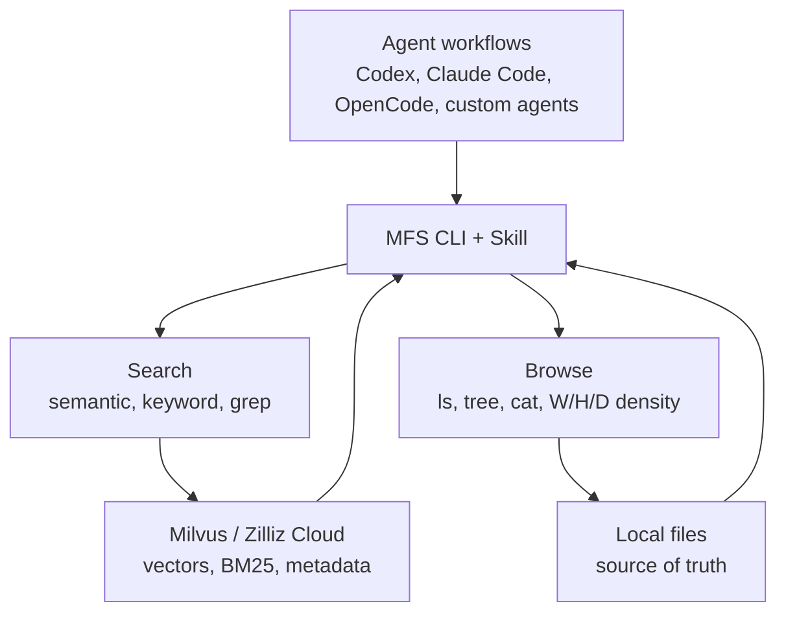

# MFS

**MFS is an agent-native file search layer for large local workspaces.**

Agent projects are increasingly built on folders full of files: Markdown memory
logs, JSONL session transcripts, SKILL documents, design notes, codebases,
runbooks, PDFs, DOCX files, and long-lived knowledge bases. These files are easy
for humans to edit, but hard for an agent to search reliably with only `grep`,
`find`, and full-file reads.

## What the Name Means

**MFS** has two meanings:

- **Memory File Search**: the files an agent depends on are increasingly its
  long-term memory surface.
- **Milvus File Search**: Milvus gives that memory surface a scalable semantic
  and keyword index.

This naming is intentional. In agent systems, "memory" is no longer just a chat
history buffer. The CoALA paper, LangChain's memory docs, and LangChain's Agent
Builder write-up all use a similar vocabulary for agent memory:

| Memory layer | What it means for agents | Common file shape |
| --- | --- | --- |
| Semantic memory | Facts, preferences, domain knowledge, project context | Markdown notes, docs, PDFs, DOCX files, knowledge bases |
| Episodic memory | Past events, conversations, tool traces, decisions, outcomes | JSONL transcripts, session logs, daily notes, benchmark traces |
| Procedural memory | Instructions, skills, workflows, rules for how the agent should behave | `AGENTS.md`, `SKILL.md`, runbooks, workflow references |
| Working memory | The agent's current context window and scratch state | Usually not a durable corpus; MFS retrieves long-term files into it |

That is why MFS treats memory as files first. Many useful agent memories are
already human-readable files: a skill tree, a conversation archive, a project
decision log, a codebase, a folder of onboarding docs. Milvus then turns those
files into searchable infrastructure: dense vectors for meaning, BM25 for exact
terms, and metadata filters for scoped retrieval.

References: [CoALA](https://arxiv.org/abs/2309.02427),
[LangChain memory overview](https://docs.langchain.com/oss/python/concepts/memory),
[LangChain Deep Agents memory](https://docs.langchain.com/oss/python/deepagents/memory),
and
[LangChain Agent Builder memory](https://www.langchain.com/blog/how-we-built-agent-builders-memory-system).

MFS adds a Milvus-backed retrieval layer over those files while keeping the
folder itself as the source of truth. It gives agents the two capabilities they
need most:

- **Search**: quickly locate likely files and chunks across a large corpus with
  hybrid semantic and keyword retrieval.
- **Browse**: inspect just enough surrounding structure with `ls`, `tree`, and
  `cat` before reading exact lines or making changes.

```bash
mfs add .
mfs search "where do we store memory rollover rules" .
mfs tree --peek -L 2 ./skills
mfs cat --skim ./memory/2026-04.md
mfs cat -n 80:140 ./memory/2026-04.md
```

## The Layer MFS Provides

MFS sits between shell-based agents and the files they need to understand.



Typical corpora:

| Corpus | Common shape | What MFS helps with |
| --- | --- | --- |
| Agent memory | Markdown summaries, JSONL transcripts, daily logs | Recover prior decisions, inspect raw turns, compare nearby memories. |
| Agent skills | `SKILL.md`, references, examples, scripts | Find the right skill rule and verify the exact instruction text. |
| Codebases | Source files, tests, package metadata, docs | Search concepts, identifiers, errors, and browse symbols before editing. |
| Knowledge bases | Markdown, PDFs, DOCX, runbooks, design specs | Locate answers when the user's wording does not match titles or filenames. |
| Session archives | Long JSONL or text logs | Combine indexed search with exact grep and structured `cat` views. |

## Why Agents Need Both Search and Browse

Plain shell tools are strong when the agent already knows the exact token. They
are weak when the user asks in natural language, or when the relevant file name
does not contain the answer.

Pure semantic search is also not enough. A single chunk can point to the right
place but still hide the surrounding directory, headings, adjacent files, or
exact line range the agent must verify.

MFS treats search and browsing as two separate, complementary moves:

1. Use `mfs search` or `mfs grep` to find candidates across the corpus.
2. Use `mfs ls`, `mfs tree`, and `mfs cat --peek/--skim/--deep` to inspect the
   candidate neighborhood without reading everything.
3. Use `mfs cat -n start:end` to read exact lines before answering or editing.

This matches how people use web search: index first, result preview second,
focused reading third.

## Built for Agent Integration

MFS is intentionally a CLI first. Agents already know how to run shell commands,
parse JSON, and pipe outputs. Developers do not need to add a retrieval SDK to
every agent framework.

MFS ships:

- a POSIX-style CLI: `mfs add`, `search`, `grep`, `ls`, `tree`, `cat`
- a companion [Agent Skill](skill.md) that teaches agents when to search, when
  to browse, and when to verify with line ranges
- JSON output for automation and readable terminal output for humans
- Milvus Lite for local use, plus Milvus server and Zilliz Cloud for shared or
  managed deployments

## Design Commitments

- **Files remain the source of truth.** The index can be rebuilt; the original
  files stay readable, editable, and Git-friendly.
- **Body chunks are searchable.** MFS embeds original file chunks instead of
  relying only on summaries, so identifiers, error codes, and config keys remain
  visible to retrieval.
- **Project directories stay clean.** MFS state lives under `~/.mfs/` by
  default. It does not create generated summary files inside your repo.
- **LLM enrichment is optional.** Default indexing does not call an LLM. File
  summaries and image descriptions are available through `--summarize` and
  `--describe` when the use case justifies them.
- **Large corpora become progressively useful.** The queue prioritizes entry
  files, docs, source roots, and other high-value paths so early indexed results
  are useful even before a large job fully finishes.

## Start Here

- [Quickstart](getting-started.md) for local setup and the first index.
- [Search and Browse](search-and-browse.md) for the agent workflow.
- [CLI Reference](cli.md) for exact command inputs, outputs, and options.
- [Design Philosophy](design-philosophy.md) for the principles behind the tool.
- [Evaluation](https://github.com/zilliztech/mfs/tree/main/evaluation) for
  end-to-end agent results on code and document search tasks.
