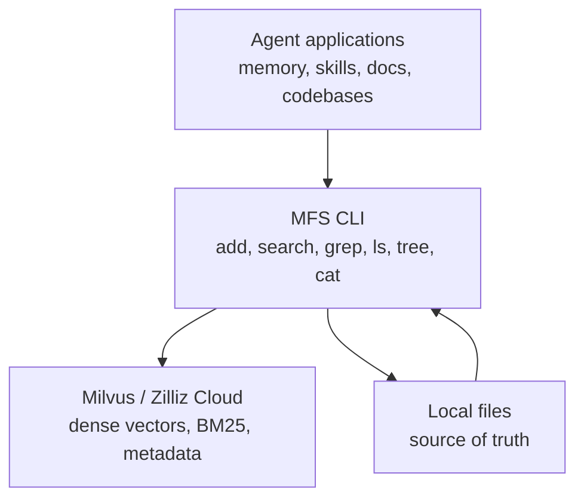

# MFS

**MFS is a semantic file search CLI built for agents driving a shell.** It gives
local folders a search layer that feels like normal POSIX tools: `search`,
`grep`, `ls`, `tree`, and `cat`.

The core idea is simple:

- files stay on disk and remain the source of truth
- Milvus is a rebuildable index, not a second filesystem
- agents use semantic search to locate candidates
- agents use progressive browsing to verify context before acting

```bash
mfs add .
mfs search "how do we refresh expired tokens" .
mfs cat --skim ./src/auth/token.py
mfs cat -n 80:140 ./src/auth/token.py
```

## Where MFS sits



MFS is not a daemon, an SDK-first framework, or a filesystem mount. It is a
small command-line layer that any agent, script, or developer can invoke.

## Two legs: search and browse

Search is flat and global. It answers: **where might the answer be?**

Browse is hierarchical and local. It answers: **what is around this hit, and
what should I inspect next?**

This matters for agents. A single search chunk is often too narrow; reading
whole files is often too expensive. MFS gives agents the middle path:
`--peek`, `--skim`, `--deep`, and line-range drilldown.

## What it can index

MFS currently indexes Markdown, text, source code, PDF, and DOCX files. PDF and
DOCX are converted to Markdown before chunking and cached under
`~/.mfs/converted/`.

Structured files such as JSON, JSONL, CSV, YAML, TOML, HTML, and logs are not
embedded by default. They remain searchable through `mfs grep` and readable
through compact `mfs cat` views.

## Start here

- [Quickstart](getting-started.md) for installation and the first index
- [Search and Browse](search-and-browse.md) for the agent workflow
- [CLI Reference](cli.md) for command options
- [Architecture](architecture.md) for how ingestion, queueing, and retrieval work
- [Benchmarks](benchmarks/README.md) for code and document retrieval results
