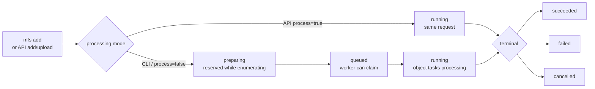

# Jobs and Indexing Progress

Use this page when `mfs add` returns a job id, indexing is still running, or
search does not yet match the content you just added.

## Daily Loop

| Need | CLI | HTTP API |
|---|---|---|
| Queue or sync a source | `mfs add TARGET` | `POST /v1/add` |
| Check server-level counts | `mfs status` | `GET /v1/status` |
| List recent jobs | `mfs job list` | `GET /v1/jobs?limit=...` |
| Inspect one job | `mfs job show JOB_ID` | `GET /v1/jobs/{job_id}` |
| Cancel work | `mfs job cancel JOB_ID` | `POST /v1/jobs/{job_id}/cancel` |
| Inspect one connector's indexed objects | `mfs connector inspect TARGET` | `GET /v1/connectors/inspect?target=...` |

`mfs add` queues work and returns after the server has a job id:

```text
queued (job JOB_ID). Worker running in background -- run `mfs status` to check progress.
```

Use `mfs job show JOB_ID` or `mfs job list` to inspect progress until the job
reaches `succeeded`, `failed`, or `cancelled`.

## Lifecycle



| Status | What it means | What to do |
|---|---|---|
| `preparing` | Internal reserved state while the server enumerates objects and builds task rows. Workers do not claim the job yet. | Usually wait. If it stays visible, inspect the job and connector; a later sync may report `sync_already_running` while this slot is held. |
| `queued` | Enumeration is done and a worker can claim the job. | Make sure a worker is available for your deployment shape. |
| `running` | A worker or inline API request is processing object tasks. | Poll `mfs job show JOB_ID`; cancel only if the work should stop. |
| `succeeded` | The job reached a terminal success state. | Check `succeeded_objects`, `failed_objects`, and search/browse the connector. |
| `failed` | The job reached a terminal failure state. | Read `error`, fix the cause, then rerun `mfs add ...`. |
| `cancelled` | The job was cancelled directly or as part of connector removal. | Re-run add only after the cancel/removal path is finished. |

!!! note "Status is an open string"
    The API models job status as a string. Display unknown values if you build a
    direct client.

## Queued Versus Inline

| Caller | Current behavior | Worker requirement |
|---|---|---|
| Rust CLI `mfs add` | Sends `process=false` to `/v1/add` and returns a `job_id`; upload mode also sends `process=false` to the file-upload endpoint. | A worker drains the queued job. |
| Direct API with `process=false` | Enqueue worker processing and return a `job_id`. | Run an in-process worker or standalone `mfs-server worker`. |
| Direct API with `process=true` | Run indexing inline before returning the `job_id`. | The request does the processing. |

API clients should send `process` explicitly when they depend on queued or
inline behavior. Do not rely on generated defaults.

## Worker Modes

| Deployment shape | What drains queued jobs | Notes |
|---|---|---|
| Source or Docker all-in-one with SQLite | The app starts one in-process worker when `worker.in_process` is enabled. | This is the local default path. |
| Client/server or Postgres-backed deployments | Run `mfs-server worker --concurrency auto` or a configured value. | Use a standalone worker for queued jobs. |
| Kubernetes api/worker | The chart renders a separate worker deployment. | The scale-out path; see [Deployment](deployment.md). |

For topology setup, see [Deployment](deployment.md). For server entrypoints, see
[Server](server.md).

## Reading Job Output

`mfs job show JOB_ID` prints the `JobResponse` object.

| Field | Meaning |
|---|---|
| `id` | Job id. |
| `status` | Current job status. Treat it as an open string. |
| `op_kind` | Operation kind when stored, such as `sync`. |
| `trigger` | Trigger source when stored, such as `manual`. |
| `error` | Error text or code when the job fails. |
| `total_objects` | Total object tasks counted at finalization. |
| `succeeded_objects` | Object tasks completed successfully. |
| `failed_objects` | Object tasks that failed. |
| `cancelled_objects` | Object tasks cancelled. |
| `started_at` | Start timestamp when available. |
| `finished_at` | Finish timestamp when available. |

`mfs status` is broader. It returns registered connector rows plus `jobs`, a
count grouped by job status:

```json
{
  "connectors": [
    {"root_uri": "file://local/tmp/mfs-quickstart", "type": "file", "status": "active"}
  ],
  "jobs": {"queued": 1, "running": 1}
}
```

The connector `status` in this response is a connector lifecycle state, not
per-object search readiness. For object readiness, use `mfs ls PATH --json` and
check `search_status`, or use `mfs connector inspect TARGET` for one connector.

## Recovery

| Symptom | Check | Recovery |
|---|---|---|
| `mfs add` returned a job id and search misses new content | `mfs job show JOB_ID` | Wait for `succeeded`; browse directly with `mfs ls`, `mfs head`, or `mfs cat` meanwhile. |
| Job stays `queued` | Confirm the deployment has a worker path. | For SQLite all-in-one, check the server is running with in-process worker enabled. For Postgres/client-server, start `mfs-server worker --concurrency auto`. |
| Job stays `running` longer than expected | `mfs job show JOB_ID` | Keep polling, or run `mfs job cancel JOB_ID` if the work should stop. |
| Job is `failed` | Read `error` and object counts. | Fix the root cause, then rerun `mfs add ...`. Use [Troubleshooting](troubleshooting.md) for canonical error codes. |
| Job is `cancelled` | Check whether you or a connector removal cancelled it. | Re-run add after the cancel/removal path is finished. |
| New add fails with `sync_already_running` | `mfs job list` and `mfs job show JOB_ID` | Wait for the in-flight sync or cancel the job if it should stop. |
| `succeeded_objects` is `0` | `mfs connector inspect TARGET` and `mfs ls PATH --json` | Confirm the target URI, connector config, indexability, and `[[objects]] text_fields` for structured sources. |
| `failed_objects` is non-zero | `mfs job show JOB_ID` | Read `error`, inspect the connector and a sample path, then rerun after fixing the cause. |

## Related Pages

| Page | Use it for |
|---|---|
| [Quickstart](getting-started.md) | First local `mfs add` checkpoint. |
| [Content Model](content-model.md) | How object tasks become chunks, result envelopes, and object `search_status`. |
| [CLI Reference](cli.md) | Exact command flags and output shapes. |
| [HTTP API](api.md) | Endpoint paths and schema fields. |
| [Storage and Backup](storage-and-backup.md) | How job, metadata, cache, and vector state fit into backup and reset workflows. |
| [Troubleshooting](troubleshooting.md) | Endpoint, auth, upload, indexing, search, and browse recovery. |
| [Search and Browse](search-and-browse.md) | How to keep working while search is partial or still building. |
