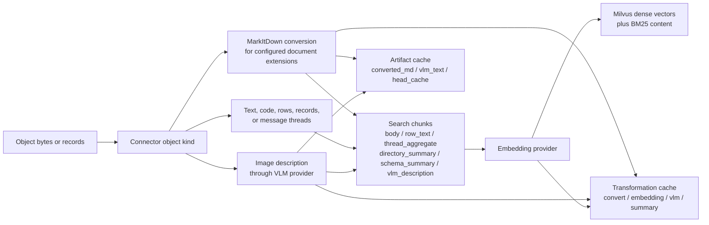

# Providers and Processing

Use this page when you need to choose an embedding provider, install the right
server extra, set the right credential, or understand where conversion, VLM,
summary, embedding, and search failures appear.

For Milvus, database, cache, auth, and config-file precedence, use
[Configuration](configuration.md). For source, Docker, Compose, and Helm
topologies, use [Deployment](deployment.md).

## Fast Choice

| Need | Use | Setup path | Credential or service |
|---|---|---|---|
| Local default with no API key | `onnx` embeddings | `uv sync`, then `uv run mfs-server setup --section embedding` or built-in defaults | None |
| Hosted OpenAI embeddings | `openai` embeddings | `uv sync`, then `uv run mfs-server setup --section embedding` | `OPENAI_API_KEY` |
| Google Gemini embeddings | `gemini` embeddings | `uv sync --extra gemini`, then `uv run mfs-server setup --section embedding` | `GOOGLE_API_KEY`, or Vertex AI auth for the embedding SDK |
| Voyage embeddings | `voyage` embeddings | `uv sync --extra voyage`, then `uv run mfs-server setup --section embedding` | `VOYAGE_API_KEY` |
| Local Ollama embeddings | `ollama` embeddings | `uv sync --extra ollama`, then `uv run mfs-server setup --section embedding` | Running Ollama server; `OLLAMA_HOST` is optional |
| Local sentence-transformers embeddings | `local` embeddings | `uv sync --extra local`, then `uv run mfs-server setup --section embedding` | None; this extra pulls the sentence-transformers stack |
| Image-description and summary setup | `openai`, `anthropic`, or `gemini` LLM/VLM | `uv run mfs-server setup --section vlm` | Provider key for the selected LLM/VLM provider |

Provider names are exact. The supported embedding names are `openai`, `onnx`,
`gemini`, `voyage`, `ollama`, and `local`.

## Install Paths

Run these commands from `server/python` in a source checkout:

```bash
cd server/python
uv sync
```

Core dependencies include the OpenAI SDK and the default ONNX embedding stack.
Alternate provider extras are separate:

```bash
uv sync --extra gemini
uv sync --extra voyage
uv sync --extra ollama
uv sync --extra local
uv sync --extra anthropic
uv sync --extra all-providers
```

`all-providers` installs Gemini, Voyage, Ollama, and Anthropic provider
dependencies. It does not include `local`, because `local` pulls the larger
sentence-transformers dependency stack.

## Embedding Providers

The embedding registry is the source of truth for provider names and default
models.

| Provider | Default model | Default or detected dimension | Dependency | Runtime requirement | First-run behavior |
|---|---|---|---|---|---|
| `onnx` | `gpahal/bge-m3-onnx-int8` | 1024 in the default config; probed from the model by setup | Core | No API key | `mfs-server run` and `mfs-server worker` preload the model at startup; if files are not cached under `$MFS_HOME/onnx-cache/`, startup downloads them. |
| `openai` | `text-embedding-3-small` | 1536 for the default model | Core | `OPENAI_API_KEY`; `OPENAI_BASE_URL` is optional | No local model download. Unknown model dimensions may require a trial embedding call. |
| `gemini` | `gemini-embedding-001` | 768 for the default model | `uv sync --extra gemini` or `all-providers` | `GOOGLE_API_KEY`, or Vertex AI auth with `GOOGLE_GENAI_USE_VERTEXAI=true` | Known model dimensions use a local table; unknown models require a trial embedding call. |
| `voyage` | `voyage-3-lite` | 512 for the default model | `uv sync --extra voyage` or `all-providers` | `VOYAGE_API_KEY` | Known model dimensions use a local table; unknown models require a trial embedding call. |
| `ollama` | `nomic-embed-text` | Detected by a trial embed against the selected Ollama model | `uv sync --extra ollama` or `all-providers` | Running Ollama server; `OLLAMA_HOST` can point at a non-default host | The selected model must be available to the Ollama server before dimension probing and embedding can succeed. |
| `local` | `all-MiniLM-L6-v2` | Detected from sentence-transformers model metadata | `uv sync --extra local` | No API key | `mfs-server run` and `mfs-server worker` preload the sentence-transformers model on the detected device: CUDA, MPS, then CPU. |

Prefer the setup wizard when switching providers:

```bash
uv run mfs-server setup --section embedding
```

The wizard writes:

```toml
[embedding]
provider = "onnx"
model = "gpahal/bge-m3-onnx-int8"
dim = 1024
```

It probes the selected provider for the actual dimension. If the probe fails
because credentials, dependencies, or a local service are not ready, the wizard
lets you enter the dimension manually. Only hand-edit `dim` when you know the
provider model's output size.

After changing the embedding provider or model, re-index sources you depend on
so query vectors and indexed vectors come from the same embedding space:

```bash
mfs add --force-index TARGET
```

## Summary and VLM Providers

Text summary and image-description clients use the LLM provider registry.

| Provider | Default text and vision model | Dependency | Runtime requirement |
|---|---|---|---|
| `openai` | `gpt-4o-mini` | Core | `OPENAI_API_KEY`; `OPENAI_BASE_URL` is optional |
| `anthropic` | `claude-sonnet-4-5-20250929` | `uv sync --extra anthropic` or `all-providers` | `ANTHROPIC_API_KEY` |
| `gemini` | `gemini-2.0-flash` | `uv sync --extra gemini` or `all-providers` | `GOOGLE_API_KEY`; the Gemini provider module also documents Vertex AI auth |

Directory and schema summaries are off by default. VLM provider defaults are
configured separately:

```toml
[summary]
enabled = false
include_image_description = false
provider = "openai"
model = "gpt-4o-mini"

[description]
enabled = false
provider = "openai"
model = "gpt-4o-mini"
```

Run the description setup section when you want the wizard to write summary
settings and image-description provider/model settings:

```bash
uv run mfs-server setup --section description
```

When enabled through the wizard, this section sets `summary.enabled`,
`summary.include_image_description`, the summary provider/model, and the
image-description provider/model. You can also set `MFS_SUMMARY_ENABLED` in the
server environment; truthy values are `1`, `true`, `yes`, and `on`.

!!! note
    Image indexing is gated by `[description].enabled`: indexable image objects
    use the configured provider to produce `vlm_description` chunks when the call
    succeeds. `summary.include_image_description` only controls whether cached
    image-description text is folded into directory-summary input.

## Conversion and Processing

Framework conversion uses MarkItDown by default:

```toml
[conversion]
default = "markitdown"
```

The framework converter path is used for these file-form document extensions:
`.pdf`, `.docx`, `.doc`, `.pptx`, `.ppt`, `.xlsx`, `.xls`, `.html`, and
`.htm`. Web crawler HTML-to-markdown conversion is connector-specific and does
not use this framework converter path.



| Input kind | Processing path | Search chunk kind | Cache or artifact |
|---|---|---|---|
| Text, code, markdown, plain documents | Read text, split into chunks, embed | `body` | Embedding results in the transformation cache |
| Documents with converter extensions | Convert to markdown, split, embed | `body` | `converted_md` artifact plus convert and embedding cache entries |
| Structured rows or record collections | Render configured text fields, embed each record | `row_text` | `head_cache` artifact for fast `head`; embedding cache entries |
| Message streams | Aggregate messages by thread, split long threads, embed | `thread_aggregate` | Embedding cache entries |
| Table schemas, when summary is enabled | Summarize schema, embed summary | `schema_summary` | Summary and embedding cache entries |
| Directories, when summary is enabled | Build bottom-up directory summaries, embed summaries | `directory_summary` | Summary and embedding cache entries |
| Images | Generate an image description through the configured VLM provider, then embed it | `vlm_description` | `vlm_text` artifact plus VLM and embedding cache entries |

The transformation cache is content-addressed by input hash, kind, provider,
model, and version. Losing it causes recomputation. The artifact cache stores
derived per-object blobs such as converted markdown and image-description text.
For how these chunks appear as `ResultEnvelope.source`, `locator`,
`metadata.chunk_kind`, and `metadata.fields`, see
[Content Model](content-model.md).

## Where Provider Errors Show Up

Hosted provider SDKs and credentials are loaded lazily. Local downloadable
embedding providers (`onnx` and `local`) are preloaded by `mfs-server run` and
`mfs-server worker`, so missing dependencies or failed downloads stop startup
before the service begins accepting work.

| Operation | Provider used | Failure surface |
|---|---|---|
| `mfs-server setup --section embedding` | Selected embedding provider | Dimension probe can fail; install the extra, export credentials, start local services, or enter a verified dimension manually. |
| `mfs-server run` / `mfs-server worker` | `onnx` or `local` embedding provider | Startup blocks while the model is loaded or downloaded; failure stops the process. |
| `mfs add ...` indexing | Embedding provider, and summary/VLM provider when those features are enabled | `mfs job show JOB_ID`, `mfs connector inspect TARGET`, and the provider-related codes in [Troubleshooting](troubleshooting.md#canonical-error-codes). |
| `mfs search QUERY PATH --mode semantic` | Embedding provider for the query vector | Search can fail if the selected embedding provider is unavailable. |
| `mfs search QUERY PATH --mode hybrid` | Embedding provider for the dense half plus Milvus BM25 for the keyword half | Hybrid search can fail before querying Milvus if query embedding fails. |
| `mfs search QUERY PATH --mode keyword` | No embedding provider for the query | Useful when the embedding provider is unavailable but indexed BM25 content exists. |

For provider auth, quota, repeated retry, and circuit-breaker recovery, see
[Troubleshooting](troubleshooting.md#canonical-error-codes).
