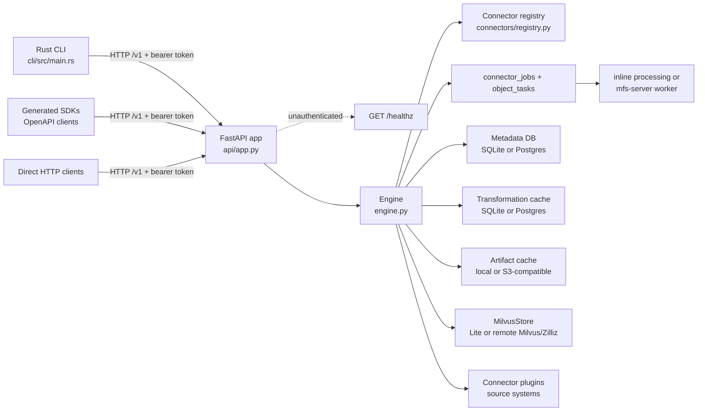

# Server

The Python server is the runtime that sits behind the Rust `mfs` CLI,
generated SDKs, and direct HTTP clients. It exposes the FastAPI `/v1` control
plane and owns connector execution, ingest jobs, upload staging, object
processing, search, browse/read operations, metadata, caches, and Milvus
integration.

Use this page when you need to orient yourself in the server code. For exact
endpoint shapes, open [HTTP API](api.md). For backend values and precedence,
open [Configuration](configuration.md). For provider selection and processing
behavior, open [Providers and Processing](providers.md). For runnable source,
Docker, Compose, and rendered Helm topologies, open [Deployment](deployment.md).
For local package setup and contributor checks, open
[Development](development.md).
For operator state, backup, and reset guidance, open
[Storage and Backup](storage-and-backup.md).

## Run From Source

```bash
cd server/python
uv sync --extra all-connectors
uv run mfs-server setup
uv run mfs-server run
```

`mfs-server run` and `mfs-server api` both default to
`--bind 127.0.0.1:13619`. The Rust CLI default endpoint is
`http://127.0.0.1:13619`, and `mfs serve start` starts a detached
`mfs-server run --bind <bind>` process with the same default bind address.

```bash
uv run mfs-server run --bind 127.0.0.1:13619
uv run mfs-server api --bind 127.0.0.1:13619
uv run mfs-server worker --concurrency auto
mfs serve start
```

## Runtime Boundary



The HTTP layer is deliberately thin: it validates request/response models,
applies bearer-token middleware, maps runtime errors into the stable error
envelope, and forwards work to `Engine`. The Engine is where connector
registration, job orchestration, uploads, object processing, search, grep,
browse, and removal happen.

The Rust CLI owns client concerns: endpoint selection, bearer-token source,
profiles, local/remote path decisions, upload packaging, and terminal output.
The server owns runtime concerns: auth enforcement, config-backed storage and
cache construction, connector execution, jobs, indexing, and read/search
behavior.

## Entrypoints

| Command or surface | Runtime path | Verified behavior |
|---|---|---|
| `mfs-server run` | `server/python/src/mfs_server/server/__main__.py` | Loads server config, bootstraps auth, creates the FastAPI app, and runs Uvicorn. Defaults to `--bind 127.0.0.1:13619`. |
| `mfs-server api` | `server/python/src/mfs_server/server/__main__.py` | Same FastAPI startup path as `run`. Defaults to `--bind 127.0.0.1:13619`. |
| `mfs-server worker` | `server/python/src/mfs_server/server/__main__.py` | Constructs `Engine`, runs `Engine.startup()`, then drains queued jobs with `run_worker_forever()`. |
| `mfs-server reload` | `server/python/src/mfs_server/server/__main__.py` | Validates `server.toml` and prints resolved backend kinds. Restart the process to apply changes. |
| `mfs-server setup` | `server/python/src/mfs_server/server/__main__.py` | Special entrypoint routed before the main argparse subcommands to the setup wizard. |
| `mfs-server connector add` | `server/python/src/mfs_server/server/__main__.py` | Special entrypoint routed before the main argparse subcommands to the connector wizard. |
| `mfs-server connector list` | `server/python/src/mfs_server/server/__main__.py` | Special entrypoint routed before the main argparse subcommands to the local connector listing path. |
| `mfs serve start` | `cli/src/main.rs` | Rust CLI process manager that spawns `mfs-server run --bind <bind>` and records local PID/log files under `MFS_HOME`. |
| `/v1` HTTP API | `server/python/src/mfs_server/api/app.py` and `api/models.py` | FastAPI routes, lifespan startup/shutdown, auth middleware, error wrappers, and Pydantic request/response models. |
| OpenAPI contract | `protocol/openapi.yaml` | Source of truth for endpoint paths, operation IDs, tags, and schemas. |

!!! note "Special server subcommands"
    `mfs-server setup`, `mfs-server connector add`, and
    `mfs-server connector list` are dispatched from raw `argv` before the
    regular argparse subcommands. Do not debug those commands by looking only at
    the `run` / `api` / `worker` / `reload` parser branch.

## Module Responsibility Map

| Path | Owns |
|---|---|
| `server/python/src/mfs_server/server/__main__.py` | Server command dispatch, auth-token bootstrap, Uvicorn startup, standalone worker startup, and config reload validation. |
| `server/python/src/mfs_server/api/app.py` | FastAPI app construction, lifespan, bearer auth middleware, `/healthz`, `/v1` routes, and error-envelope handlers. |
| `server/python/src/mfs_server/api/models.py` | Pydantic request and response models for the `/v1` control plane. |
| `server/python/src/mfs_server/config.py` | `ServerConfig`, config lookup, resolved defaults, environment overrides, auth settings, backend settings, worker settings, chunking, and search knobs. |
| `server/python/src/mfs_server/engine/engine.py` | Connector registration, credential-reference resolution, sync jobs, upload staging, object task processing, inline and queued workers, indexing, artifact writes, search, grep, browse/read, and connector removal. |
| `server/python/src/mfs_server/engine/state.py` | Persistent per-connector state with staged writes, checkpoints, commits, and worker-applied snapshots. |
| `server/python/src/mfs_server/connectors/registry.py` | URI scheme to plugin registry. `file` is imported directly; optional built-ins are loaded lazily and skipped when their dependencies are not installed. |
| `server/python/src/mfs_server/storage/metadata/` | Metadata store factory and SQLite/Postgres implementations for connector registry rows, objects, jobs, tasks, state, and related metadata. |
| `server/python/src/mfs_server/storage/transformation_cache/` | Transformation-cache factory and SQLite/Postgres implementations for content-addressed conversion, embedding, VLM, and summary lookup data. |
| `server/python/src/mfs_server/storage/artifact_cache.py` | Local and S3-compatible artifact-cache backends, plus local upload/file staging directories. |
| `server/python/src/mfs_server/storage/milvus.py` | Milvus client, collection creation/loading, chunk upsert/delete, dense search, BM25 sparse search, and hybrid search. |
| `server-rs/` | Optional Rust acceleration for server hot paths when installed; the Python server falls back when it is absent. |

## API Surface

The server page should explain the runtime, not replace the API reference.
`protocol/openapi.yaml` lists the `/v1` control-plane groups. The runtime
FastAPI app also exposes `GET /healthz` outside `/v1` for probes.

| Group | Endpoints |
|---|---|
| Server and health | `GET /v1/server/info`, `GET /v1/status`, `GET /healthz` |
| Ingest and jobs | `POST /v1/add`, `POST /v1/upload`, `POST /v1/files/manifest`, `PUT /v1/files/upload`, `GET /v1/jobs`, `GET /v1/jobs/{job_id}`, `POST /v1/jobs/{job_id}/cancel` |
| Connectors | `POST /v1/connectors/probe`, `POST /v1/connectors/estimate`, `GET /v1/connectors/inspect`, `DELETE /v1/connectors` |
| Retrieval | `GET /v1/search`, `GET /v1/grep` |
| Browse/read | `GET /v1/ls`, `GET /v1/cat`, `GET /v1/head`, `GET /v1/tail`, `GET /v1/export` |

Generated SDK coverage can be narrower than the OpenAPI surface. Use
[HTTP API](api.md) for the full endpoint contract and [SDKs](sdks.md) before
depending on a generated client method name.

## Auth and Config Boundary

`mfs-server run` and `mfs-server api` call `load_server_config()`, then
bootstrap the bearer token before starting Uvicorn:

| Server config state | Runtime behavior |
|---|---|
| `auth_token` is a non-empty value | The server uses that token. |
| `auth_token = "-"` | The entrypoint converts it to no auth. Use only for an intentionally open trusted or isolated network. |
| `auth_token` is empty or omitted | The server reuses or creates `$MFS_HOME/server.token` and uses it as the bearer token. |

When `cfg.auth_token` is set, FastAPI middleware requires
`Authorization: Bearer <token>` for every request except `GET /healthz`.
`/healthz` returns only liveness data and is left unauthenticated for probes.

Config lookup and default paths are owned by `config.py`: `--config`,
`MFS_SERVER_CONFIG`, `./server.toml`, `$MFS_HOME/server.toml`,
`~/.mfs/server.toml`, `/etc/mfs/server.toml`, then built-in defaults. Resolved
defaults put local server state under `MFS_HOME`, including metadata SQLite,
transformation-cache SQLite, local artifact cache, Milvus Lite, and
`server.token`. See [Configuration](configuration.md) for the full precedence
table and environment overrides. For an operator-focused token and secret
lookup, see [Auth and Secrets](auth-and-secrets.md).

## Jobs and Workers

Ingest is a job system whether it is driven by the CLI, direct HTTP, or a
worker process.

| Mode | How work runs | Use it for |
|---|---|---|
| Inline request | `POST /v1/add` or upload endpoints with `process=true`; `Engine.add()` drains the job before returning. | Direct API callers that explicitly want the request to block until indexing is done. |
| Queued all-in-one | `process=false` enqueues a job; FastAPI lifespan can start one in-process worker when `worker.in_process` is true and metadata is SQLite. | Local source, Docker, or Compose all-in-one runs where the API process also drains queued jobs. |
| Dedicated worker | `mfs-server worker --concurrency auto` starts an Engine and polls queued jobs from metadata. | Client/server or Postgres deployments where API replicas should serve HTTP and a separate worker should do indexing. |

!!! warning "API replicas and workers"
    The FastAPI lifespan starts an in-process worker only for SQLite all-in-one
    runs when `worker.in_process` is enabled. Client/server deployments that use
    shared Postgres metadata should run `mfs-server worker` separately instead
    of letting API replicas also perform indexing work.

Queued jobs are stored in the metadata backend. The worker atomically claims
queued jobs, processes object tasks, updates job counts, and commits deferred
connector state only after a job succeeds.

## Storage and Cache Boundary

| Concern | Constructor or module | Backends | Local default | Stores |
|---|---|---|---|---|
| Metadata | `make_metadata_store(cfg)` in `storage/metadata/` | SQLite or Postgres | `$MFS_HOME/metadata.db` | Connectors, objects, jobs, object tasks, connector state, file state, and related metadata. |
| Transformation cache | `make_transformation_cache(cfg)` in `storage/transformation_cache/` | SQLite or Postgres | `$MFS_HOME/transformation_cache.db` | Content-addressed lookup data for embedding, conversion, VLM, and summary work. |
| Artifact cache | `make_artifact_cache(cfg)` in `storage/artifact_cache.py` | Local filesystem or S3-compatible storage | `$MFS_HOME/cache` | Derived per-object blobs such as converted markdown and image descriptions. Upload/file staging directories stay local even when artifact bytes use S3-compatible storage. |
| Vector index | `MilvusStore(cfg)` in `storage/milvus.py` | Milvus Lite file or remote Milvus/Zilliz URI | `$MFS_HOME/milvus.db` | Indexed chunks with dense vectors, BM25 sparse vectors, locators, content, chunk kinds, and metadata. |

The Engine constructs all four stores during initialization. During startup it
loads built-in connectors, connects and initializes metadata, connects the
transformation cache, connects Milvus, and ensures the namespace collection.

## What To Open Next

| Need | Page |
|---|---|
| Identifiers, locators, chunk kinds, artifacts, and object search status | [Content Model](content-model.md) |
| Exact `/v1` endpoint paths, request fields, response models, and error envelope | [HTTP API](api.md) |
| Config lookup, `MFS_HOME`, auth modes, backend defaults, and environment overrides | [Configuration](configuration.md) |
| State components, backup targets, restore order, and reset boundaries | [Storage and Backup](storage-and-backup.md) |
| Process token boundaries, connector credential references, and first auth recovery commands | [Auth and Secrets](auth-and-secrets.md) |
| Embedding, summary, VLM, converter setup, and provider runtime requirements | [Providers and Processing](providers.md) |
| Source, Docker, Compose, and rendered Helm runtime shapes | [Deployment](deployment.md) |
| CLI commands, endpoint resolution, token precedence, and upload behavior | [CLI Reference](cli.md) |
| Connector schemes, TOML config, credentials, and lifecycle commands | [Connectors](connectors.md) |
| Search, browse, and exact-content verification workflow | [Search and Browse](search-and-browse.md) |
| Endpoint, auth, job, indexing, search, and browse failures | [Troubleshooting](troubleshooting.md) |
| Generated Python and TypeScript clients | [SDKs](sdks.md) |
| Local package setup, checks, and OpenAPI-to-SDK regeneration | [Development](development.md) |
| System-wide component map | [Architecture](architecture.md) |
