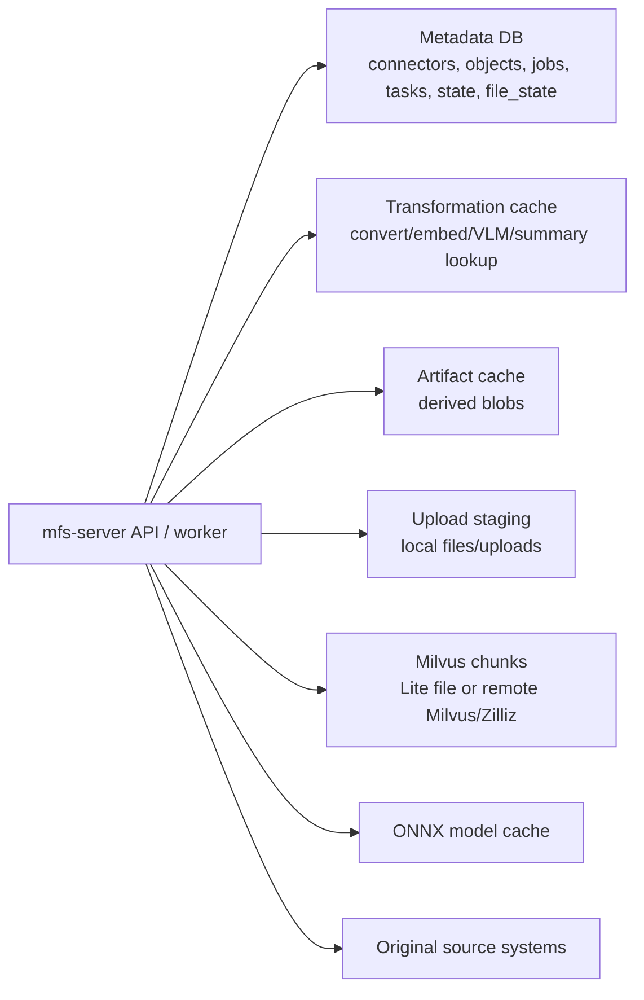

# Storage and Backup

Use this page when you need to decide what MFS stores, where it lives, what to
back up, and what to reset. It is intentionally conservative: if a delete or
restore action is not backed by the current repository behavior, this page tells
you to stop at inspection or use a connector-level rebuild.

For configuration precedence, see [Configuration](configuration.md). For source,
Docker, Compose, and rendered Helm shapes, see [Deployment](deployment.md). For
worker and job state, see [Jobs and Indexing Progress](jobs.md). For endpoint
and indexing triage, see [Troubleshooting](troubleshooting.md). For the runtime
module map behind these statements, see [Server](server.md).

## Mental Model



MFS state is split across relational metadata, vector chunks, derived artifacts,
upload staging, and provider caches. Do not treat one directory as disposable
until you know which part you are looking at.

## Local Defaults

In a source run, `MFS_HOME` defaults to `~/.mfs` unless it is set. The Docker
image and Compose file set `MFS_HOME=/data`.

| Path | Default role | Backup priority | Reset boundary |
|---|---|---|---|
| `$MFS_HOME/server.toml` | Server config written by setup and read by `mfs-server run`, `api`, `worker`, and `reload`. | Back up with every deployment snapshot. | Recreate only through setup or a known config source. |
| `$MFS_HOME/server.token` | Auto-generated bearer token when no `auth_token` or server-side `MFS_API_TOKEN` is configured. | Back up or intentionally rotate. Clients using the old token will fail after rotation. | Deleting it makes the next auto-token start create a new token. It is not a cache. |
| `$MFS_HOME/client.toml` | Local CLI profiles, active endpoint, profile tokens, and stable client id. | Back up for operator workstations and upload-mode identity continuity. | Delete only to reset local CLI profiles. This does not reset server state. |
| `$MFS_HOME/metadata.db` | SQLite metadata: connectors, objects, jobs, object tasks, connector state, file state, and artifact-cache rows. | Critical for local SQLite deployments. | Do not delete independently of Milvus/artifacts unless doing a full reset or restoring a consistent snapshot. |
| `$MFS_HOME/transformation_cache.db` | SQLite transformation cache for conversion, embedding, VLM, and summary lookup data. | Optional for correctness; useful for recovery speed and cost control. | Can be rebuilt by recomputation after the server is stopped. |
| `$MFS_HOME/cache/` | Local artifact cache root. Holds artifact bytes and local upload staging. | Back up if artifacts or upload-mode staged bytes matter. | Do not delete blindly. See [Artifact Cache Boundary](#artifact-cache-boundary). |
| `$MFS_HOME/milvus.db` | Milvus Lite vector database when no remote Milvus/Zilliz URI is configured. | Critical if you want search to work after restore without a full re-index. | Delete only as part of a full local reset or a planned full re-index. |
| `$MFS_HOME/onnx-cache/` | Cached files for the default local ONNX embedding model. | Optional; keep it to avoid first-run downloads. | Can be removed after stopping the server if you accept a later model download. |

!!! warning "Back up state as a set"
    Metadata, Milvus chunks, artifact rows, and local artifact bytes can refer to
    each other. For local SQLite and Milvus Lite, stop the server and workers,
    then snapshot the relevant files together.

## Component Matrix

| Component | Backends | Local default | Persistent state or cache | What it stores | Backup guidance |
|---|---|---|---|---|---|
| Server config | TOML file plus env overrides | `$MFS_HOME/server.toml` | Persistent configuration | Backend choices, auth, namespace, provider, worker, chunking, and search settings. | Back up config and record runtime env vars. |
| API token | TOML `auth_token`, server env `MFS_API_TOKEN`, or token file | `$MFS_HOME/server.token` | Secret state | Bearer token for `/v1` when auth is enabled. | Back up or rotate deliberately. Do not publish it in tickets or logs. |
| Metadata | SQLite or Postgres | `$MFS_HOME/metadata.db` | Persistent state | Connector rows, object rows, job rows, object tasks, connector state, file state, and artifact-cache index rows. | Must be backed up for connector/job/object continuity. |
| Transformation cache | SQLite or Postgres | `$MFS_HOME/transformation_cache.db` | Cache | Content-addressed conversion, embedding, VLM, and summary results. | Optional for correctness; backing it up reduces recompute. |
| Artifact bytes | Local filesystem or S3-compatible object storage | `$MFS_HOME/cache/artifacts/...` | Derived cache with metadata references | Converted markdown, image/VLM text, structured head cache, and similar per-object blobs. | Back up with metadata when you want read paths and cache hits to survive restore. |
| Upload staging | Local filesystem only | `$MFS_HOME/cache/files/...` and `$MFS_HOME/cache/uploads/...` | Local staging/scratch | Server-side copies and upload request staging for client/server upload mode. | Include when upload-mode file connectors should survive without re-upload. |
| Vector index | Milvus Lite file or remote Milvus/Zilliz | `$MFS_HOME/milvus.db` | Persistent search state | Dense vectors, BM25 sparse vectors, locators, chunk content, chunk kind, metadata, and indexed timestamps. | Back up local Lite data, or use the remote service backup policy. |
| ONNX cache | Local filesystem | `$MFS_HOME/onnx-cache/` | Provider cache | Hugging Face model and tokenizer files for the default ONNX embedding provider. | Optional; keep for offline or faster restarts. |

## Database Boundaries

The outward `database` setting feeds relational state:

| Setting path | Effect |
|---|---|
| `[database] backend = "sqlite"` | Metadata and transformation cache inherit SQLite unless overridden. |
| `[database] backend = "postgres"` with `dsn` | Metadata and transformation cache inherit Postgres unless a per-store override changes them. |
| `[metadata] backend` / `dsn` | Overrides only metadata for advanced split-backend deployments. |
| `[transformation_cache] backend` / `dsn` | Overrides only the transformation cache. |
| `MFS_METADATA_DSN` | Server env override that switches metadata to Postgres. |
| `MFS_TX_CACHE_PG` plus `MFS_TX_CACHE_DSN` or `MFS_METADATA_DSN` | Server env path that opts the transformation cache into Postgres. |

For SQLite, the current metadata and transformation-cache implementations enable
WAL mode. If you copy files while the server is stopped, include the database
file and any adjacent `-wal` or `-shm` files that exist.

!!! caution "Metadata is not a cache"
    Deleting metadata while leaving Milvus, artifact bytes, or upload staging in
    place creates orphaned state. Use connector removal or a full reset instead.

## Artifact Cache Boundary

The artifact cache has two backends for derived artifact bytes:

| Backend | Where artifact bytes live | Where upload staging lives | Notes |
|---|---|---|---|
| `local` | `$MFS_HOME/cache/artifacts/<namespace>/<object-hash>/<artifact-kind>` | `$MFS_HOME/cache/files/...` and `$MFS_HOME/cache/uploads/...` | Default for source, Docker, and Compose unless configured otherwise. |
| `s3` | `s3://<bucket>/<prefix>/artifacts/<namespace>/<object-hash>/<artifact-kind>` | The resolved local `artifact_cache.root` | S3-compatible covers S3, R2, GCS, and MinIO through endpoint configuration. |

Only artifact bytes move to S3-compatible storage. The server-side upload
staging directories returned by `files_root()` and `uploads_dir()` remain local
filesystem state under the artifact cache root. This matters for container and
Kubernetes layouts: object storage does not make uploaded local files available
to every pod by itself.

S3-compatible artifact cache is selected by TOML or by `MFS_OBJECT_STORE_BUCKET`
plus the related endpoint, region, prefix, access key, and secret key env vars.
When S3 is enabled, back up or protect both:

- the metadata backend, because it stores artifact-cache rows and connector
  state;
- the S3 bucket/prefix that stores artifact bytes;
- any local upload staging root needed by active upload-mode file connectors.

!!! warning "Do not reset artifact bytes in isolation"
    Artifact metadata rows live in the metadata database. If you manually remove
    artifact bytes while keeping the metadata rows, read paths can lose expected
    cache hits. Prefer connector removal plus re-add, or a full state reset.

## Milvus Boundary

MFS writes chunks through `MilvusStore`.

| Mode | How it is selected | Backup boundary |
|---|---|---|
| Milvus Lite | No Milvus URI is configured, so the resolved URI is `$MFS_HOME/milvus.db`. | Back up the local Lite file with metadata and local cache state. |
| Remote Milvus or Zilliz | Configure `[milvus] uri` / `token`, `MILVUS_URI` / `MILVUS_TOKEN`, or the Zilliz fallback env names read by the server. | Treat it as external state. Use that service's backup, snapshot, export, or retention policy. |

Do not invent local collection backup commands for remote Milvus/Zilliz. The
current MFS code deletes chunks by object or connector; the public operator path
for connector data removal is `mfs connector remove TARGET` or
`DELETE /v1/connectors`.

!!! warning "Rendered deployment env names"
    Current Compose and Helm assets mention `MFS_MILVUS_URI` and
    `MFS_MILVUS_TOKEN`, while the server config code reads `MILVUS_URI`,
    `MILVUS_TOKEN`, and Zilliz fallback names. Follow
    [Deployment](deployment.md#environment-variables) before relying on remote
    Milvus configuration.

## Deployment Mapping

| Deployment shape | Runtime state location | Persistence facts | Backup target |
|---|---|---|---|
| Source server | `$MFS_HOME`, default `~/.mfs` | Local defaults use SQLite metadata, SQLite transformation cache, local artifact cache, Milvus Lite, and ONNX cache unless configured otherwise. | Snapshot `$MFS_HOME` plus any external Postgres, S3, or remote Milvus service you configured. |
| Docker all-in-one | `/data` | Dockerfile sets `MFS_HOME=/data`, declares `/data` as a volume, and runs `mfs-server` by default. | Persist and back up the mounted `/data` volume. |
| Docker Compose all-in-one | `mfs-data` volume mounted at `/data` | Compose sets `MFS_HOME=/data` and persists `/data` through the `mfs-data` volume. | Back up the `mfs-data` volume while the service is stopped. |
| Helm-rendered api/worker | Rendered values target Postgres metadata, S3-compatible object storage, and remote Milvus/Zilliz | The chart renders API and worker deployments, but current docs describe this as the post-v0.4 scalable direction and note runtime/env mismatches to resolve. | Back up external services according to their policies; do not assume local pod files are durable. |

## Backup Checklist

Use this checklist before file-level backups or service snapshots.

1. Identify the deployment shape and active backend settings.
2. Stop or quiesce API and worker processes. For queued work, inspect
   [Jobs and Indexing Progress](jobs.md) first.
3. Confirm there are no jobs you need to preserve in a running state.
4. Snapshot metadata and Milvus together for local SQLite/Milvus Lite.
5. Include config and token files.
6. Include local artifact cache and upload staging when local artifacts or
   upload-mode connectors must survive restore.
7. Include `onnx-cache/` only when you need faster or offline restarts.
8. For Postgres, S3-compatible object storage, and remote Milvus/Zilliz, use
   those services' backup and retention controls.

Useful non-destructive inspection commands:

```bash
mfs status
mfs job list
mfs connector list
mfs connector inspect TARGET
```

Example local source backup after stopping the server:

```bash
export MFS_HOME="${MFS_HOME:-$HOME/.mfs}"
tar -C "$(dirname "$MFS_HOME")" -czf mfs-home-backup.tgz "$(basename "$MFS_HOME")"
```

??? note "SQLite file checklist"
    For local SQLite deployments, include these files when they exist:

    ```text
    $MFS_HOME/metadata.db
    $MFS_HOME/metadata.db-wal
    $MFS_HOME/metadata.db-shm
    $MFS_HOME/transformation_cache.db
    $MFS_HOME/transformation_cache.db-wal
    $MFS_HOME/transformation_cache.db-shm
    ```

## Restore Checklist

Restore into the same intended deployment shape and backend configuration.

1. Stop API and worker processes before replacing files or pointing services at
   restored state.
2. Restore `server.toml`, `server.token`, and the runtime env vars or secrets
   that select external services.
3. Restore metadata first, then local Milvus Lite state, then local artifact
   cache and upload staging.
4. Restore or point to the correct Postgres database, S3-compatible
   bucket/prefix, and remote Milvus/Zilliz service when those backends are used.
5. Start the server and run the inspection ladder.
6. If search chunks, artifact bytes, or upload staging were intentionally not
   restored, re-run `mfs add --force-index TARGET` or re-upload as needed.

```bash
mfs status
mfs job list
mfs connector list
mfs connector inspect TARGET
```

!!! caution "Schema compatibility"
    The metadata store records a schema version and fails fast when an existing
    database was written by an incompatible build. Restore with the same MFS
    build, or plan a fresh database and re-index.

## Safe Reset Boundaries

| Goal | Supported path | What it affects | What to avoid |
|---|---|---|---|
| Stop one in-flight job | `mfs job cancel JOB_ID` | Marks the job and pending/running tasks cancelled. A worker stops at task boundaries. | Do not delete files or database rows to cancel a job. |
| Remove one connector | `mfs connector remove TARGET --yes` or `mfs remove TARGET --yes` | Removes MFS-owned metadata rows, artifact rows/bytes, file state, object tasks/jobs, and Milvus chunks for that connector after running work has stopped. | Do not manually delete connector rows or Milvus chunks. |
| Rebuild one connector | `mfs add --force-index TARGET` | Forces a full re-index without deleting the whole server home. | Do not delete metadata just to force a rebuild. |
| Re-upload and rebuild an upload-mode connector | `mfs add --force-upload --wait PATH` | Re-sends file bytes and forces a full re-index through upload mode. | Do not remove local upload staging for an active connector unless you are ready to re-upload. |
| Reset transformation cache | Stop the server, then remove the transformation cache DB for the backend you use. | Loses memoized conversion, embedding, VLM, and summary outputs. | Do not remove Postgres tables manually without using your database change controls. |
| Reset ONNX model cache | Stop the server, then remove `$MFS_HOME/onnx-cache/`. | Forces the default ONNX provider to download model files again. | Do not do this in offline environments unless the model is already available elsewhere. |
| Full local reset | Stop the server and workers, then move aside or replace the whole `$MFS_HOME` or `/data` volume. | Removes config, token, metadata, caches, upload staging, and Milvus Lite state. | Do not run this without a backup if any connector, token, or index state matters. |

!!! danger "Manual partial deletes are the risky case"
    The highest-risk reset is deleting one persistent component while keeping
    the others. Examples: deleting `metadata.db` while keeping `milvus.db`,
    deleting artifact bytes while keeping artifact-cache metadata rows, or
    deleting upload staging while keeping upload-mode connector rows. Prefer
    connector removal, a forced re-index, or a full local reset.

## Related Pages

| Page | Use it for |
|---|---|
| [Configuration](configuration.md) | Config lookup, `MFS_HOME`, backend defaults, auth, and env overrides. |
| [Deployment](deployment.md) | Source, Docker, Compose, Helm rendering, and upload-mode placement. |
| [Server](server.md) | Runtime module map and storage/cache constructors. |
| [Jobs and Indexing Progress](jobs.md) | Job states, workers, cancellation, and queued versus inline processing. |
| [Troubleshooting](troubleshooting.md) | Endpoint, auth, upload, search, browse, and indexing recovery. |
| [CLI Reference](cli.md) | `mfs add`, `mfs job`, `mfs connector`, and `mfs remove` command details. |
| [HTTP API](api.md) | `/v1/status`, `/v1/jobs`, upload endpoints, and connector removal endpoints. |
